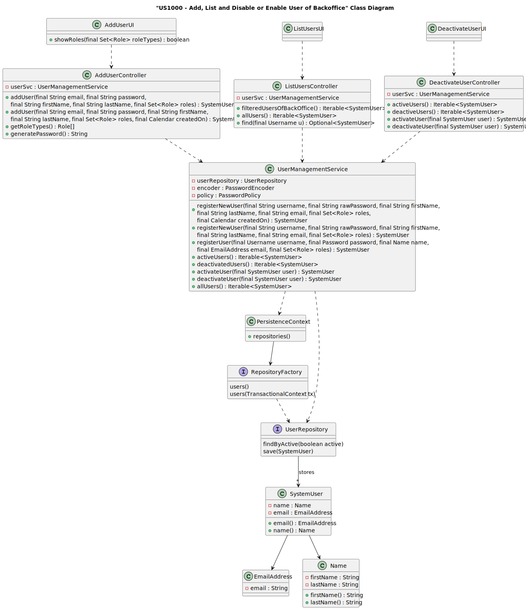
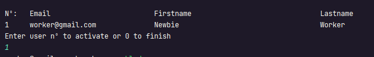
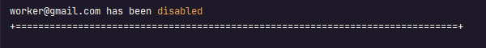

# US 1000


## 1. Context

As part of the development of the software system, it is necessary to implement user management functionalities within the administrative interface. These functionalities are essential to allow administrators to control user access, manage permissions and monitor user activity in the system. This is the first time this task has been assigned for development.

## 2. Requirements

**US 1000** As Administrator, I want to be able to register, disable/enable, and list users of the backoffice

**Acceptance Criteria:** 

- 1000.1. Alternatively this can be achieved by a bootstrap process.
- 1000.2. The First and Last name can't start with a number.
- 1000.3. The Users need to be active by default.

**Customer Specifications and Clarifications:**

> **Question 23:** Does the status change refer to the applicant or the individual application and how does it relate to the enable/disable of users?
>
> **Answer:** The enable/disable of users is only to control access to the system. The status, in the application process, is the status of a candidate's application for a job opening, it is not directly related to the enable/disable of users.

> **Question 72:** Multiple enable/disable (US1000) – Can a user (from the backoffice, for example) be enabled/disabled multiple time
>
> **Answer:** Yes.

> **Question 80:** US1000 – Information about the users - Based on the user story description: "As Administrator, I want to be able to register, disable/enable, and list users of the backoffice.", I have the following questions: 
> 1 - Can there be more than one administrator of the backoffice? 
> 2 - What information about the backoffice users need to be registered?
> 
> **Answer:** Regarding question 1, one admin is enough. Regarding question 2, see Q11.

**Dependencies/References:**

* There is a dependency to "USG007:  "As a Project Manager, I want the system to support and apply authentication and authorization for all its users and functionalities.", since is necessary to be able to Sign Up as admin to create others Users.

**Input and Output Data**

**Input Data:**

* Typed data:
    * First Name
    * Last Name
    * E-mail


* Selected data:
    * User 
    * Role


**Output Data:**
* Display the success of the operation and the data of the registered user (Add User)
* Display the success of the operation and the list the users of the backoffice (List Users)
* Display the success of the operation and the disable or enable action on the specific user (Enable/Disable User)

## 3. Analysis

> **Question 11:** Isn't the statement explicit about the information to be collected for Customers? What information is needed? What about company employees?
>
> **Answer:** In fact, it's not explicit. However, they are referred to in the name of the company and its address in the context of a job opening. As for the users
> (company representative accessing the Customer App), I would say that it will be similar data to the Candidate. As for company employees, I'd say it's important to
> ensure that email is used to identify any user of the system. I think it will be important for each user to have their full name as well as a short username (which should be unique).
> Update on 2024-03-21: The Product Owner has reconsidered and decided that the short username is dispensable since only the email and password should be used to authenticate users.

> **Question 97:** US1000 – Regarding user registration, should these all be considered "enable" by default or should there be an option to "enable/disable" users during the registration process?
>
> **Answer:** In the context of the US1000 it should be possible to activate and deactivate users. I suppose they should be active by default.

### 3.1. Domain Model


## 4. Design


**Domain Class/es:** E-mail, SystemUser

**Controller:** DeactivateUserController, AddUserController, ListUserController

**UI:** DeactivateUserUI, AddUserUI, ListUserUI

**Repository:**	UserRepository

**Service:** UserManagementService, AuthorizationService


### 4.1. Sequence Diagram

**Register User**


**List User**


**Disable User**


**Enable User**


### 4.2. Class Diagram



### 4.3. Applied Patterns

### 4.4. Tests

Include here the main tests used to validate the functionality. Focus on how they relate to the acceptance criteria.


**Before Tests** **Setup of Dummy Users**

```
    public static SystemUser dummyUser(final String email, final Role... roles) {
        final SystemUserBuilder userBuilder = new SystemUserBuilder(new NilPasswordPolicy(), new PlainTextEncoder());
        return userBuilder.with(email, "duMMy1", "dummy", "dummy", email).build();
    }

    public static SystemUser crocodileUser(final String email, final Role... roles) {
        final SystemUserBuilder userBuilder = new SystemUserBuilder(new NilPasswordPolicy(), new PlainTextEncoder());
        return userBuilder.with(email, "CroC1_", "Crocodile", "SandTomb", email).withRoles(roles).build();
    }

    private SystemUser getNewUserFirst() {
        return dummyUser("dummy@gmail.com", Roles.ADMIN);
    }

    private SystemUser getNewUserSecond() {
        return crocodileUser("crocodile@gmail.com", Roles.OPERATOR);
    }

```

**Test 1:** *Verifies if Users are equals*


```
@Test
public void verifyIfUsersAreEquals() {
    assertTrue(getNewUserFirst().equals(getNewUserFirst()));
}
````

**Test 2:** *Verifies if Users are different*


```
@Test
public void verifyIfUsersAreNotEquals() {
    assertFalse(getNewUserFirst().equals(getNewUserSecond()));

}
````

**Test 3:** *Assign to Role Coverage*


```
@Test
public void testAssignToRole() {
    SystemUser user = getNewUserFirst();
    user.assignToRole(Roles.OPERATOR);
    assertTrue(user.hasAny(Roles.OPERATOR));
}
````

**Test 4:** *Unassigned to Role Coverage*


```
@Test
    public void testUnassignRole() {
        SystemUser user = getNewUserSecond();

        assertTrue(user.unassignRole(Roles.OPERATOR));
    }
````

**Test 5:** *Active and Deactivate a User Coverage*


```
@Test
    public void testActivate() {
        SystemUser user = getNewUserFirst();
        user.deactivate(Calendar.getInstance());
        user.activate();
        assertTrue(user.isActive());
    }
````

**Test 6:** *Verify if the User has all Roles Coverage*


```
@Test
    public void testHasAll() {
        SystemUser user = getNewUserSecond();
        user.assignToRole(Roles.OPERATOR);
        assertTrue(user.hasAll(Roles.OPERATOR));
    }
````


## 5. Implementation


### Methods in the ListUsersController
* **Iterable<SystemUser> filteredUsersOfBackOffice()**  this method filters to list all backoffice users


### Methods in the AddUsersController

* **Role[] getRoleTypes()** this method list the roles to choose for the User

* **SystemUser addUser(final String email, final String password, final String firstName,
  final String lastName, final Set<Role> roles, final Calendar createdOn)**  this method send the information to create the User.

* **String generatePassword()** this method automatically generate a password for the User. 


### Methods in the DeactivateUsersController

* **Iterable<SystemUser> activeUsers()** this method list all the activated Users. 

* **Iterable<SystemUser> deactiveUsers()** this method list all the deactivated Users.

* **SystemUser activateUser(final SystemUser user)** this method activate the chosen User.

* **SystemUser deactivateUser(final SystemUser user)** this method deactivate the chosen User. 


## 6. Integration/Demonstration

### Add System User

>**After doing the log in process, to be able to perform this function you need to have admin as your role. Then select the option that says “Add User”.
The process of registering a new system user will then begin. The system will ask you to enter the Email, First and Last Name and choose the role you want to attribute to the 
User:**


>**After that, if there is no error, the new system user data will appear.**


### List Users of the Backoffice

>**After doing the log in process, to be able to perform this function you need to have admin as your role. Then select the option that says “List all Users”.
The process of listing the system users of the backoffice will then begin. The system will filter to only show the backoffice Users if there is any:**


### Disable or Enable System User

>**After doing the log in process, to be able to perform this function you need to have admin as your role. Then select the option that says “Disable or Enable User”.
The process of disable or enable a user will then begin. The system will ask you to enter the option, if you want to enable or disable (if type 0 you will back to main menu):**


>**After that, the system will list the of activated or deactivated [depending of the option you have chosen] if there is any, then you choose which user you want to perform the operation on.**




>**Finally, if all is alright it will appear a message on the screen saying the operation you released and the system user you have chosen.**




[//]: # (## 7. Observations)

[//]: # ()
[//]: # (*This section should be used to include any content that does not fit any of the previous sections.*)

[//]: # ()
[//]: # (*The team should present here, for instance, a critical perspective on the developed work including the analysis of alternative solutions or related works*)

[//]: # ()
[//]: # (*The team should include in this section statements/references regarding third party works that were used in the development this work.*)