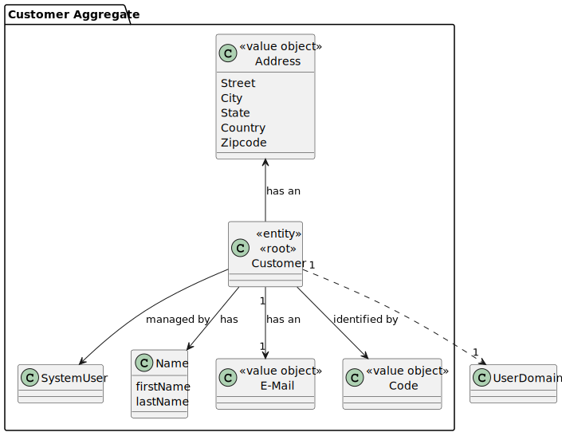
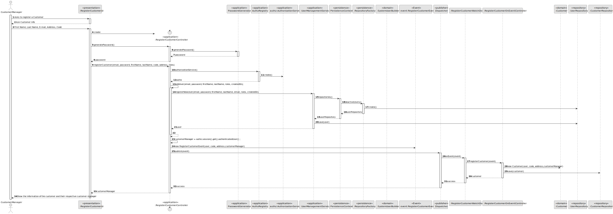
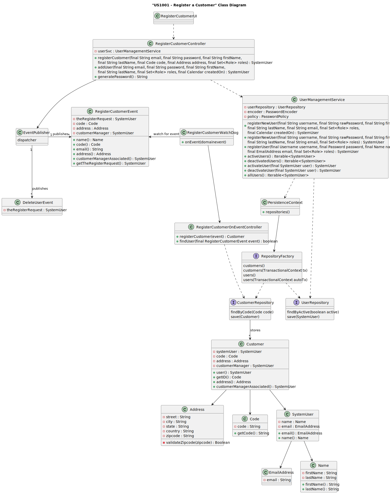
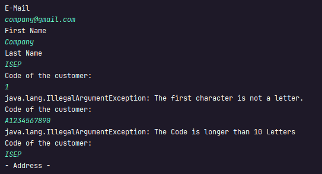
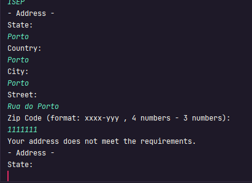
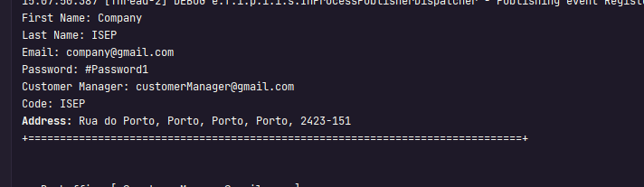

# US 1001


## 1. Context

The task at hand is to enable Customer Managers to register new customers and automatically generate user accounts for them within the system. This is the first time this feature is being implemented, so we're starting from scratch to design and develop a seamless process for customer registration and account creation.

## 2. Requirements

**US 1001** As Customer Manager I want to register a customer and that the system automatically creates a user for that customer

**Acceptance Criteria:**

- 1001.1. Alternatively this can be achieved by a bootstrap process.
- 1001.2. The Code need to start with a letter and can't be longer than 10 characters .
- 1001.3. The zipcode of the address of the job should follow the portuguese standard;


**Customer Specifications and Clarifications:**

> **Question 104: Is creating an account for the customer done by manually entering the customer's email and name or is it expected to have a list of 
> customers not registered in the system to use?** 
> 
> **Answer: I didn't quite understand the concept of unregistered customers. I don't think this concept exists. 
> US 1001 indicates that you want to register a customer. When registering, the customer must also create a user so that 
> the customer can access the Customer App.** 
 
**Dependencies/References:**

* There is a dependency to "US1000:  "As Administrator, I want to be able to register, disable/enable, and list users of the backoffice.", since is necessary to be able to create a User when we create a Customer.

**Input and Output Data**

**Input Data:**

* Typed data:
    * First Name
    * Last Name
    * E-mail
    * Code
    * Address
        * street
        * city
        * state
        * country
        * zip-code


* Selected data:
    * None


**Output Data:**
* Display the success of the operation and the data of the registered customer


## 3. Analysis


> **Question 11: Does the statement not explain the information to be collected for Customers? 
> What information is needed? And what about company employees?**
>
> **Answer: In fact, this is not explicit. However, they are mentioned in the name of the company and its address within 
> the scope of a job opening. As for users (representative of the company that accesses the Customer App) I would say that 
> it will be similar data to that of the Candidate. When it comes to company employees, I would say that it is important to 
> ensure that email is used to identify any user of the system. I think it will be important for each user to have their full 
> name as well as a short user name (which must be unique). 
> Update on 2024-03-21: The Product Owner reconsidered and decided that the short user name is unnecessary since only email 
> and password should be used to authenticate users**


> **Question 35: Customer must have an address and company name or if this information is enough to be in the job opening?**
>
> **Answer: We must register the customer's name and address. For each job opening, the address can be specific (and different from the customer's address).**

> **Question 112: Is it correct to assume that the customer is automatically assigned to the customer manager who registered it?**
>
> **Answer: Yes. Within the scope of this project we will assume that this should happen.**

> **Question 122: US 1001 - Email assigned to the Customer - In US 1001 it is requested that the creation of a User through the created CustomerEntity is automatic. However, to create a User an email is required. Does it allow an email to be requested from the Manager, to be associated with the entity? The password will already be generated automatically, so it would also be possible to automatically generate an email.**
>
> **Answer: For this US it makes sense to assume that the Customer Manager knows the email to be used for this Customer and can enter it. As in other similar situations, you can assume that the password is generated by the system and that there is a way for the user to know this password, but that it is outside the current scope of the system. I didn't understand the reference to CustomerEntity. What is it?**

> **Question 135: US1001 - Customer Code - Regarding the format of the customer code, in all examples provided, this is an acronym/acronym with capital letters (e.g. "ISEP", "IBM"). Can it only have this format or can it contain numbers and lowercase letters?**
> 
> **Answer: In Q22, a maximum of 10 characters is suggested. I think it would be only capital letters and could still have digits (0-9), but always starting with a letter**


### 3.1. Domain Model


## 4. Design

**Domain Class/es:** Customer, E-mail, Address, SystemUser, Code

**Controller:** RegisterCustomerController

**UI:** RegisterCustomerUI

**Repository:** CustomerRepository, UserRepository

**Event:** RegisterCustomerEvent, RegisterCustomerWatchDog, RegisterCustomerOnEventController

**Service:** UserManagementService, AuthorizationService

### 4.1. Sequence Diagram

**Register Customer**


### 4.2. Class Diagram



### 4.3. Applied Patterns

### 4.4. Tests


**Before Tests** **Setup of Dummy Users**

```
    public static SystemUser dummyUser(final String email, final Role... roles) {
        final SystemUserBuilder userBuilder = new SystemUserBuilder(new NilPasswordPolicy(), new PlainTextEncoder());
        return userBuilder.with(email, "duMMy1", "dummy", "dummy", email).build();
    }

    public static SystemUser crocodileUser(final String email, final Role... roles) {
        final SystemUserBuilder userBuilder = new SystemUserBuilder(new NilPasswordPolicy(), new PlainTextEncoder());
        return userBuilder.with(email, "CroC1_", "Crocodile", "SandTomb", email).withRoles(roles).build();
    }

    public static SystemUser customerManagerUser(final String email, final Role... roles) {
        final SystemUserBuilder userBuilder = new SystemUserBuilder(new NilPasswordPolicy(), new PlainTextEncoder());
        return userBuilder.with(email, "customerM", "dummy", "dummy", email).build();
    }

    private SystemUser getNewUserFirst() {
        return dummyUser("dummy@gmail.com", Roles.ADMIN);
    }

    private SystemUser getNewUserSecond() {
        return crocodileUser("crocodile@gmail.com", Roles.OPERATOR);
    }

    private SystemUser getCustomerManager() {
        return customerManagerUser("customerM@gmail.com", Roles.CUSTOMER_MANAGER);
    }

```

**Test 1:** *Test Customer Creation*


```
@Test
    public void testCustomerConstructor() {
        SystemUser user = getNewUserSecond();
        SystemUser userCustomerManager = getCustomerManager();
        Code code = new Code("ABC123");
        Address address = new Address("Street1", "City1", "State1", "Country1", "1234-232");

        Customer customer = new Customer(user, code, address, userCustomerManager);

        assertNotNull(customer);
        assertEquals(user, customer.user());
        assertEquals(code, customer.getId());
        assertEquals(address, customer.address());
    }
````

**Test 2:** *Change Address of the Customer Coverage*


```
 @Test
    public void testChangeAddress() {
        Address address1 = new Address("Street1", "City1", "State1", "Country1", "1234-232");
        Address address2 = new Address("Street2", "City2", "State2", "Country2", "5432-232");

        SystemUser user = getNewUserSecond();
        SystemUser userCustomerManager = getCustomerManager();
        Code code = new Code("ABC123");
        Customer customer = new Customer(user, code, address1, userCustomerManager);

        assertEquals(address1, customer.address());

        customer.changeAddress(address2);

        assertEquals(address2, customer.address());
    }
````

**Test 3:** *Verify if the customers are equals*


```
 @Test
    public void testEquals() {
        SystemUser user1 = getNewUserFirst();
        SystemUser user2 = getNewUserSecond();
        SystemUser userCustomerManager = getCustomerManager();
        Code code1 = new Code("ABC123");
        Code code2 = new Code("DEF456");
        Address address1 = new Address("Street1", "City1", "State1", "Country1", "1234-232");
        Address address2 = new Address("Street2", "City2", "State2", "Country2", "5432-232");


        Customer customer1 = new Customer(user1, code1, address1, userCustomerManager);
        Customer customer2 = new Customer(user1, code1, address1, userCustomerManager);
        Customer customer3 = new Customer(user2, code2, address2, userCustomerManager);

        assertTrue(customer1.equals(customer2)); // Teste de igualdade com outro objeto igual
        assertFalse(customer1.equals(customer3)); // Teste de igualdade com outro objeto diferente
    }
````


**Test 4:** *Customer's HashCode Coverage*


```
 @Test
    public void testHashCode() {
        SystemUser user = getNewUserSecond();
        SystemUser userCustomerManager = getCustomerManager();
        Code code = new Code("ABC123");
        Address address = new Address("Street1", "City1", "State1", "Country1", "1234-232");


        Customer customer = new Customer(user, code, address, userCustomerManager);
        int hashCode1 = customer.hashCode();
        int hashCode2 = new Customer(user, code, address, userCustomerManager).hashCode();

        assertEquals(hashCode1, hashCode2); // hashCode deve ser igual para objetos iguais
    }
````

**Test 5:** *Customer's setId and hasIdentity Coverage*


```
  @Test
    public void testId() {
        SystemUser user = getNewUserFirst();
        SystemUser userCustomerManager = getCustomerManager();
        Code code1 = new Code("ABC123");
        Code code2 = new Code("DEF456");
        Address address = new Address("Street1", "City1", "State1", "Country1", "1234-232");


        Customer customer = new Customer(user, code1, address, userCustomerManager);

        customer.setId(code2);

        assertTrue(customer.hasIdentity(code2)); // Teste de igualdade com outro objeto igual
    }
````

**Test 6:** *Change Customer User*


```
   @Test
    public void testChangeUser() {
        SystemUser user1 = getNewUserFirst();
        SystemUser user2 = getNewUserSecond();
        SystemUser userCustomerManager = getCustomerManager();
        Code code = new Code("ABC123");
        Address address = new Address("Street1", "City1", "State1", "Country1", "1234-232");


        Customer customer = new Customer(user1, code, address, userCustomerManager);
        customer.changeUser(user2);

        assertTrue(customer.sameAs(user2)); // Teste de igualdade com outro objeto igual
    }

````

**Test 7:** *Code Methods Coverage*


```
    @Test
    public void testCodeId() {
        SystemUser user1 = getNewUserFirst();
        SystemUser user2 = getNewUserSecond();
        SystemUser userCustomerManager = getCustomerManager();
        Code code = new Code("ABC123");
        Code code2 = new Code("DEF456");
        String code3 = "GHI123";
        Address address = new Address("Street1", "City1", "State1", "Country1", "1234-232");


        Customer customer = new Customer(user1, code, address, userCustomerManager);
        customer.getId().setCode(code3);
        Code code4 = new Code(customer.getId().getCode());

        assertEquals(0, customer.compareTo(code4)); // Teste de igualdade com outro objeto igual
    }

````


## 5. Implementation

### Methods in the Controller

* **Role[] getRoleTypes()** this method list the roles to choose for the User

* **SystemUser addUser(final String email, final String password, final String firstName,
  final String lastName, final Set<Role> roles, final Calendar createdOn)**  this method send the information to create the User.

* **public SystemUser registerCustomer(final String email, final String password, final String firstName,
  final String lastName, final Code code, final Address address, final Set<Role> roles)** this method send the information to create the Customer.


## 6. Integration/Demonstration

>**After doing the log in process, to be able to perform this function you need to have admin or customer manager as your role. Then select the option that says “Register Customer”.
The process of registering a new system user will then begin. The system will ask you to enter the Email, First and Last Name, Code of company and Address:**



> **If the submitted value is not valid then the system will ask again for the value until it is valid.**

>**After the Code, will ask to input the Address of the customer.**



> **If the submitted value is not valid then the system will ask again for the value until it is valid.**

> **Finally,  if all is alright it will appear a message on the screen saying the information of the customer registered**
> 



[//]: # (## 7. Observations)

[//]: # ()
[//]: # (*This section should be used to include any content that does not fit any of the previous sections.*)

[//]: # ()
[//]: # (*The team should present here, for instance, a critical perspective on the developed work including the analysis of alternative solutions or related works*)

[//]: # ()
[//]: # (*The team should include in this section statements/references regarding third party works that were used in the development this work.*)