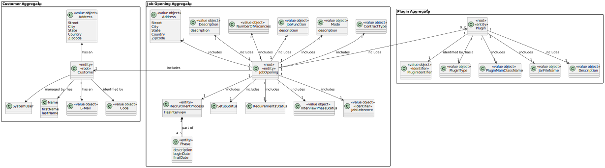

# US 1002

## 1. Context

In this User Story, the goal is to register Job Openings, as a Customer Manager.

## 2. Requirements

**US 1002** As Customer Manager, I want to register a job opening.

**Acceptance Criteria:**

- 1002.1. Alternatively this can be achieved by a bootstrap process;

- 1002.2. The zipcode of the address of the job should follow the portuguese standard;

- 1002.3. The Number of Vacancies cannot be less than or equal to zero;

- 1002.4. The list of customers shown for the user to chose, must be the ones that the current customer manager/admin logged in is responsible for

**Customer Specifications and Clarifications:**

> **Question:** How does the Customer Manager select the model to use for the interviews?
>
> **Answer:** It is accepted that when templates are registered in the system (the "plugins") they are identified with a name or description. For example, "Supermarket Cashier Interview Template" or "Junior Backend Java Programmer Interview Template". The Customer manager is supposed to select a template from a possible list of templates.


> **Question:** In the context in which the Customer Manager registers a job offer, how are the requirements for that job offer selected/defined?
>
> **Answer:** The Customer Manager registers the job opening (US 1002) and then (normally) selects which requirements specification is suitable for that job opening. The requirements specification will be one that has been "created" by the language engineer and registered in the system


> **Question:** Could we use the same interview model for more than one job opening?
>
> **Answer:** Yes. In US1011, the Customer manager selects the interview model to use in the interviews for a job opening. In other words, there will only be one interview model to use in the interviews for that job opening.


> **Question:**  When the Customer Manager registers a job offer, does he create the requirement specifications and interview models or is he given a list of these to select from?
>
> **Answer:**  There is US1002 and US1009 and US1011. I think it's clear what each one is responsible for. The creation of interview models and requirements is a specific use case with a specific US to register the respective plugins in the system (US1008).


> **Question:**  when is a job opening considered valid? Given the features 1002, 1007, 1009, we had a question about job openings and how they are set up. In US1002, we are supposed to register a job opening and only then, in US1009, should we select the requirements specifications for the given job opening. That said, when registering the job opening, it wouldn't have all the mandatory information as required. Therefore, should there be a direct link between these user stories so that, when registering, we automatically select the requirements, thus obtaining a valid job opening? In addition, we would like to clarify whether the recruitment process is mandatory for a job opening to be valid.
>
> **Answer:** The product owner is not an expert in the solution domain (they only have knowledge of the problem) but, with regard to the first question, he suggests that perhaps user stories are not (may not be) “distinct” menu options. As for the second question (recruitment process), I think it's also more related to the solution than to the problem, so I'm not going to suggest anything that might complicate things rather than clarify them.


> **Question:** A customer manager is responsible for creating job openings for the customers he is responsible for. When creating a job opening, how does he determine the customer for that job opening? Does he select a customer from among those he is responsible for?
>
> **Answer:** Yes, as you indicate.


> **Question:** In US1002, when registering a job opening, is it imperative to also select the job requirement and/or the recruitment phases?
>
> **Answer:**  These are different US (US1002, US1007 and US1009) and, from my point of view, they can be carried out at different times. I'd just like to point out that, of course, I want the system to be in a consistent state at all times.


> **Question:** Mode of Work and Type of Contract - In a job opening, are the type of contract and the mode of work fixed elements, in that the types shown in the documentation are static and do not change, or could there be more types of these two elements?
>
> **Answer:** The most “normal” ones will be those that appear in the documentation. But I think it makes sense for the system to accept different ones if the Customer Manager so wishes.


> **Question:** Are the phone number and zipcode checks only made for Portuguese domains, or do we have to program according to the country concerned?
>
> **Answer:** Just take the Portuguese case.


**Dependencies/References:**


* There is a dependency to "US1000: As Administrator, I want to be able to register, disable/enable, and list users of the backoffice", since there is a need to have users registered in the system to be able to do any kind of action.


* There is a dependency to "US1001: As Customer Manager I want to register a customer and that the system automatically creates a user for that customer", since one attribute of Job Opening is the Customer(company), so in order to register the job opening, there must first be at least one customer.


**Input and Output Data**

**Input Data:**

* Typed data:
    * Number of Vacancies
    * Job Function
    * Description
    * Address
      * street
      * city
      * state
      * country
      * zip-code


* Selected data:
    * company (customer)
    * Mode
    * Contract Type

**Automatic Data:**
* JobReference
* RegistrationDate

**Output Data:**
* Display the success of the operation  and the data of the registered job openings


## 3. Analysis

* In this User Story, the customer manager only registers a job opening (with the data: Customer(company), Number of Vacancies, Job function, Mode, Contract Type,Address(street, city, state, country, zip-code), Description, Job Reference and Registration Date), without selecting the plugins. The registration Date and the Job reference are set automatically.


* The customer Manager logged in the system is responsible for some Customers, and the Job Opening registered must have a Customer associated that is part of those that the customer Manager is responsible for. 

### 3.1. State Diagram


### 3.2. Domain Model



## 4. Design

**Domain Class/es:** JobOpening, Customer, NumberOfVacancies, Address, Description, JobFunction, JobReference, Mode, ContractType, SystemUser, Name, EmailAddress, Code

**Controller:** RegisterJobOpeningController

**UI:** RegisterJobOpeningUI

**Repository:**	JobOpeningRepository, CustomerRepository

**Service:** AuthorizationService

### 4.1. Sequence Diagram


### 4.2. Class Diagram


### 4.3. Applied Patterns

### 4.4. Tests

**Test 1:** Verifies if the JobOpening object is correctly instantiated with the provided parameters..

```
@Test
    public void testCreateOpening() {
        SystemUser user = getNewUserSecond();
        SystemUser userCustomerManager = getCustomerManager();
        Code code = new Code("ABC123");
        Address address = new Address("Street1", "City1", "State1", "Country1", "1234-232");

        Customer customer = new Customer(user, code, address, userCustomerManager);


        NumberOfVacancies nv = new NumberOfVacancies(1);
        JobFunction jf = new JobFunction("Testing Unit");
        Mode m = Modes.HYBRID;
        ContractType ct = ContractType.valueOf(ContractTypes.FULL_TIME);
        Address ad = new Address("Colorado", "United States of America", "Brownstone", "Willow Street", "4444-111");
        Description d = new Description("Testing Unit");
        Calendar c = Calendar.getInstance();
        JobOpening first = new JobOpening(nv, jf, m, ct, ad, customer, d, c);

        assertNotNull(first);
        assertEquals(nv, first.numberOfVacancies());
        assertEquals(jf, first.jobFunction());
        assertEquals(ct, first.contractType());
        assertEquals(ad, first.address());
        assertEquals(d, first.description());
        assertEquals(c, first.registrationDate());
    }
````

**Test 2:** Verifies if the method equals() in the JobOpening class behaves as expected, correctly determining whether two JobOpening objects are equal based on their attribute values.
```
@Test
    public void testEqualsOpening() {
        SystemUser user = getNewUserSecond();
        SystemUser userCustomerManager = getCustomerManager();
        Code code = new Code("ABC123");
        Address address = new Address("Street1", "City1", "State1", "Country1", "1234-232");

        Customer customer = new Customer(user, code, address, userCustomerManager);


        NumberOfVacancies nv = new NumberOfVacancies(1);
        JobFunction jf = new JobFunction("Testing Unit");
        Mode m = Modes.HYBRID;
        ContractType ct = ContractType.valueOf(ContractTypes.FULL_TIME);
        Address ad = new Address("Colorado", "United States of America", "Brownstone", "Willow Street", "4444-111");
        Description d = new Description("Testing Unit");
        Calendar c = Calendar.getInstance();
        JobOpening first = new JobOpening(nv, jf, m, ct, ad, customer, d, c);
        JobOpening second = new JobOpening(nv, jf, m, ct, ad, customer, d, c);

        assertEquals(first,second);
    }
````

**Test 3:** Verifies if the method equals() in the JobOpening class behaves as expected, correctly determining whether two JobOpening objects are not equal based on their attribute values.
```
 @Test
    public void testDifferentOpening() {
        SystemUser user = getNewUserSecond();
        SystemUser userCustomerManager = getCustomerManager();
        Code code = new Code("ABC123");
        Address address = new Address("Street1", "City1", "State1", "Country1", "1234-232");

        Customer customer = new Customer(user, code, address, userCustomerManager);


        NumberOfVacancies nv = new NumberOfVacancies(1);
        JobFunction jf = new JobFunction("Testing Unit");
        Mode m = Modes.HYBRID;
        ContractType ct = ContractType.valueOf(ContractTypes.FULL_TIME);
        Address ad = new Address("Colorado", "United States of America", "Brownstone", "Willow Street", "4444-111");
        Address ad2 = new Address("Colorado", "United States of America", "Brownstone", "Tanglewood Drive", "4444-122");
        Description d = new Description("Testing Unit");
        Calendar c = Calendar.getInstance();
        JobOpening first = new JobOpening(nv, jf, m, ct, ad, customer, d, c);
        JobOpening second = new JobOpening(nv, jf, m, ct, ad2, customer, d, c);

        assertNotEquals(first,second);
    }
````


## 5. Implementation


### Methods in the Controller
* **public JobOpening registerJobOpening(final NumberOfVacancies numberOfVacancies, final JobFunction jobFunction, final Mode mode, final ContractType contractType, final JobReference jobReference, final Address address, final Customer companyName, final Description description)** - 
this method registers a new job opening


* **public List<Customer> filterCustomerBySystemUser()** - this method filters the list of customers in the system by one specific customer manager. Returns then a List of Customers.


* **public Integer getLastJobReference()** - this method gets the last job reference registered in the system, which means it gets the last job opening registered and gets its job reference. Returns an Integer that is that Job Reference.


* **public JobReference generateNextJobReference(Integer lastJobReference)** - this method, using the method above, adds a job reference to the job opening being registered, since it must be sequential. Returns that Job Reference. 

## 6. Integration/Demonstration


After doing the log in process, to be able to perform this function you need to have admin or customer manager as your role. Then select the option that says “Register Job Opening”.
The process of registering a new job opening will then begin. A list of customers (company name, code and email) will be printed on the screen and the user must select one.


If the submitted value is not valid (letter, a symbol or a number greater or smaller than the ones that appear on the lis), then the system will ask again for the value until it is valid.

After selecting the customer (company) the system will ask you to enter the number of vacancies:


If the submitted value is not valid (letter, a symbol or a number greater or smaller than the ones that appear on the lis), then the system will ask again for the value until it is valid.

Then the system will ask to enter the job function, which has no limit on the values you can enter:
A list of modes is then displayed, and the user is asked to select an option:


If the submitted value is not valid (letter, a symbol or a number greater or smaller than the ones that appear on the lis), then the system will ask again for the value until it is valid.
the same for contract types:


the user is then asked to type in the address, which is divided into street, city, state, country and zip-code


If the value of the zip-code is not correct the system will keep asking to enter the value until it is valid (with 4 numbers, a "-" and following 3  numbers):


Finally, if there are no problems, the job opening is registered and the system displays the data of the job opening created on the screen:


[//]: # ()
[//]: # (## 7. Observations)

[//]: # ()
[//]: # (*This section should be used to include any content that does not fit any of the previous sections.*)

[//]: # ()
[//]: # (*The team should present here, for instance, a critical perspective on the developed work including the analysis of alternative solutions or related works*)

[//]: # ()
[//]: # (*The team should include in this section statements/references regarding third party works that were used in the development this work.*)