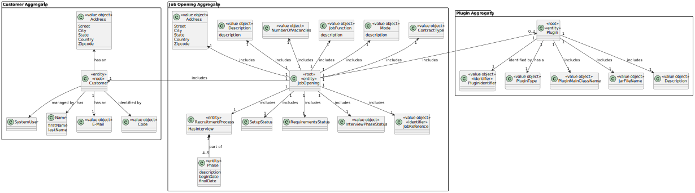

# US 1003

## 1. Context

In this User Story, the goal is to list Job Openings, as a Customer Manager.

## 2. Requirements


**US 1003** As Customer Manager, I want to list job openings.

**Acceptance Criteria:**

- 1003.1. The job openings must be ordered by job reference (smaller to bigger)
- 1003.2. It should be implemented a way to filter the job openings by its company (customer), by its registration date or show all the job openings
- 1003.3. All the job openings listed must be the ones that the costumer manager logged in is responsible for


**Customer Specifications and Clarifications:**

> **Question1:** In us1003 you are asked to list job openings, is there a criterion for which ones to list? Or is it the whole system?
>
> **Answer1:**  I suppose being able to filter by Customer and date would be useful. Also being able to filter only the active ones or all of them seems useful to me


> **Question2:** With regard to an earlier question, it was mentioned that “you can filter by Customer” in this US. In this case, what way will the Customer Manager use to filter Job Openings by Costumer (name, email,...)? And when you say “you can filter by date”, do you mean a specific date or a time interval?
>
> **Answer2:** The Customer is typically a company and has a name. The existence of a customer code has also been mentioned. As for the filter by date, if you're in the role of the customer manager who has to consult job openings, does it make sense for it to be for one day? In other words, he would have to know on which day he registered the job opening he is searching for...


> **Question3:**  The answer to question Q1 raised some doubts about a job opening in the “active” state. When does a job opening become active? Is it when it is created and has a set of requirements associated with it? Is it when it is linked to an ongoing recruitment process? We'd appreciate some clarification.
>
> **Answer3:**  In the context of Q1, the reference to active appears in the context of dates. A job opening whose process has already ended is not active.


> **Question4:** Regarding the listing of job openings, a customer manager can list all job openings or only those assigned to him. In other words, the job openings are assigned to a specific customer manager, and he can only access his list of job openings?
>
> **Answer:** See Q1. I think it makes sense to list only “your” job openings.


> **Question5:** The client clarified the status of a job opening in questions Q68 and Q95. He said that a job opening ceased to be active when its recruitment process ended. However, what is the status of job openings that have already been registered but do not yet have a recruitment process associated with them?
>
> **Answer5:**  I don't know what to say about the state (name of state) they're in after they've been registered but don't yet have a process. But I can add that if they don't have a process, then they don't have dates for the phases of the process and, therefore, it seems to me that they haven't entered the application phase yet, so nobody is “officially” aware of this job offer and there shouldn't be any applications for it.

 
**Dependencies/References:**

* There is a dependency to "US1000: As Administrator, I want to be able to register, disable/enable, and list users of the backoffice", since there is a need to have users registered in the system to be able to do any kind of action.


* There is a dependency to "US1001: As Customer Manager I want to register a customer and that the system automatically creates a user for that customer", since one attribute of Job Opening is the Customer(company), so in order to register the job opening, there must first be at least one customer.


* There is a dependency to "US1002:  As Customer Manager, I want to register a job opening.", since at least one job Opening must be registered in the system so that the operator can list a job opening.

**Input and Output Data**

**Input Data:**

* Typed data:
    * none

* Selected data:
    * filter option to filter the list of jobOpening 
    * the customer name if the filter option is by Customer
    * the registration date if the filter option is by registration date

**Output Data:**
* List of registered job openings, according to the filter option chosen.


## 3. Analysis

* Filter Job Openings by Customer, Registration Date or show all the Job Openings

* The job opening to be listed must be the ones associated with customers that the customer manager currently logged in is responsible for

### 3.1. Domain Model



## 4. Design

**Domain Class/es:** JobOpening, Customer, RegistrationDate 

**Controller:** ListJobOpeningController

**UI:** ListJobOpeningUI

**Repository:**	JobOpeningRepository

**Service:** AuthorizationService


### 4.1. Sequence Diagram


### 4.2. Class Diagram


[//]: # (### 4.3. Tests)

[//]: # ()
[//]: # (Include here the main tests used to validate the functionality. Focus on how they relate to the acceptance criteria.)

[//]: # ()
[//]: # (**Test 1:** *Verifies that it is not possible to ...*)

[//]: # ()
[//]: # (**Refers to Acceptance Criteria:** G002.1)

[//]: # ()
[//]: # ()
[//]: # (```)

[//]: # (@Test&#40;expected = IllegalArgumentException.class&#41;)

[//]: # (public void ensureXxxxYyyy&#40;&#41; {)

[//]: # (	...)

[//]: # (})

[//]: # (````)

## 5. Implementation

### Methods in the Controller

* **public List<Calendar> allJobOpeningRegistrationDates()** - this method gets all the Registration Dates, by going through all the job openings associated with the customer manager logged in and getting all the different dates. 


* **public List<JobOpening> filterJobOpeningsBySystemUser()** - this method filters the job openings registered in the system by the associated customer manager logged in at the time.


* **public List<Customer> filterCustomersBySystemUser()** - this method filters the customers registered in the system by the associated customer manager logged in at the time.


* **public List<JobOpening> filterJobOpeningsByCustomer(Customer customer)** - this method filters the job openings(already filtered by system user) by the associated customer(also in a list of already filtered customers).


* **public List<JobOpening> filterJobOpeningsByRegistrationDate(Calendar registrationDate)** - this method filters the job openings(already filtered by system user) by registration date (listed before).

## 6. Integration/Demonstration

After doing the log in process, to be able to perform this function you need to have admin or customer manager as your role. Then select the option that says “List Job Openings”. Then there will appear a menu with the different types of filter options to chose from.
The menu is the following:

The user needs to type a number (1, 2 or 3), other than these numbers, nothing will happen, and the user will be asked to type the wanted number again, until the value is valid(it cannot be a letter, a symbol or a number greater or smaller than the ones that appear on the list).


If option 1 is selected, the system will display all the job openings that the user currently logged in is responsible for:


If option 2 is selected, the system will ask to select a customer (registered in the system, managed by the customer Manager logged in).
If the number submitted is not valid(it cannot be a letter, a symbol or a number greater or smaller than the ones that appear on the list), then the user will be asked to type the wanted number again, until the value is valid.


If option 3 is selected, the system will ask to select a registration date(from the job openings registered).
If the number submitted is not valid(it cannot be a letter, a symbol or a number greater or smaller than the ones that appear on the list), then the user will be asked to type the wanted number again, until the value is valid.


Also, in every circumstance the job openings will be listed ordered by job reference, from smallest to largest.

[//]: # ()
[//]: # ()
[//]: # (## 7. Observations)

[//]: # ()
[//]: # (*This section should be used to include any content that does not fit any of the previous sections.*)

[//]: # ()
[//]: # (*The team should present here, for instance, a critical perspective on the developed work including the analysis of alternative solutions or related works*)

[//]: # ()
[//]: # (*The team should include in this section statements/references regarding third party works that were used in the development this work.*)