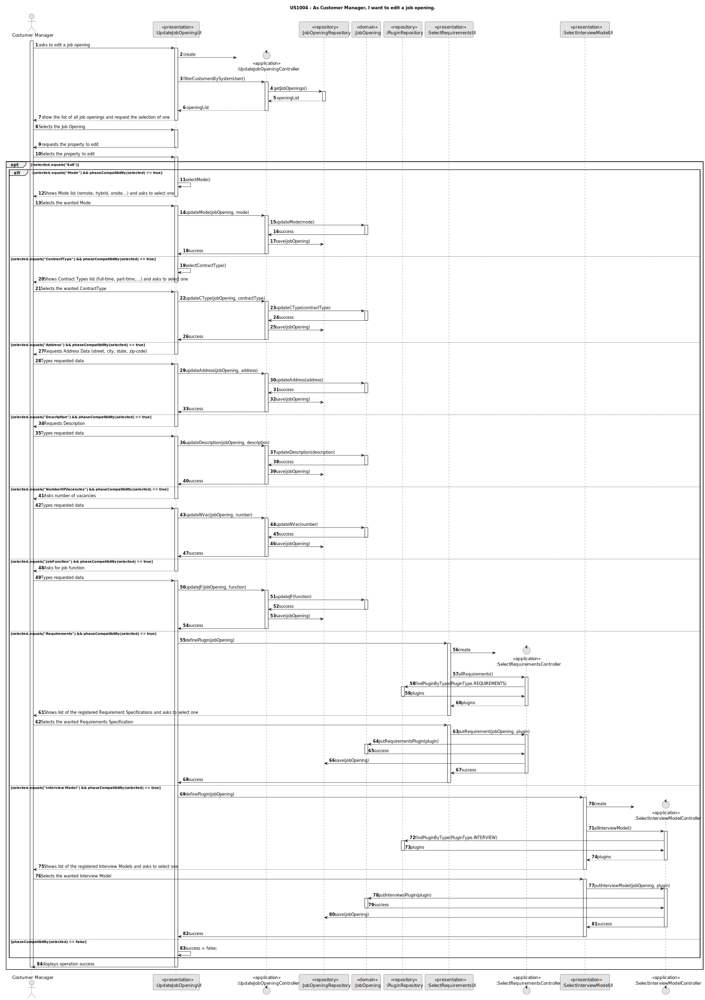
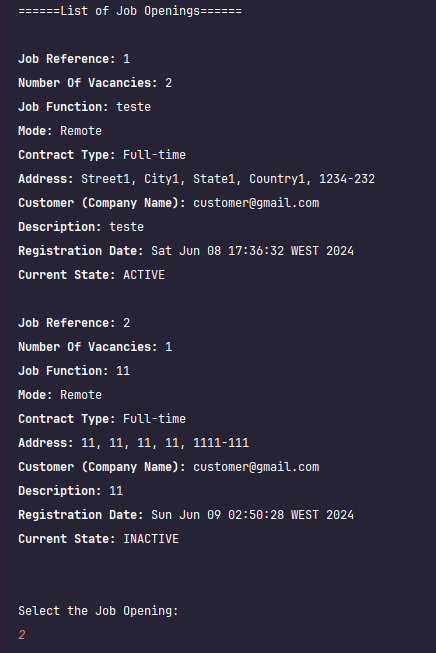
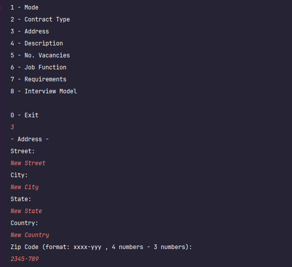
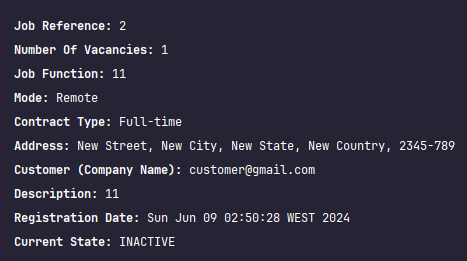
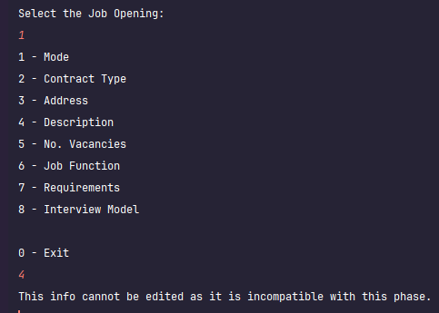

# US 1004

## 1. Context

This User Story's goal is to edit/update the properties of a job opening, post-creation.

## 2. Requirements

**US 1004**  As Customer Manager, I want to edit a job opening.

**Acceptance Criteria:**

* 1004.1. The changes must be compatible with the moment. That is, the system must check what phase the Opening is in and validate if the property the user is trying to edit can indeed be edited at that time.
* 1004.2. The only property that cannot be changed at all, no matter the phase, is the job reference.

**Customer Specifications and Clarifications:**

> **Question:**  Following US 1004 to allow editing a job opening, we are assuming that it is allowed to change: Number of vacancies; Household; Contract Type('FULL_TIME', 'PART_TIME'); Mode('ON_SITE','REMOTE'); Description; Function. Are we following the correct line of reasoning, or is it necessary to change the list to include other additional information or delete some of this list?
>
> **Answer:**  From my point of view, it should be possible to change “everything” except the job reference itself. Consideration must be given to maintaining the system's state of consistency.

> **Question:** When the Costumer Manager wants to edit a Job Opening, is he supposed to choose which Job Opening he wants to edit based on a reference search?
>
> **Answer:** The question refers a little to good UI/UX practices. The context indicated in the question refers to a situation in which the user has to identify the entity/object they want to edit. It can be assumed that the user knows this identifier. But, in terms of UX/UI, it must be possible to obtain this identification through other means (especially because it is an identification generated by the system). I think that, for this particular case, there is already a US that allows this to be done.

> **Question:** In which or until what recruitment phases of a Job Opening can you edit its information? And what information can be edited within a Job Opening?
>
> **Answer:** The changes must be compatible with the “moment” in which we are in this job opening. For example, it doesn't make sense to change the contract type if we are already receiving applications. These applications were made according to a description of the job offer and it makes no sense to change it after people have applied. But, for example, it must be possible to change the job requirements specification (refers to another US) while people apply, as it is a technical aspect, which is not public knowledge. Therefore, these types of concerns must be taken into account

> **Question:** With each edit made to any information in a Job Opening, is it necessary to record the date and time of the edit, as is the case when registering the Job Opening?
>
> **Answer:** I don't remember the indication to record date and time when registering a job opening. But on this topic, and in general, it is common to have a record of the user who created or last updated a “record” in the system. Another good practice is for applications to have log systems for situations like this. But I don't remember there being any non-functional requirement that mentions a logging system for our project (except for the application file bot).

> **Question:** Edit a Job Opening (Active Since and Customer) – Taking into account us1004 has already mentioned in past questions that it should be possible to edit all job Opening attributes, except the job Reference. However, I wonder if it would make sense to edit the active date (active since) of a Job Opening since it is a unique record of when the Job Opening became active. I also ask if it would also be possible to edit the Customer associated with the Opening job, since the Job Reference is based on the Customer. Given the impossibility of editing the Job Reference, I wonder if it would make sense to edit the customer as well.
>
> **Answer:** I think it refers to Q144. I agree with your concerns. This is what I am referring to when in Q144 I write “Maintaining the system’s state of consistency must be taken into account.”

> **Question:** Attribute Editing Question – As you explained in question 154 in the question file, you mentioned that it would not make sense to edit the Contract Type if we were already in the Application phase. I wonder if it would also make sense for the Mode not to be editable at this stage, as well as your address and role (Like "Front-end Programmer"), since these are attributes that a candidate has in mind when applying for a Job Opening . I also ask if the Job Requirements should not be editable from the screening phrase (just like the Interview Model in the Interviews phase) since this is the phase in which they are verified. Finally, I ask: Is the number of vacancies editable at all stages?
>
> **Answer:** In general, what you say is correct. The public information of a job opening must not be changed after it is made public. As for non-public and more technical information, I think it is acceptable that they can be changed if they do not result in possible incoherent states of the system.

> **Question:** Question Editing Job Requirements and Interview Model – As explained in previous questions, it is possible to edit an Interview Model and Job Requirements of a jobOpening if you are in the application phase (for example). I ask if it would be possible to edit their name and description for each one. I also ask if you would or would be interested in editing the name of the class that implements the interface that performs the service for each Plugin: "ReqEvaluator" for Job Requirements in my case.
>
> **Answer:** The question is a little technical for me. For me, editing makes sense as long as it maintains the consistency of the system. As for the more technical aspects, I don't know how to answer.

> **Question:** Regarding the editing of a Job Opening, one of the rules that seemed clear regarding what can be modified was: public information from a Job Opening, which is available to potential candidates, cannot be modified during/after the phase in which We are accepting applications. According to the System Specification document ("The recruitment process for a job opening follows a sequence of phases: application; resume screen; interviews; analysis; result.") the team structured the Job Openings so that the first possible phase for a Job Opening is for applications. Therefore, I ask you if it seems right to include a new preliminary phase, in which the aforementioned changes can be made?
>
> **Answer:** I would say this would be a solution related option. Maybe it’s a solution to the “problem” you describe, but I don’t think it’s the only solution.

> **Question:** Still regarding the editing of a Job Opening, the following table was created which represents a suggestion of which elements of a Job Opening should be editable for each of the phases (considering the previously suggested preliminary phase). Please let me know if this approach meets your wishes or if you feel there is a need to change something to better accommodate the purpose of the feature.
>
> **Answer:** It seems appropriate to me, but I'm answering without understanding the entire solution.

> **Question:** Edit current phase - By "editing a JobOpening" would it be possible to edit your current phase in this user story?
>
> **Answer:** The intention of this US is to allow the editing of data that characterize the job opening from the point of view of a business concept. The phase change has a specific US.

> **Question:** I would like to know if it is intended to be possible to modify a Job Opening whose Recruitment Process is not yet defined.
> 
> **Answer:** This subject has already been widely discussed. In this particular case, it seems to me that as there are no phases, there is not even a definition of the dates for the application phase (are the candidates aware of the application dates?), so we are perhaps more “free” to make changes?


**Dependencies/References:**

* There is a dependency to "US1002: As Customer Manager, I want to register a job opening", since at least one job opening must exist in order to be edited.


* There is a reference to "US1009:  As Customer Manager, I want to select the requirements specification to be used for a job opening", since this US calls upon US1009 to edit specific information.


* There is a reference to "US1011:  As Customer Manager, I want to select the interview model to use for the interviews of a job opening (for their evaluation/grading)", since this US calls upon US1011 to edit specific information.


**Input and Output Data**
**Input Data:**

* Typed data:
    * Number of Vacancies*
    * Job Function*
    * Description*
    * Address*
        * street
        * city
        * state
        * country
        * zip-code


* Selected data:
    * the attribute to edit
    * Mode*
    * Contract Type*
    * Requirement Specification (plugin)*
    * Interview Model (plugin)*

*All Input Data, except the attribute to edit, is determined by the selected attribute to edit

**Output Data:**
* Display the success of the operation  and the data of the registered job openings


[//]: # (## 3. Analysis)

[//]: # ()
[//]: # (* )

[//]: # ()
[//]: # (### 3.1. Domain Model)

[//]: # ()
[//]: # (![sub domain model]&#40;us1006_sub_domain_model.svg&#41;)

[//]: # ()
[//]: # (## 4. Design)

[//]: # ()
[//]: # (**Domain Class/es:** Candidate, SystemUser, EmailAddress, PhoneNumber, Name)

[//]: # ()
[//]: # (**Controller:** DisplayCandidateDataController)

[//]: # ()
[//]: # (**UI:** DisplayCandidateDataUI)

[//]: # ()
[//]: # (**Repository:**	CandidateRepository)

[//]: # ()
[//]: # (**Service:** AuthorizationService)

### 4.1. Sequence Diagram




[//]: # ()
[//]: # (### 4.2. Class Diagram)

[//]: # ()
[//]: # (![a class diagram]&#40;us1006_class_diagram.svg &#41;)

[//]: # (### 4.3. Applied Patterns)

[//]: # ()
### 4.4. Tests

**Test 1:** *Ensures that editing numberOfVacancies works in compatible Phase*
**Refers to Acceptance Criteria:** 1004.1
```
    @Test
    public void ensureNumberOfVacanciesWorksInCompatible() throws Exception {
        JobOpening jobOpening = getExampleJobOpening(null);
        assertTrue(jobOpening.updateVacancies(100));
    }
````
**Test 2:** *Ensures that editing numberOfVacancies in incompatible Phase throws error*
**Refers to Acceptance Criteria:** 2004.1
```
    @Test(expected = IllegalArgumentException.class)
    public void ensureNumberOfVacanciesInIncompatibleError() throws Exception {
        JobOpening jobOpening = getExampleJobOpening(PhaseNames.SCREENING);
        NumberOfVacancies newParameter = new NumberOfVacancies(100);
        jobOpening.updateVacancies(100);
    }
````
**Test 3:** *Ensures that editing JobFunction works in compatible Phase*
**Refers to Acceptance Criteria:** 1004.1
```
@Test
    public void ensureJobFunctionWorksInCompatible() throws Exception {
        JobOpening jobOpening = getExampleJobOpening(null);
        assertTrue(jobOpening.updateJF("Lorem ipsum dolor sit amet"));
    }
````
**Test 4:** *Ensures that editing JobFunction in incompatible Phase throws error*
**Refers to Acceptance Criteria:** 2004.1
```
@Test(expected = IllegalArgumentException.class)
    public void ensureJobFunctionInIncompatibleError() throws Exception {
        JobOpening jobOpening = getExampleJobOpening(PhaseNames.SCREENING);
        jobOpening.updateJF("Lorem ipsum dolor sit amet");
    }
````
**Test 5:** *Ensures that editing Mode works in compatible Phase*
**Refers to Acceptance Criteria:** 1004.1
```
@Test
    public void ensureModeWorksInCompatible() throws Exception {
        JobOpening jobOpening = getExampleJobOpening(null);
        Mode newParameter = new Mode("Lorem ipsum dolor sit amet");
        assertTrue(jobOpening.updateMode(newParameter));
    }
````
**Test 6:** *Ensures that editing Mode in incompatible Phase throws error*
**Refers to Acceptance Criteria:** 2004.1
```
@Test(expected = IllegalArgumentException.class)
    public void ensureModeInIncompatibleError() throws Exception {
        JobOpening jobOpening = getExampleJobOpening(PhaseNames.SCREENING);
        Mode newParameter = new Mode("Lorem ipsum dolor sit amet");
        jobOpening.updateMode(newParameter);
    }
````
**Test 7:** *Ensures that editing ContractType works in compatible Phase*
**Refers to Acceptance Criteria:** 1004.1
```
@Test
    public void ensureContractTypeWorksInCompatible() throws Exception {
        JobOpening jobOpening = getExampleJobOpening(null);
        assertTrue(jobOpening.updateCType("Lorem ipsum dolor sit amet"));
    }
````
**Test 8:** *Ensures that editing ContractType in incompatible Phase throws error*
**Refers to Acceptance Criteria:** 2004.1
```
@Test(expected = IllegalArgumentException.class)
    public void ensureContractTypeInIncompatibleError() throws Exception {
        JobOpening jobOpening = getExampleJobOpening(PhaseNames.SCREENING);
        jobOpening.updateCType("Lorem ipsum dolor sit amet");
    }
````
**Test 9:** *Ensures that editing Address works in compatible Phase*
**Refers to Acceptance Criteria:** 1004.1
```
@Test
    public void ensureAddressWorksInCompatible() throws Exception {
        JobOpening jobOpening = getExampleJobOpening(null);
        Address newParameter = new Address("Lorem","Ipsum","Dolor","Sit Amet","6666-666");
        assertTrue(jobOpening.updateAddress(newParameter));
    }
````
**Test 10:** *Ensures that editing Address in incompatible Phase throws error*
**Refers to Acceptance Criteria:** 2004.1
```
@Test(expected = IllegalArgumentException.class)
    public void ensureAddressInIncompatibleError() throws Exception {
        JobOpening jobOpening = getExampleJobOpening(PhaseNames.SCREENING);
        Address newParameter = new Address("Lorem","Ipsum","Dolor","Sit Amet","6666-666");
        jobOpening.updateAddress(newParameter);
    }
````
**Test 11:** *Ensures that editing Description works in compatible Phase*
**Refers to Acceptance Criteria:** 1004.1
```
@Test
    public void ensureDescriptionWorksInCompatible() throws Exception {
        JobOpening jobOpening = getExampleJobOpening(null);
        assertTrue(jobOpening.updateDescription("Lorem ipsum dolor sit amet"));
    }
````
**Test 12:** *Ensures that editing Description in incompatible Phase throws error*
**Refers to Acceptance Criteria:** 2004.1
```
@Test(expected = IllegalArgumentException.class)
    public void ensureDescriptionInIncompatibleError() throws Exception {
        JobOpening jobOpening = getExampleJobOpening(PhaseNames.SCREENING);
        assertTrue(jobOpening.updateDescription("Lorem ipsum dolor sit amet"));
    }
````

[//]: # ()
[//]: # ()
[//]: # (```)

[//]: # (@Test&#40;expected = IllegalArgumentException.class&#41;)

[//]: # (public void ensureXxxxYyyy&#40;&#41; {)

[//]: # (	...)

[//]: # (})

[//]: # (````)

## 5. Implementation

The US was implemented using the following methods:
In *UpdateJobOpeningController*:
* **public Iterable<JobOpening> allJobOpenings()** - this method returns all job openings in the system.
* **public List<JobOpening> filterJobOpeningsBySystemUser()** - this method returns all job openings associated with the authenticated user.
* **public boolean updateMode(JobOpening selected, Mode mode)** - this method updates the "Mode" attribute of the selected Job Opening.
* **public boolean updateCType(JobOpening selected, String fullTime)** - this method updates the "Contract Type" attribute of the selected Job Opening.
* **public boolean updateAddress(JobOpening selected, Address address)** - this method updates the "Address" attribute of the selected Job Opening.
* **public boolean updateDescription(JobOpening selected, String s)** - this method updates the "Description" attribute of the selected Job Opening.
* **public boolean updateJF(JobOpening selected, String s)** - this method updates the "Job Function" attribute of the selected Job Opening.
* **public boolean updateVacancies(JobOpening selected, int numberOfVacancies)** - this method updates the "Number of Vacancies" attribute of the selected Job Opening.
* **public boolean phaseCompatibility(JobOpening selected, int attribute)** - this method checks the compatibility of the selected attribute to edit against the current phase of the job opening.

In *JobOpeningRepository*:
* **public Iterable<JobOpening> jobOpenings()** - this method returns all job openings in the system.

In *JobOpening*:
* **public boolean updateMode(Mode mode)** - this method updates the "Mode" attribute of the selected Job Opening.
* **public boolean updateCType(String fullTime)** - this method updates the "Contract Type" attribute of the selected Job Opening.
* **public boolean updateAddress(Address address)** - this method updates the "Address" attribute of the selected Job Opening.
* **public boolean updateDescription(String s)** - this method updates the "Description" attribute of the selected Job Opening.
* **public boolean updateJF(String s)** - this method updates the "Job Function" attribute of the selected Job Opening.
* **public boolean updateVacancies(int numberOfVacancies)** - this method updates the "Number of Vacancies" attribute of the selected Job Opening.


## 6. Integration/Demonstration


After doing the log in process, to be able to perform this function you need to have admin or customer manager as your role. Then select the option that says “Edit Job Opening”.

Then the system will show a list of Job Openings associated with the authenticated user, then ask to select one. Afterwards it provide a list of the attributes of the job opening the can be edited.

After selecting the attribute to edit, the user with be prompted to fill out the required information to update said attribute.






Value validations work the same as registering a new Job Opening.
If the selected attribute cannot be edited because it is out-of-phase, the system will inform you and block the action before requesting additional data




[//]: # ()
[//]: # ([//]: # &#40;## 7. Observations&#41;)
[//]: # ()
[//]: # ([//]: # &#40;&#41;)
[//]: # ([//]: # &#40;*This section should be used to include any content that does not fit any of the previous sections.*&#41;)
[//]: # ()
[//]: # ([//]: # &#40;&#41;)
[//]: # ([//]: # &#40;*The team should present here, for instance, a critical perspective on the developed work including the analysis of alternative solutions or related works*&#41;)
[//]: # ()
[//]: # ([//]: # &#40;&#41;)
[//]: # (*The team should include in this section statements/references regarding third party works that were used in the development this work.*)