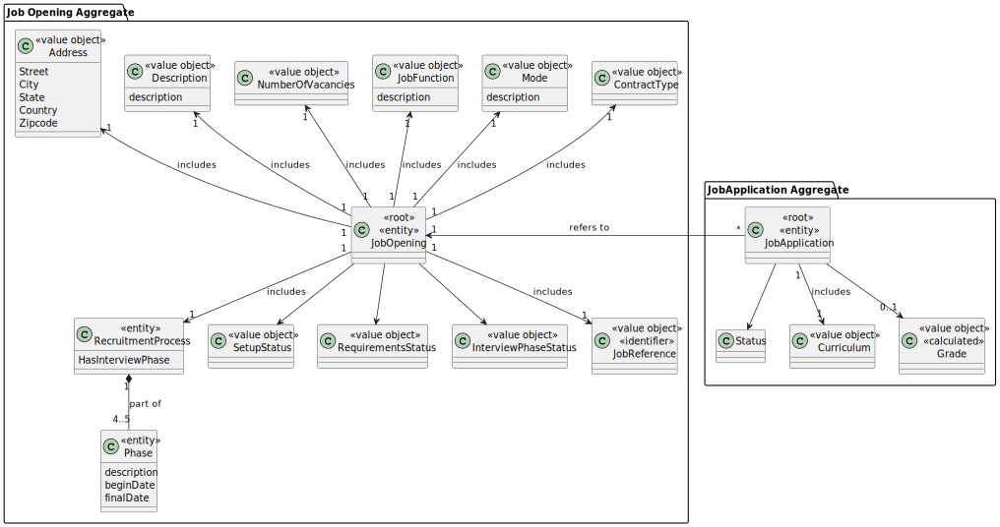
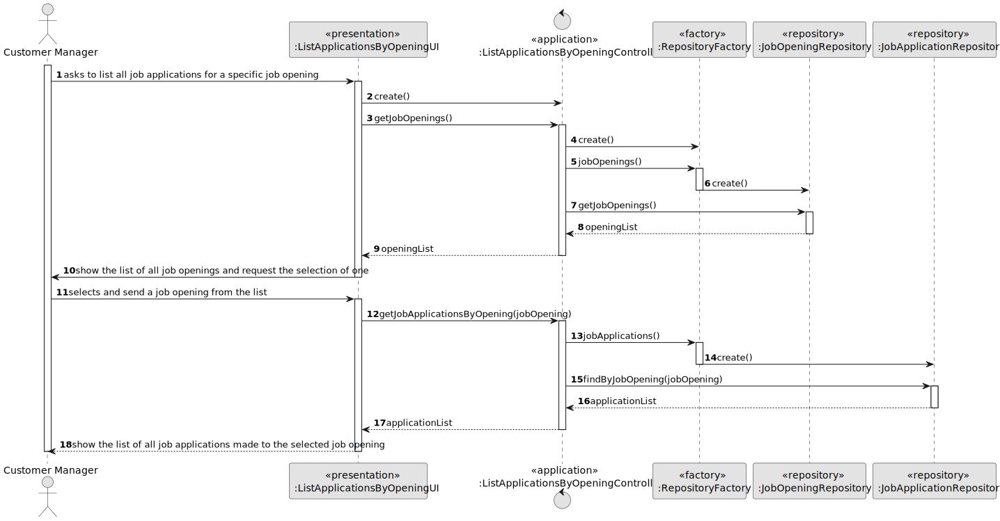
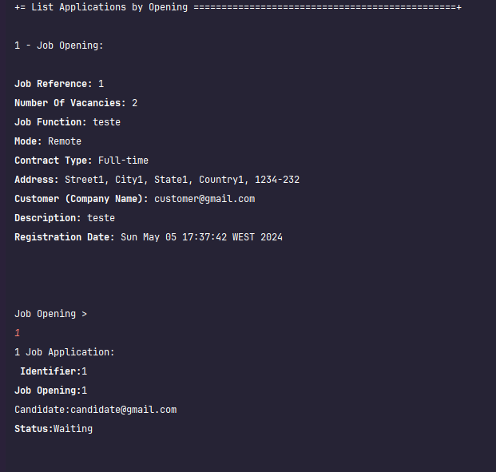

# US 1005


## 1. Context

This task is being assigned for the first time and consists on developing a functionality to display all applications for a specific job opening.


## 2. Requirements


**US 1005**  As Customer Manager, I want to list all applications for a job opening.

[//]: # (**Acceptance Criteria:**)
[//]: # ()
[//]: # (- 1005.1. )

**Customer Specifications and Clarifications:**

> **Question:** Regarding the criteria for listing applications: Should applications that are ongoing or can applications made in the past appear? Can any applications appear or only those that have been accepted? What information must be shown in each application?
> 
> **Answer:** As stated in the US description, all applications for a job opening must be listed. It makes sense to show all applications, regardless of their status. Therefore, for each application the candidate and the status of their application must be identified.

> **Question:** Should the list contain applications that have not yet completed the entire selection process defined in the Job Opening setup? If so, should the list contain the state/phase of each application?
>
> **Answer:** The selection/recruitment process only ends at the “end”, so I don’t understand the first question very well. As for the second question, I think it makes sense to include the application status, so the Customer Manager can understand applications that were rejected for not meeting the requirements.


> **Question:** When we want to list applications we have to choose which job opening it will be. How does the costumer manager choose the job opening? We list all the job openings that belong to the costumers he is responsible for, why does he choose one?
> 
> **Answer:** Question similar to Q123. [US1007]

> **Question:** The customer manager will receive the list of all job openings and select one. Once this is done, the corresponding job applications should appear. What information about job applications must be shown when listing?
> 
> **Answer:** Applications are from a candidate (person), so I think the identification of the application should appear, as well as the candidate's identification and their name

**Dependencies/References:**

Regarding this requirement we understand that it refers to the list of applications and the job opening associated with each.

* There is a dependency to "US1002: As Customer Manager, I want to register a job opening.", since at least one job Opening must be registered in the system so that the operator can list a job opening.
* There is a dependency to "US2002: As Operator, I want to register an application of a candidate for a job opening and import all files received.", since at least one job Application must be registered in the system so that the operator can list a job Application.


## 3. Analysis

[//]: # (*In this section, the team should report the study/analysis/comparison that was done in order to take the best design decisions for the requirement. This section should also include supporting diagrams/artifacts &#40;such as domain model; use case diagrams, etc.&#41;,*)
#### Information from Client Questions
- All applications for the opening must be listed.
- Candidate and Status must be identified.


#### Input Data:
- Selected Data:
  - jobOpening


#### Output Data:
- Display the insuccess of the operation in tha case it fails, otherwise:
  - openingList, list of opening from which one is selected
  - applicationList

### 3.1. Domain



## 4. Design

[//]: # (*In this section, the team should present the solution design that was adopted to solve the requirement. This should include, at least, a diagram of the realization of the functionality &#40;e.g., sequence diagram&#41;, a class diagram &#40;presenting the classes that support the functionality&#41;, the identification and rational behind the applied design patterns and the specification of the main tests used to validate the functionality.*)

### 4.1. Realization



### 4.2. Class Diagram


[//]: # (### 4.3. Applied Patterns)

[//]: # (### 4.4. Tests)

[//]: # (Include here the main tests used to validate the functionality. Focus on how they relate to the acceptance criteria.)
[//]: # ()
[//]: # (**Test 1:** *Verifies that it is not possible to ...*)
[//]: # ()
[//]: # (**Refers to Acceptance Criteria:** G002.1)


[//]: # (```)

[//]: # (@Test&#40;expected = IllegalArgumentException.class&#41;)

[//]: # (public void ensureXxxxYyyy&#40;&#41; {)

[//]: # (	...)

[//]: # (})

[//]: # (````)

## 5. Implementation

[//]: # (*In this section the team should present, if necessary, some evidences that the implementation is according to the design. It should also describe and explain other important artifacts necessary to fully understand the implementation like, for instance, configuration files.*)
[//]: # ()
[//]: # (*It is also a best practice to include a listing &#40;with a brief summary&#41; of the major commits regarding this requirement.*)

The US was implemented using the following methods:
In ***ListApplicationsByOpeningController***:
- public List<JobOpening> getJobOpenings() - this method returns a list of JobOpening
- public List<JobApplication> getJobApplicationsByOpening(JobOpening opening) - this method returns a list of JobApplication, filtered by their associated JobOpening

In **JobOpeningRepository**:
- public Iterable<JobOpening> jobOpenings() - this method returns a list of JobOpening

In **JobApplicationRepository**:
- Iterable<JobApplication> findByJobOpening(JobOpening opening) - this method returns a list of JobApplication, filtered by their associated JobOpening


## 6. Integration/Demonstration
After doing the log in process, to be able to perform this function you need to have admin or customer manager as your role. Then select the option that says “List all applications for an Opening”.
Then the system will show a list of the job opening and will ask to select one of them.
After selecting it the system will provide a list of job applications.

[//]: # (*In this section the team should describe the efforts realized in order to integrate this functionality with the other parts/components of the system*)
[//]: # ()
[//]: # (*It is also important to explain any scripts or instructions required to execute and demonstrate this functionality*)




[//]: # (## 7. Observations)

[//]: # ()
[//]: # (*This section should be used to include any content that does not fit any of the previous sections.*)

[//]: # ()
[//]: # (*The team should present here, for instance, a critical perspective on the developed work including the analysis of alternative solutions or related works*)

[//]: # ()
[//]: # (*The team should include in this section statements/references regarding third party works that were used in the development this work.*)