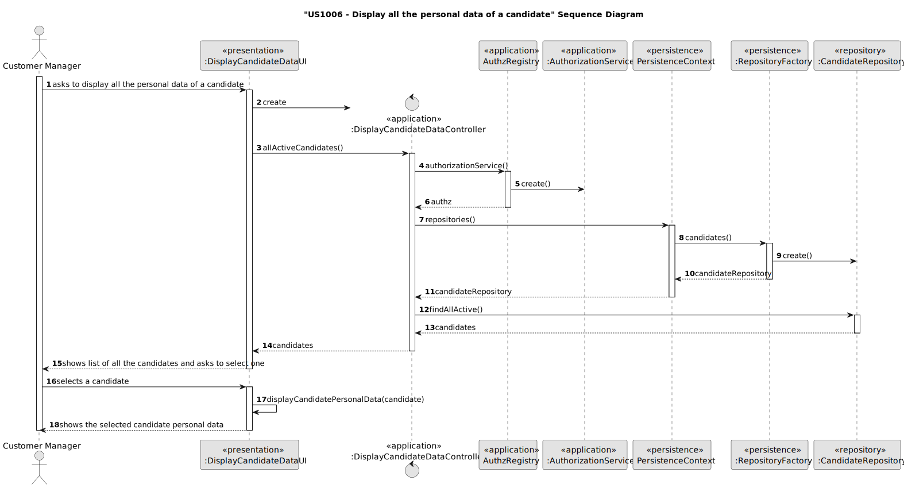

# US 1006

## 1. Context

In this User Story the goal is to list Candidates, select one of them and then display all of his/hers personal data.

## 2. Requirements

**US 1006**  As Customer Manager, I want to display all the personal data of a candidate.

**Acceptance Criteria:**

- 1006.1. Display for each candidate, their name, email, phone Number;
- 1006.2. The Phone Number should follow the portuguese standard;
- 2000c.1. When displaying the candidates, show for each their name and email;
- 2000c.2. The list of the candidates must be in the alphabetical order by name;
- 2000c.3. The list of the candidates must be of the active candidates at the moment

**Customer Specifications and Clarifications:**

> **Question:** What information should appear under the candidate's name (full name, first and last name, etc.)?
>
> **Answer:** I would say the name as received in the application you made (page 6, "name of the candidate").


> **Question:** With regard to listing the personal data of a particular candidate, will a customer manager have access to all the candidates in the system or only those candidates who have submitted an application for a job opening for a client that is managed by that customer manager?
>
> **Answer:** In the current context, let's assume that the Customer Manager can access (consult) the personal data of any candidate.


> **Question:** Regarding the process of selecting a candidate and showing their personal information, to make it easier to find a specific candidate. Would it make sense to ask the user if they want to list all the existing candidates or if they want to narrow down the list by selecting a job opening and thus showing all the candidates for that job opening, and finally selecting a candidate from that smaller list?
>
> **Answer:** The product owner expects the system to apply the best UI/UX practices but, not being a specialist in this technical area, doesn't risk suggesting solutions.


> **Question:** What information do you think should be shown?
>
> **Answer:** It will be all the personal information of a candidate that the system has registered


> **Question:** Would it be acceptable to ask the costumer manager for the id of the candidate he wants to see the data for, or would it be more pertinent to give him a list of all the candidates and let him choose from that list, assuming he has no way of knowing the id of the candidate he wants to get data for.
>
> **Answer:** Note that US1005 allows you to get the applications for a job opening. This US is for displaying a candidate's data. So there seems to be a way of accessing the candidate's id if you don't know what it is. Once again, I hope you apply good UI/UX practices


> **Question:** What information is needed by candidates and system users?
>
> **Answer:** Section 2.2.3 states that for candidates we have the following information: email of the candidate, name of the candidate, phone number of the candidate.
 

**Dependencies/References:**

* There is a dependency to "US1000: As Administrator, I want to be able to register, disable/enable, and list users of the backoffice", since there is a need to have users registered in the system to be able to do any kind of action.


* There is a dependency to "US2000a:  As Operator, I want to register a candidate and create a corresponding user", since at least one candidate must be registered in the system so that the operator can list all the candidates.


* There is a dependency to "US2000c:  As Operator, I want to list all candidates", since it helps list all the active candidates registered in the system, to then the user to select one.


**Input and Output Data**

**Input Data:**

* Typed data:
    * None
    

* Selected data:
    * candidate


**Output Data:**
* Display of all the personal data of the selected candidate


## 3. Analysis

* When showing the candidate data, it should appear the First and Last Name, his/hers Phone number and Email.

### 3.1. Domain Model


## 4. Design

**Domain Class/es:** Candidate, SystemUser, EmailAddress, PhoneNumber, Name

**Controller:** DisplayCandidateDataController

**UI:** DisplayCandidateDataUI

**Repository:**	CandidateRepository

**Service:** AuthorizationService

### 4.1. Sequence Diagram



### 4.2. Class Diagram


[//]: # (### 4.3. Applied Patterns)

[//]: # ()
[//]: # (### 4.4. Tests)

[//]: # ()
[//]: # (Include here the main tests used to validate the functionality. Focus on how they relate to the acceptance criteria.)

[//]: # ()
[//]: # (**Test 1:** *Verifies that it is not possible to ...*)

[//]: # ()
[//]: # (**Refers to Acceptance Criteria:** G002.1)

[//]: # ()
[//]: # ()
[//]: # (```)

[//]: # (@Test&#40;expected = IllegalArgumentException.class&#41;)

[//]: # (public void ensureXxxxYyyy&#40;&#41; {)

[//]: # (	...)

[//]: # (})

[//]: # (````)

## 5. Implementation

### Methods in the Controller

* **public Iterable<Candidate> allActiveCandidates()** - this method gets all active candidates registered in the system.

## 6. Integration/Demonstration

After doing the log in process, to be able to perform this function you need to have admin or customer manager as your role. Then select the option that says “Display all the personal Data if a Candidate”.
Then the system will show a list of the candidates registered in the system that are active at the moment and will ask to select one of them.
After selecting the wanted candidate, all of his/hers personal data will be shown(first name, last name, email and phone number):


If the submitted value is not valid (letter, a symbol or a number greater or smaller than the ones that appear on the list), then the system will ask again for the value until it is valid.
The list of candidates will be displayed in alphabetical order(by his/hers first name).

[//]: # (## 7. Observations)

[//]: # ()
[//]: # (*This section should be used to include any content that does not fit any of the previous sections.*)

[//]: # ()
[//]: # (*The team should present here, for instance, a critical perspective on the developed work including the analysis of alternative solutions or related works*)

[//]: # ()
[//]: # (*The team should include in this section statements/references regarding third party works that were used in the development this work.*)