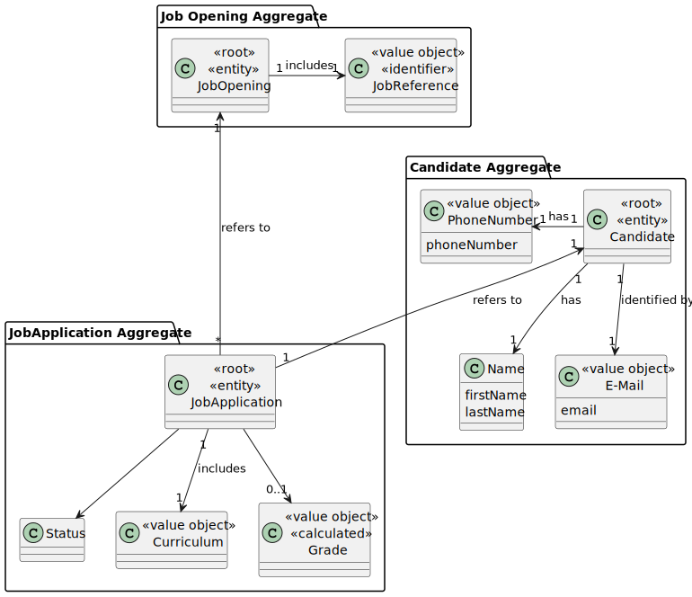
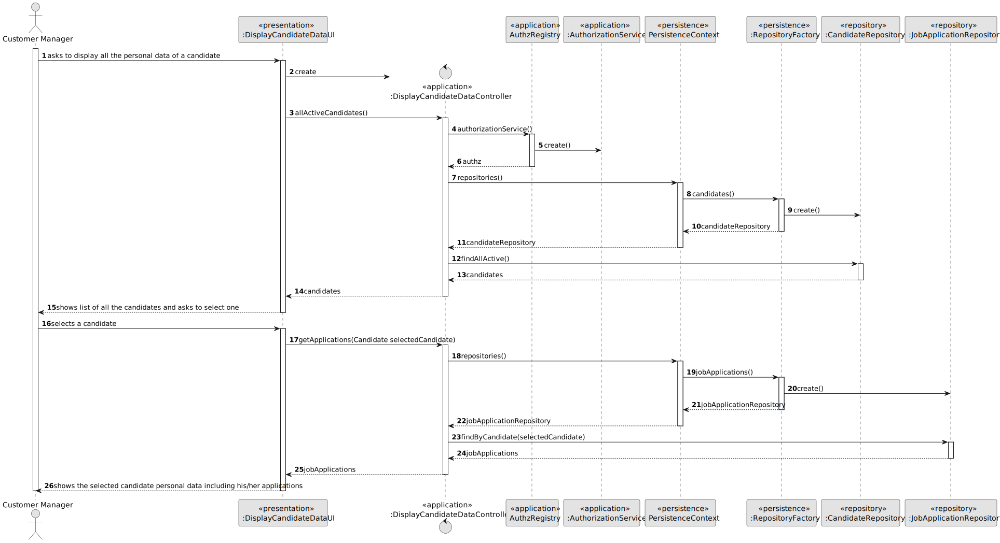
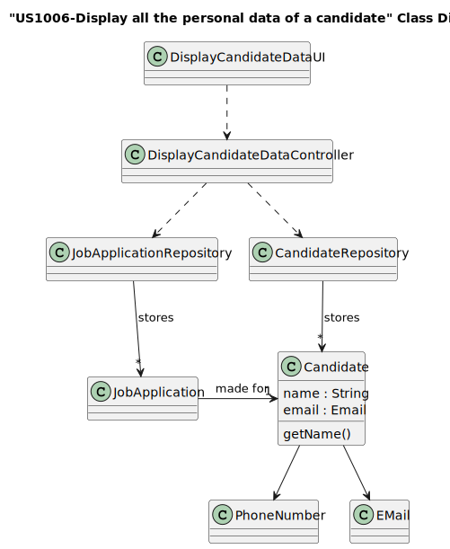
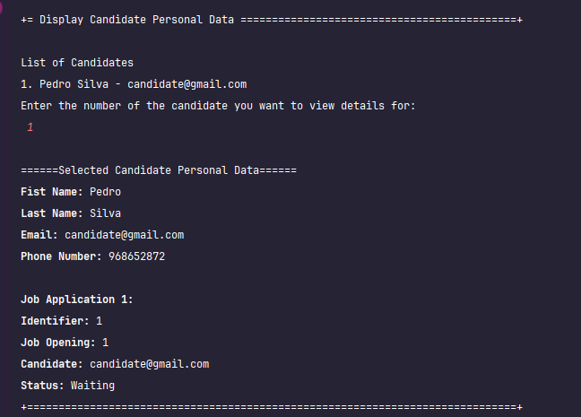

# US 1006b

## 1. Context

[//]: # (*Explain the context for this task. It is the first time the task is assigned to be developed or this tasks was incomplete in a previous sprint and is to be completed in this sprint? Are we fixing some bug?*)
This task is being developed for the first time and consists on adding a new feature to US1006, that being to display the candidate's applications

## 2. Requirements

[//]: # (*In this section you should present the functionality that is being developed, how do you understand it, as well as possible correlations to other requirements &#40;i.e., dependencies&#41;. You should also add acceptance criteria.*)

**US 1006b**  As Customer Manager, I want to display all the personal data of a candidate, including his/her applications.

**Acceptance Criteria:**

- 1006b.1. Candidate details + application list.

**Customer Specifications and Clarifications:**
> **Question:** Regarding the information presented in the 1006b, what type of information related to the candidate's "applications" do you expect to be presented to the customer manager?
>
> **Answer:** It is expected that the candidate's applications will be listed indicating the job opening, the date of registration of the application, its status and its identifier.

Other Specifications and Clarifications are present in US1006's Customer Specifications and Clarifications;

**Dependencies/References:**

* There is a dependency to "US1006: As Customer Manager, I want to display all the personal data of a candidate", as this US is an expansion of it.

## 3. Analysis

[//]: # (*In this section, the team should report the study/analysis/comparison that was done in order to take the best design decisions for the requirement. This section should also include supporting diagrams/artifacts &#40;such as domain model; use case diagrams, etc.&#41;,*)

#### Input Data:
- Selected Data: Same as US1006

#### Output Data:
- Same as US1006 plus Job Application List (if candidate has any).

### 3.1. Domain

## 4. Design

[//]: # (*In this section, the team should present the solution design that was adopted to solve the requirement. This should include, at least, a diagram of the realization of the functionality &#40;e.g., sequence diagram&#41;, a class diagram &#40;presenting the classes that support the functionality&#41;, the identification and rational behind the applied design patterns and the specification of the main tests used to validate the functionality.*)

### 4.1. Realization

### 4.2. Class Diagram

## 5. Implementation

The US was implemented using the following methods:
Specific to this US, in *DisplayCandidateDataController*:
- public Iterable<JobApplication> getApplications(Candidate selectedCandidate) - this method returns a list of JobApplication

In *JobApplicationRepository**:
- Iterable<JobApplication> findByCandidate(Candidate email) - this method returns a list of JobApplication

## 6. Integration/Demonstration

[//]: # (*In this section the team should describe the efforts realized in order to integrate this functionality with the other parts/components of the system*)
[//]: # ()
[//]: # (*It is also important to explain any scripts or instructions required to execute and demonstrate this functionality*)

The process is exactly the same as described in US1006, the difference being it also shows the list of applications made by the candidate

[//]: # (## 7. Observations)

[//]: # ()
[//]: # (*This section should be used to include any content that does not fit any of the previous sections.*)

[//]: # ()
[//]: # (*The team should present here, for instance, a critical perspective on the developed work including the analysis of alternative solutions or related works*)

[//]: # ()
[//]: # (*The team should include in this section statements/references regarding third party works that were used in the development this work.*)