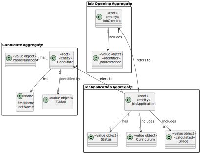
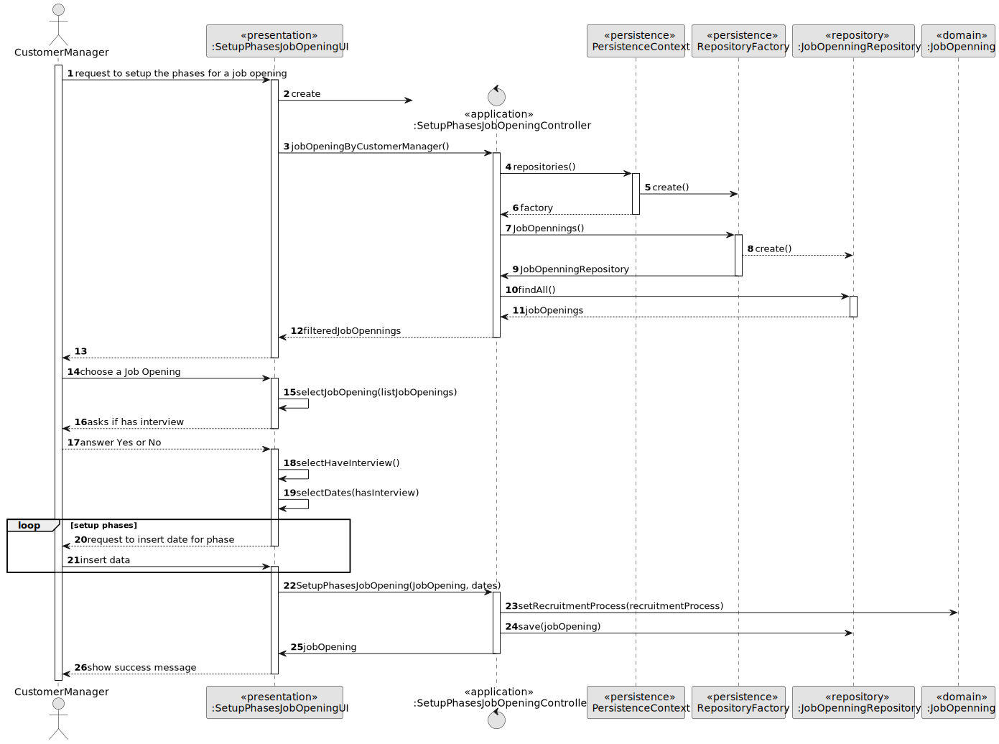
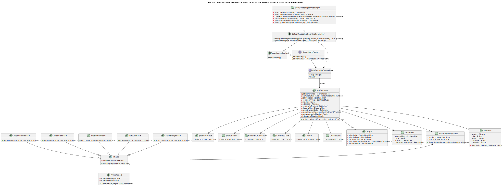
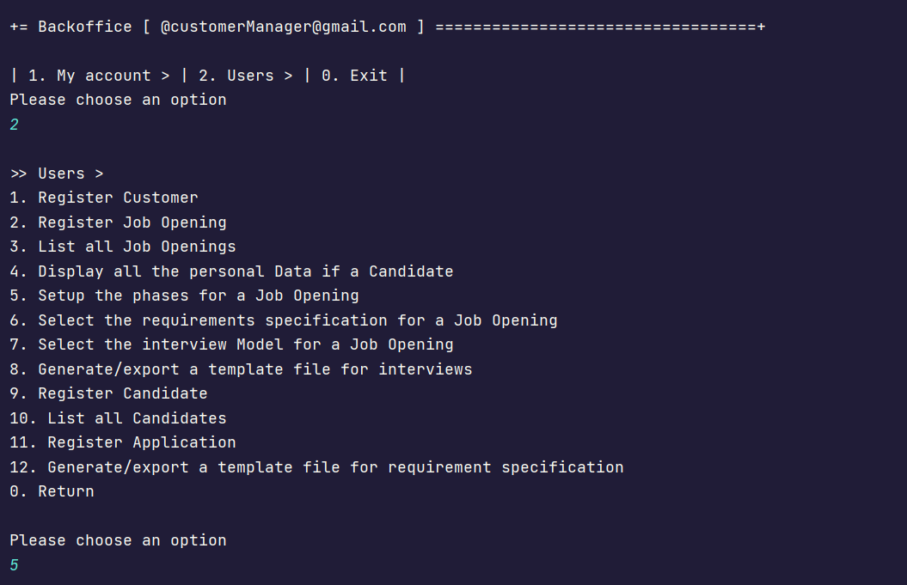
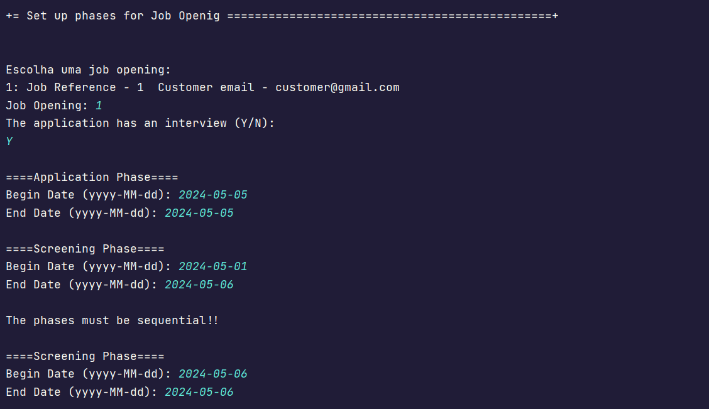
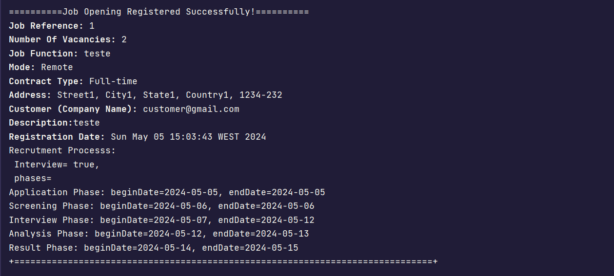

# US 1007


## 1. Context

The task at hand is to setup up the phases for a job opening, as a Customer Manager.
This is the first time this feature is being implemented,
so we're starting from scratch to design and develop a seamless process for setting up the dates for each phase and associate them to the job opening.


For this US, it is needed to setup the phases of the process for a job opening.

## 2. Requirements


**US 1007**  As Customer Manager, I want to setup the phases of the process for a job opening.

**Acceptance Criteria:**

- 1007.1 The dates must be sequential.

**Customer Specifications and Clarifications:**
> **Question16:** Regarding section 2.2.1 and the phases of the recruitment process, in order to move on to the next phase, does the previous one have to be closed or can we move on without the previous one being closed?
> 
> **Answer16:** The short answer is that the phases must be sequential and not overlapping. When one phase closes, the next one opens. US 1007 provides for the definition of phases. US 1010 provides for the opening and closing of phases in the process. The Customer Manager's decision to close a phase should assume that the process moves on to the next phase automatically (regardless of the dates set for the phases).


> **Question46:** US1007, can the identification of the recruitment process be an automatic number or more specific?
>
> **Answer46:** The job opening has an identifier. The recruitment process for a job opening is a "tribute" to that job opening. From the outset, I don't see the need to have a "special" identifier for the recruitment process (i.e. phases of the recruitment process for that job opening).


> **Question62:** US1007/US1010. According to these US's and Q16, each Job Opening must have defined phases. Questions Q23, Q32 and Q45 refer to the status of the application. Are the Job Opening phase and the application status separate concepts or do they refer to the same thing?
> 
> **Answer62:** As mentioned above, they are related but different concepts.


> **Question91:** [1002, 1007, 1009] - Validity of Job Openings - Our main question would be: when is a job opening considered valid? In view of the features 1002, 1007, 1009, we had a question regarding job openings and their constitution. In US1002, we are supposed to register a job opening and only then, in US1009, should we select the requirements specifications for the given job opening. That said, when registering the job opening, it wouldn't have all the mandatory information as required. Therefore, should there be a direct link between these user stories so that, when registering, we automatically select the requirements, thus obtaining a valid job opening? In addition, we would like to clarify whether the recruitment process is mandatory for a job opening to be valid.
> 
> **Answer91:** The product owner is not an expert in the solution domain (they only have knowledge of the problem) but, with regard to the first question, he suggests that perhaps user stories are not (may not be) "distinct" menu options. As for the second question (recruitment process), I think it's also more related to the solution than to the problem, so I'm not going to suggest anything that might complicate things rather than clarify them.


> **Question92:** [1007, 1011] - Job Opening Setup Process - Taking into account US1007, the setup of the different phases of the recruitment process, we would like clarification on whether, if an Interview phase is selected, there needs to be a direct link with US1011, the selection of an interview model, or are they separate functions? If they are separate, is a recruitment process only valid once an interview model has been selected?
>
> **Answer92:** I suppose my answer is similar to the previous question (Q91). I can say that we can consider that the company for now always intends to use an "automatic" interview evaluation process, so this must be defined in order to "execute/process" the interviews.

**Dependencies/References:**

- 1002 - "As Customer Manager, I want to register a job opening."


**Input and Output Data**

**Input Data:**
  * date for each phase


* Selected data:
    * Job opening
    * has interview


**Output Data:**
* Display the success of the operation  and the data of the registered job opening


## 3. Analysis

> **Question53:** Can the recruitment process be identified by the job reference?
>
> **Answer53:** US 1007 states that when the Customer Manager defines the recruitment phases for each job opening. I don't think there will be any need to have an explicit ID for the recruitment process, since there is only one for each job reference, and it is specific to each job reference. In technical terms, if there is a need for an ID for the recruitment process, I have nothing against it being the same as the job reference.


> **Question73:** US1007 - In terms of the user interface, in this case for the customer manager, how should the setup of the recruitment process be carried out?
>
> **Answer73:** I don't have any specific requirements for the user interface. You should use good practice principles for designing user interfaces, taking into account "The customer manager is responsible for setting up the process, defining the dates for the phases and if the process includes interviews" (section 2.2.1).


> **Question103:** US1007 - For a recruitment process we will have several phases. What do you want for "Setup"?
> 
> **Answer103:** See Q73. The recruitment process, explained in section 2.2.1, defines a sequence of phases in which only the interview phase is indicated as optional. Setup essentially consists of defining the dates for each phase and whether we have the interview phase.


> **Question116:** US1007 - Setting phase dates - The phases of the recruitment process must have dates assigned to them. Is it possible to finish one phase and start another on the same day?
> 
> **Answer116:**  See Q16. Dates must not overlap, but we can allow them to end and finish on the same day (e.g. one ends in the morning and the next starts in the afternoon).

> **Question123:** US1007- When the customer manager wants to set up the phases of a job opening, how does he choose it? Does he list all the job openings for all the customers he is responsible for? Or does he list all the customers and select the one he wants and only then select the Job Opening?
> 
> **Answer123:** I wanted to avoid constraining the way they design the UI/UX (for this or other US). I think you should use best practices. As a product owner, I'd like you to apply best practices assuming they improve user interaction. Note also that there is US1003.


### 3.1. Domain Model




## 4. Design

**Domain Class/es:** JobOpening, RecruitmentProcess, Phase , AnalysisPhase ,ResultPhase, ScreeningPhase, ApplicationPhase, InterviewPhase 

**Controller:** SetupPhasesJobOpeningController

**UI:** SetupPhasesJobOpeningUI

**Repository:**	JobOpeningRepository

### 4.1. Sequence Diagram



### 4.2. Class Diagram



[//]: # (### 4.3. Applied Patterns)

[//]: # ()
[//]: # (### 4.4. Tests)

[//]: # ()
[//]: # (Include here the main tests used to validate the functionality. Focus on how they relate to the acceptance criteria.)

[//]: # ()
[//]: # (**Test 1:** *Verifies that it is not possible to ...*)

[//]: # ()
[//]: # (**Refers to Acceptance Criteria:** G002.1)

[//]: # ()
[//]: # ()
[//]: # (```)

[//]: # (@Test&#40;expected = IllegalArgumentException.class&#41;)

[//]: # (public void ensureXxxxYyyy&#40;&#41; {)

[//]: # (	...)

[//]: # (})

[//]: # (````)

## 5. Implementation

* JobOpening setUpPhasesJobOpening(jobOpening, dates, hasInterview) - this method creates an object recruitment process (with hasInterview and date)
and associates it with the job opening. Then saves in the job opening repository the updated job opening. 

* List<JobOpening> jobOpeningByCustomerManager() - this method gets all job openings in the system and filters them by the customer manager that is logged in the system.
These job openings are saved in a list.


## 6. Integration/Demonstration

After the main menu appears and select the option: "Set up Phases for Job Opening".




Then select a job opening from the list.
Answer if the opening has interview and type the data of each phase.




It will appear a success message and the info of the job opening.




[//]: # ()
[//]: # (## 7. Observations)

[//]: # ()
[//]: # (*This section should be used to include any content that does not fit any of the previous sections.*)

[//]: # ()
[//]: # (*The team should present here, for instance, a critical perspective on the developed work including the analysis of alternative solutions or related works*)

[//]: # ()
[//]: # (*The team should include in this section statements/references regarding third party works that were used in the development this work.*)