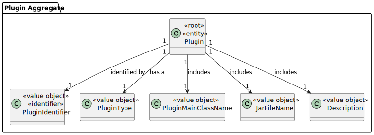

# US 1008


## 1. Context

*Explain the context for this task. It is the first time the task is assigned to be developed or this tasks was incomplete in a previous sprint and is to be completed in this sprint? Are we fixing some bug?*

## 2. Requirements

*In this section you should present the functionality that is being developed, how do you understand it, as well as possible correlations to other requirements (i.e., dependencies). You should also add acceptance criteria.*

*Example*

**US 1008** As Language Engineer, I want to deploy and congure a plugin (i.e., Job Requirement Specication or Interview Model) to be used by the system.

**Acceptance Criteria:**

- 1008.1 See NFR09(LPROG).

**Customer Specifications and Clarifications:**
> **Question:** How does Language Engineer create the interview model and job requirements? Is it text? Or does he select questions for the interview and requirements for the job opening? And this is when you are creating an interview or a job opening or do you stop in the middle of doing that and then continue?
> 
> **Answer:** The language engineer, with information provided by the customer manager (which he obtained from the customer), will develop a jar in Java corresponding to the module/plugin. For this development you will have to use grammar/language development techniques such as antlr. This code will be in a jar that the language engineer then “installs/registers” in the application (US1008, for example, associating a name to the jar in a configuration file – “5 years java experience”, “req-model-5-years-java .jar”). The application with this information dynamically loads this jar. The grammar used in the jar will reflect the structure of the questions to be used in this model and their evaluation. These activities must be done before US1008 can be done. This work is done “outside” the system, simply by registering the model (when ready) in US1008. US 1009 and US1011 allow you to select models to use (from those that have been duly registered in the system).
 
> **Question:** US1008, regarding interview and requirements modules, can their identifiers be automatic or specific (i.e., manual)?
>
> **Answer:** [The previous question] refers to the same US. There it is mentioned that each module will be registered in the system through 2 pieces of data, for example, associating a name with the jar in a configuration file – “5 years java experience”, “req-model-5-years-java.jar”. In other words, it is assumed that each module will have a name/designation (which I assume must be unique) and this name will be associated with the name of the jar file (probably a complete path) that implements that module. In other words, this name/designation can be considered as a specific/manual identifier

> **Question:** Questions for the plugins.- Can you clarify if the questions to be asked for the Interview Models and Requirement Specifications are those in the documentation example or do you have a group of questions that you would like us to use
>
> **Answer:** The specification document presents, as I said, examples. These are just indicative examples. You can use these examples as test cases and as a starting point to define others. But the solution is supposed to support more than just the examples in the document. In any of the plugins, the type of questions that must be supported is what is presented on page 8 of the document. As a product owner, I would like a functional demonstration of the system to include at least 2 plugins of each type, to be able to demonstrate, at a minimum, support for more than one plugin used (of each type) simultaneously


> **Question:** In US1008, is the deployment jar file (plugin) supposed to be stored in the database? How will we maintain the plugin after different uses? Or should we store a string for the jar file path?
>
> **Answer:** This question is a bit technical. As a customer, what I want is for it to be possible to use several modules (plugins). I don't think it's necessary to store the plugins in the database. It could even be done, but let's not go there. A plugin can be seen as part of the application code that is “made” after the application is in production, allowing “functionality” to be added to the application without having to generate a new version of the application, through the installation of plugins. Being code. Its versions are managed like the rest of the code, in a source code repository. But I'm getting into technical considerations that I wanted to avoid. For technical questions there is another forum and there are UC professors.


[//]: # (> **Question:**)

[//]: # (>)

[//]: # (> **Answer:**)

[//]: # (> **Question:**)

[//]: # (>)

[//]: # (> **Answer:**)

[//]: # (> **Question:**)

[//]: # (>)

[//]: # (> **Answer:**)

[//]: # (> **Question:**)

[//]: # (>)

[//]: # (> **Answer:**)

**Dependencies/References:**

NFR09(LPROG) - Requirement Specifications and Interview Models The support for this functionality must follow specific technical requirements, specified in LPROG. The ANTLR tool should be used (https://www.antlr.org/).

## 3. Analysis

[//]: # (*In this section, the team should report the study/analysis/comparison that was done in order to take the best design decisions for the requirement. This section should also include supporting diagrams/artifacts &#40;such as domain model; use case diagrams, etc.&#41;,*)

#### Input Data:
- Typed Data:
  - description
- Selected Data:
  - jarFileName
  - pluginType
  
#### Automatic Data:
  - pluginMainClassName (retrieved automatically by reading the selected Jar File's META-INF/MANIFEST.MF file)

#### Output Data:
- List of Jar Files present in the input folder
- Operation Success

### 3.1. Domain



## 4. Design

[//]: # (*In this section, the team should present the solution design that was adopted to solve the requirement. This should include, at least, a diagram of the realization of the functionality &#40;e.g., sequence diagram&#41;, a class diagram &#40;presenting the classes that support the functionality&#41;, the identification and rational behind the applied design patterns and the specification of the main tests used to validate the functionality.*)

### 4.1. Realization


### 4.2. Class Diagram


### 4.3. Applied Patterns

### 4.4. Tests


**Test 1:** *Verifies that it is not possible to validate a null Plugin Identifier*

```
@Test(expected = java.lang.NullPointerException.class)
    public void ensureValidationExceptionForNull() throws Exception {
        PluginIdentifier.validateIdentifier(null);
    }
````


**Test 2:** *Verifies that it is not possible to validate an empty Plugin Identifier*

```
@Test
    public void ensureValidationFailsForEmptyString() throws Exception {
        final boolean actual = PluginIdentifier.validateIdentifier("");
        assertFalse(actual);
    }
````


**Test 3:** *Verifies that it is not possible to validate an Plugin Identifier of the wrong format*

```
@Test
    public void ensureValidationFailsForWrongFormat() throws Exception {
        final boolean actual = PluginIdentifier.validateIdentifier("123_ADHMALKDJA");
        assertFalse(actual);
    }
````

**Test 4:** *Verifies that it is possible to validate a Plugin Identifier of the correct format*

```
 @Test
 public void ensureValidationSuccessForCorrectFormat() throws Exception {
        final boolean actual = PluginIdentifier.validateIdentifier("REQ_123456789_jarfileName");

        assertTrue(actual);
    }
````

**Test 5:** *Verifies that it is possible to generate a Plugin Identifier with the correct values*

```
 @Test
  public void generatePluginIdentifierSuccess() throws Exception{
        final PluginIdentifier actual = PluginIdentifier.generatePluginIdentifier(new PluginType("Test", "TES"), new JarFileName("jarFileName"), 123456789L);

        assertNotNull(actual);
    }
````

**Test 6:** *Verifies that two given Plugin Identifier instances with the same content are equal*

```
 @Test
    public void ensureEqualPluginIdentifiers() throws Exception{
        final PluginIdentifier expected = new PluginIdentifier("TES_123456789_jarFileName");
        final PluginIdentifier actual = PluginIdentifier.generatePluginIdentifier(new PluginType("Test", "TES"), new JarFileName("jarFileName"), 123456789L);

        assertEquals(expected,actual);
    }
````

**Test 7:** *Verifies that two given Plugin Identifier instances with different content are not equal*

```
 @Test
    public void ensureDifferentPluginIdentifiers() throws Exception{
        final PluginIdentifier id1 = PluginIdentifier.generatePluginIdentifier(new PluginType("Test", "TES"), new JarFileName("jarFileName"), 987654321L);
        final PluginIdentifier id2 = PluginIdentifier.generatePluginIdentifier(new PluginType("Test", "TES"), new JarFileName("jarFileName"), 123456789L);

        assertNotEquals(id1,id2);
    }
````

**Test 8:** *Verifies that the Plugin is created without error and its attributes aren't changed during creation*
```
@Test
    public void testPluginCreation() {
        PluginType pluginType = PluginType.INTERVIEW;
        Description description = new Description("Description");
        PluginMainClassName mainClassName = new PluginMainClassName("MainClassName");
        JarFileName jarFileName = new JarFileName("FileName.jar");

        Plugin plugin = new Plugin(pluginType, description, mainClassName, jarFileName);

        assertNotNull(plugin);
        assertEquals(pluginType, plugin.pluginType());
        assertEquals(description, plugin.description());
        assertEquals(mainClassName, plugin.pluginMainClassName());
        assertEquals(jarFileName, plugin.jarFileName());
    }
```
**Test 9:** *Verifies that two instances of Plugin with the same attributes are equal*
```
@Test
    public void testPluginEquality() {
        PluginType pluginType = PluginType.REQUIREMENTS;
        Description description = new Description("Description");
        PluginMainClassName mainClassName = new PluginMainClassName("MainClassName");
        JarFileName jarFileName = new JarFileName("FileName.jar");
        PluginIdentifier pluginIdentifier = PluginIdentifier.generatePluginIdentifier(pluginType, jarFileName, 123456789L);


        Plugin plugin1 = new Plugin(pluginIdentifier, pluginType, description, mainClassName, jarFileName);
        Plugin plugin2 = new Plugin(pluginIdentifier, pluginType, description, mainClassName, jarFileName);

        assertEquals(plugin1, plugin2);
        assertEquals(plugin1.pluginMainClassName().name(),plugin2.pluginMainClassName().name());
        assertEquals(plugin1.pluginType().getPluginTypeName(),plugin2.pluginType().getPluginTypeName());
    }
```
**Test 10:** *Verifies that two instances of Plugin with different attributes are not equal*
```
@Test
    public void testPluginInequality() {
        PluginType pluginType1 = PluginType.REQUIREMENTS;
        PluginType pluginType2 = PluginType.INTERVIEW;
        Description description1 = new Description("Description1");
        Description description2 = new Description("Description2");
        PluginMainClassName mainClassName1 = new PluginMainClassName("MainClassName1");
        PluginMainClassName mainClassName2 = new PluginMainClassName("MainClassName2");
        JarFileName jarFileName1 = new JarFileName("FileName1.jar");
        JarFileName jarFileName2 = new JarFileName("FileName2.jar");

        Plugin plugin1 = new Plugin(pluginType1, description1, mainClassName1, jarFileName1);
        Plugin plugin2 = new Plugin(pluginType2, description2, mainClassName2, jarFileName2);

        assertNotEquals(plugin1, plugin2);
    }
```
**Test 11:** *Verifies that Plugin creation errors out when values are null*
```
@Test(expected = java.lang.NullPointerException.class)
    public void testPluginError(){
        Plugin plugin1 = new Plugin(null, null, null, null);
    }
```
**Test 12:** *Verifies that PluginType creation errors out when values are null*
```
@Test(expected = java.lang.NullPointerException.class)
    public void ensurePluginTypeErrorWhenNull(){
        PluginType pt = new PluginType(null, null);
    }
```
**Test 13:** *Verifies that PluginType creation errors out when values are wrongly formatted*
```
@Test(expected = java.lang.IllegalArgumentException.class)
    public void ensurePluginTypeErrorWhenInvalid(){
        PluginType pt = new PluginType("Null", "Null");
    }
```
**Test 14:** *Verifies that PluginType is Not Null when values are correctly formatted*
```
@Test
public void ensurePluginTypeNotNullWhenValid(){
        PluginType pt = new PluginType("Null", "NIL");
        assertNotNull(pt);
    }
```
**Test 15:** *Verifies that two instances of PluginType are equal when they have the same attributes*
```
@Test
    public void ensurePluginTypeEqual(){
        PluginType pt = new PluginType("Null", "NIL");
        PluginType pt2 = new PluginType("Null", "NIL");
        assertEquals(pt,pt2);
    }
```
**Test 16:** *Verifies that two instances of PluginType are not equal when they have different attributes*
```
@Test
    public void ensurePluginTypeNotEqual(){
        PluginType pt = new PluginType("Null", "NIL");
        PluginType pt2 = new PluginType("False", "FAL");
        assertNotEquals(pt,pt2);
    }
```

## 5. Implementation

[//]: # (*In this section the team should present, if necessary, some evidences that the implementation is according to the design. It should also describe and explain other important artifacts necessary to fully understand the implementation like, for instance, configuration files.*)

[//]: # (*It is also a best practice to include a listing &#40;with a brief summary&#41; of the major commits regarding this requirement.*)
The US was implemented using the following methods:
In *ConfigurePluginController*:
- public void createPlugin(PluginType pluginType, JarFileName jarFileName, Description description) - this method creates a new instance of Plugin
- public List<PluginType> fetchPluginTypes() - this method returns a list of PluginType
- public List<String> fetchJarFiles() - this method reads jar files from a specific folder
- public void displayOptions(List<String> list) - this method displays on the screen the options provided in a list
- public void displayPluginTypes(List<PluginType> list) - this method displays on the screen the options provided in a list

In *PluginType*
- public static List<PluginType> pluginTypeList() - this method returns a list of PluginType


## 6. Integration/Demonstration
After doing the log in process, to be able to perform this function you need to have admin or language engineer as your role. Then select the option that says “Deploy and configure a plugin”.
Then the system will show a list of the plugin types and will ask to select one of them.
After selecting it the system will provide a list of available jar files and will ask to select one of them.
Then it will ask the user to write its description after which it will register the plugin and move the jar file from the input folder to the plugin folder


In the case that there are no Jar Files, the registration process will halt the moment it is accessed.


[//]: # (/*In this section the team should describe the efforts realized in order to integrate this functionality with the other parts/components of the system*)
[//]: # ()
[//]: # (*It is also important to explain any scripts or instructions required to execute and demonstrate this functionality*)
[//]: # ()
[//]: # (## 7. Observations)
[//]: # ()
[//]: # (*This section should be used to include any content that does not fit any of the previous sections.*)
[//]: # ()
[//]: # (*The team should present here, for instance, a critical perspective on the developed work including the analysis of alternative solutions or related works*)
[//]: # ()
[//]: # (*The team should include in this section statements/references regarding third party works that were used in the development this work.*)