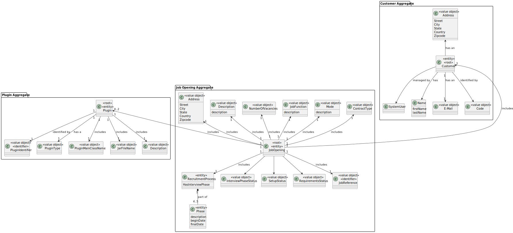
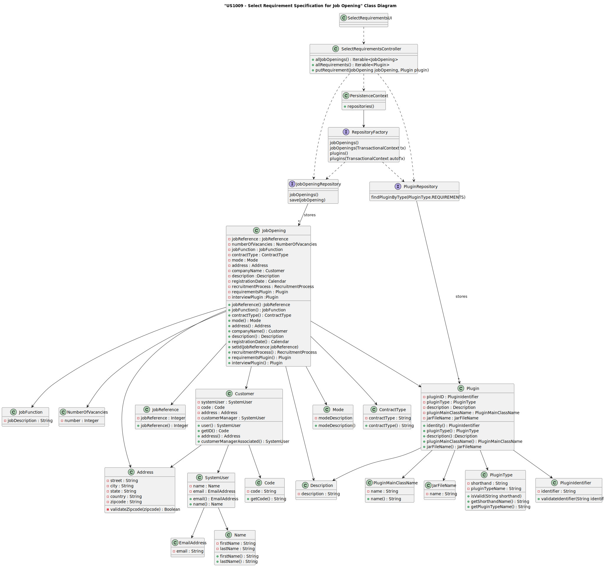
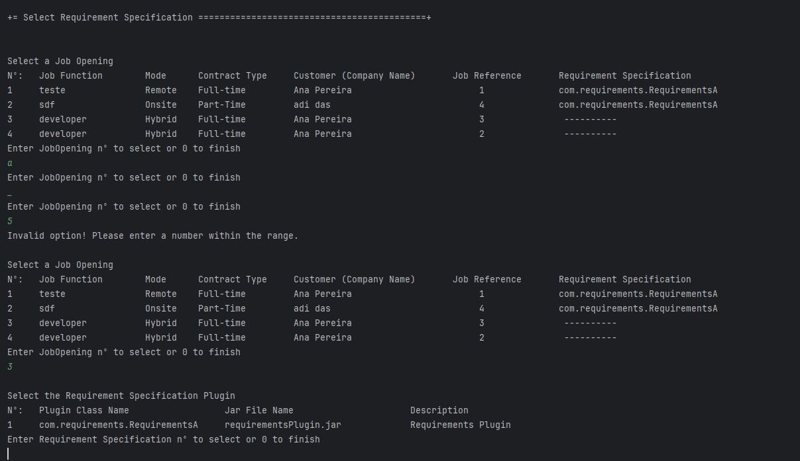
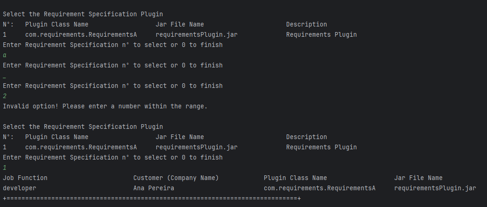
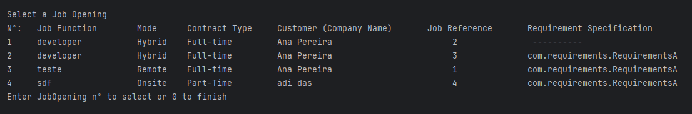

# US 1009

## 1. Context

In this user story the goal is to select a requirement specification for a job opening, to later verify job applications and if they fit in the requirements.
## 2. Requirements

**US 1009** As Customer Manager, I want to select the requirements specification to be used for a job opening.

**Acceptance Criteria:**

- 1009.1 Non-functional Requirement-NFR09(LPROG)-Requirement Specifications and Interview Models The support for this functionality must follow specific technical requirements, specified in LPROG. The ANTLR tool should be used (https://www.antlr.org/).


**Customer Specifications and Clarifications:**

> **Question:** How does the Customer Manager select the model to use for the interviews?
>
> **Answer:** It is accepted that when templates are registered in the system (the "plugins") they are identified with a name or description. For example, "Supermarket Cashier Interview Template" or "Junior Backend Java Programmer Interview Template". The Customer manager is supposed to select a template from a possible list of templates.


> **Question:** How does the Language Engineer make the interview model and job requirements? Is it text? Or does he select questions for the interview and requirements for the job opening? And is that when you're creating an interview or a job opening, or do you stop halfway through to do that and then carry on?
>
> **Answer:** The language engineer, with information from the customer manager (who has obtained it from the customer), will develop a jar corresponding to the module/plugin in Java. To do this, he will have to use grammar/language development techniques such as antlr. This code will be in a jar that the language engineer then “installs/registers” in the application (US1008, for example, by associating a name with the jar in a configuration file - “5 years java experience”, “req-model-5-years-java.jar”). The application with this information dynamically loads the jar. The grammar used in the jar will mirror the structure of the questions to be used in the model and their evaluation. These activities have to be done before the US1008 can be taken. This work is done “outside” the system, and the model is only registered (when it is ready) in US1008. US1009 and US1011 allow you to select models to use (from those that have been duly registered in the system).


> **Question:** Regarding the User Story of selecting the Job Requirement Specification for the Job Opening, will the Customer Manager be able to choose a Job Opening that already has a Job Requirement Specification?
>
> **Answer:** I admit that this situation is possible for any similar user story. In other words, the situation you describe is equivalent to any situation in which a selection has to be made but the user has made a mistake and wants to choose another option. You must, however, ensure that the system remains in a consistent state.


> **Question:** After defining the recruitment states for a JobOpening, can the Customer Manager select the Job Requirement Specification for that same Job Opening? If so, up to what stage of recruitment can the action be carried out?
>
> **Answer:** The Customer Manager defines the phases of the recruitment process, he does not define the states. The requirements assessment is carried out in the Screening phase. So I don't quite understand the question.

**Input and Output Data**

**Input Data:**

* Typed data:
    * None


* Selected data:
    * Job Opening
    * Requirement Specification(plugin)


**Output Data:**
* Display the success of the operation and shows the job opening and the associated Requirement Specification


**Dependencies/References:**


* There is a dependency to "US1000: As Administrator, I want to be able to register, disable/enable, and list users of the backoffice", since there is a need to have users registered in the system to be able to do any kind of action.


* There is a dependency to "US1001: As Customer Manager I want to register a customer and that the system automatically creates a user for that customer", since one attribute of Job Opening is the Customer(company), so in order to register the job opening, there must first be at least one customer.


* There is a dependency to "US1002: As Customer Manager, I want to register a job opening.", since at least one job Opening must be registered in the system so that the operator can list a job opening.


* There is a dependency to "US1008: As Language Engineer, I want to deploy and configure a plugin (i.e., Job Requirement Specification or Interview Model) to be used by the system", since at least one requirement must be registered in the system so that the costumer manager can list requirements to select from.


## 3. Analysis

* The Requirements(plugins) are identified with a name or description

* If the job opening has already a requirement specification selected, the user still can change it.

* it must appear a list of job openings, which are the ones that the current customer manager logged in is responsible for, to then select the one to associate the requirement to that job opening.



## 4. Design

**Domain class/es:** JobOpening, Plugin, PluginType 

**Controller:** SelectRequirementsController

**UI:** SelectRequirementsUI

**Repository:** PluginRepository, JobOpeningRepository

**Service:** AuthorizationService


### 4.1. Sequence Diagram


### 4.2. Class Diagram



[//]: # (### 4.3. Tests)

[//]: # ()
[//]: # (Include here the main tests used to validate the functionality. Focus on how they relate to the acceptance criteria.)

[//]: # ()
[//]: # (**Test 1:** *Verifies that it is not possible to ...*)

[//]: # ()
[//]: # (**Refers to Acceptance Criteria:** G002.1)

[//]: # ()
[//]: # ()
[//]: # (```)

[//]: # (@Test&#40;expected = IllegalArgumentException.class&#41;)

[//]: # (public void ensureXxxxYyyy&#40;&#41; {)

[//]: # (	...)

[//]: # (})

[//]: # (````)

## 5. Implementation

### Methods in the Controller

* **public Iterable<JobOpening> allJobOpenings()** - this method gets all the jobOpenings registered in the system that the current logged in customer manager is responsible for

* **Iterable<Plugin> allRequirements()** - this method gets all the Requirement Specifications registered in the system

* **putRequirement(JobOpening jobOpening, Plugin plugin)** - this method 


## 6. Integration/Demonstration

After doing the log in process, to be able to perform this function you need to have admin or customer manager as your role. Then select the option that says “Select the requirements specification for a Job Opening”. Then there will appear a list of Job Openings which the user must select one.

if the number submitted is not valid(it cannot be a letter, a symbol or a number greater or smaller than the ones that appear on the list), then the user will be asked to type the wanted number again, until the value is valid:



Then there will appear a list of Requirement Specifications which the user must select one.

if the number submitted is not valid(it cannot be a letter, a symbol or a number greater or smaller than the ones that appear on the list), then the user will be asked to type the wanted number again, until the value is valid:



And finally we can see that the requirement was associated with the selected job opening



Even if a job opening has a requirement , the user can still change it.

[//]: # ()
[//]: # (## 7. Observations)

[//]: # ()
[//]: # (*This section should be used to include any content that does not fit any of the previous sections.*)

[//]: # ()
[//]: # (*The team should present here, for instance, a critical perspective on the developed work including the analysis of alternative solutions or related works*)

[//]: # ()
[//]: # (*The team should include in this section statements/references regarding third party works that were used in the development this work.*)