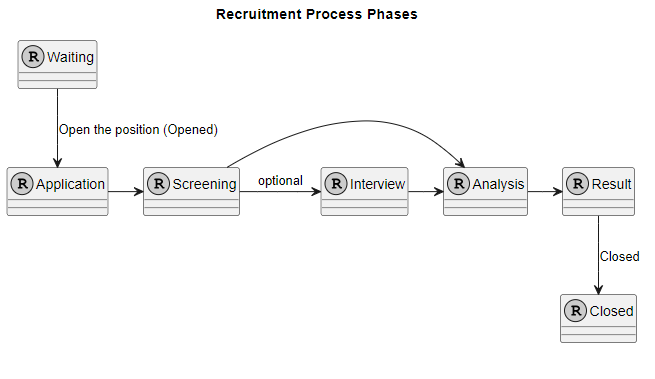
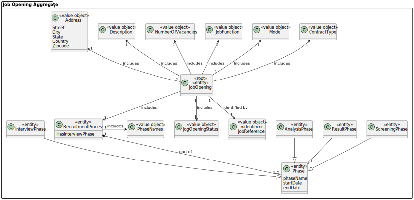
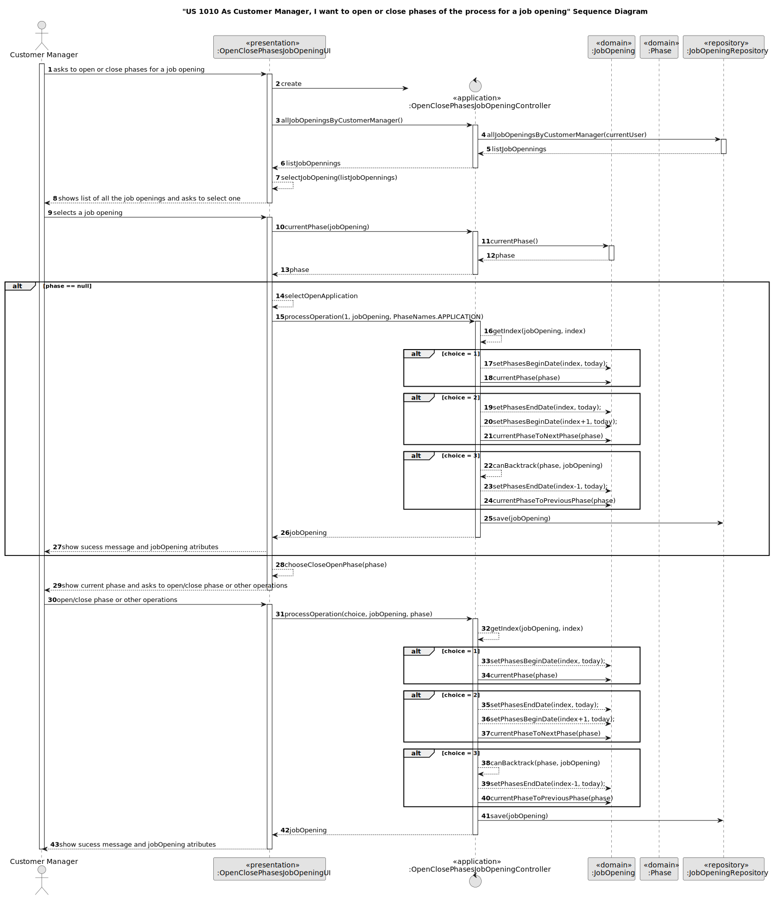

# US 1010

## 1. Context


The task at hand is to be able to open or close phases of a job opening, as a Customer Manager.
This is the first time this feature is being implemented,
so we're starting from scratch to design and develop a seamless process for setting up the process to open or close phases of the process for a job opening

## 2. Requirements

**US 1010** As Customer Manager, I want to open or close phases of the process for a job opening

**Acceptance Criteria:**

- 1010.1. Display the list of customer manager's active job openings;
- 1010.2. The phases are sequential;
- 1010.3. Closing a Phase automatically opens the next phase, and that phase becames "actvice".
- 1010.4. “Switching” phases to “backtrack” should be possible if the phase you want to “abandon” is not actually “running/active” yet.
- 1010.5. When the last phase closes the job opening is no longer "active"
- 1010.6. To enter the interview phase, the interview model has to be specified
- 1010.7. Display the current phase and indicate what can be done (f it is possible to move forward or backward, it should indicate that it is possible and the resulting phase. If it is not (yet) possible to move forward/backward, it should indicate the justification for this)


**Customer Specifications and Clarifications:**

> **Question16:** Regarding section 2.2.1 and the phases of the recruitment process, in order to move on to the next phase, does the previous one have to be closed or can we move on without the previous one being closed?
>
> **Answer16:** The short answer is that the phases must be sequential and not overlapping. When one phase closes, the next one opens. US 1007 provides for the definition of phases. US 1010 provides for the opening and closing of phases in the process. The Customer Manager's decision to close a phase should assume that the process moves on to the next phase automatically (regardless of the dates set for the phases).


> **Question143:** US 1010 - Open or close phases of the process for a job opening. - When the Customer Manager wants to open or close a recruitment phase, he must have the opportunity to choose which phase he wants to open or close, or he automatically moves on to the next phase, i.e. he closes the current phase and opens the next one.
> 
> **Answer143:** Already answered in Q16. But, in short, the idea of this US is to allow you to advance through the phases of a job opening. The phases must always be sequential. We can consider that closing one phase results in opening the next (and moving on to the next phase means closing the previous one). It shouldn't be possible to “skip” phases, except phases that aren't part of the process (for example, if there are no interviews).


> **Question149:**  US 1010 - In the last sprint, the dates on which each phase of a job opening starts were defined, in which it is possible to close and open phases. My question is this: if you want to close a phase before the next one starts, is the start of the next phase brought forward? In a scenario where the start date of a phase y has already passed and x (the predecessor) has been closed, if you want to reopen phase x, is that possible? Or should the system prohibit such an attempt since it violates the defined dates?
> 
> **Answer149:**  See Q147 and Q16. “Switching” phases to “backtrack” should be possible if the phase you want to “abandon” is not actually “running/active” yet. For example, if I'm in the screening phase and I've already started checking candidates' requirements, it doesn't make sense to be able to “go back” to the application phase. But if I was in the application phase and decided to move on to the next (screening) phase and after a while I want to go back to the previous one (for example, because I made a mistake and I'm still receiving applications), I should be able to do so if I haven't done any “operation/processing” specific to the screening phase. When it comes to moving on, a similar principle applies: you should be able to move on to the next phase if the previous one is “finished”, for example, I can move on to interviews if the screening is finished, i.e. if all the candidates have been checked and notified. Typically/usually, the phases are to proceed sequentially.


> **Question153:**  US 1010 - In US 1010, considering that when we close a phase the next one starts, when we consider the case of reaching the last phase, when we close the phase should we also change the status of the job opening?
> 
> **Answer153:**   See Q151. As for the second question, when you close the last phase of a process, that process ends, i.e. that job opening is no longer “active”.


> **Question161:**  US1010 - Should the system for Us1010 validate that, for example, the user can't open the interview phase if the interview model hasn't been defined yet, or that the user can change phase but won't be able to, in this case, carry out the interview assessment process until an interview specification has been assigned?
>
> **Answer161:**   I think you can do that. What you shouldn't be able to do is carry out interviews without having the interview model specified.


> **Question168:**  US1010 - Does the user have to choose the phase they want to open or close?
> 
> **Answer168:**  Without wanting to condition the UI/UX, I think one possibility would be for the system to display the current phase of the process and indicate what can be done. If it is possible to move forward or backward, it should indicate that it is possible and the resulting phase. If it is not (yet) possible to move forward/backward, it should indicate the justification for this


> **Question171:** US1010 - We believe that an “open” phase is not the same as an “active” phase. The “open” phase is a phase that is available to be executed, while the “active” phase is a phase that is being executed. Do you agree with this distinction? Because if the system automatically considers the next phase to be “open” when it closes a phase, and if “open” is the same as “active/in progress”, then it will never be possible to “back out” of a phase.
>
> **Answer171:**  Yes, I think what you say is in line with what I tried to explain in the previous questions about this US. I used the term “open” and “close” to indicate the opening and closing of phases. I used the term “active” to indicate that some operation specific to the phase had already been carried out (or was being carried out) and I then considered that phase to be “active”, which meant that it couldn't change phase until those “operations” had finished.


> **Question194:** 1010 - Open or close phases of the process for a job opening - For this User Story, considering that the “Application” phase was closed on 19/05 and we are currently in the “Screening” phase. If it is necessary to go back to the previous phase, should the dates be adjusted? Since it could affect the dates of subsequent phases that have not yet started.
>
> **Answer194:** The possibility indicated above of “going back” in the phases should be considered exceptional, but possible if the consistency of the system is guaranteed. When this happens, I don't see the need to adjust dates.


> **Question200:** US 1010 - Cycle of a “Job Offer” - I would like to ask if it is correct to consider that the cycle of a “job offer” is as follows: That is, a job offer at the moment it is created is in the “Waiting” state, then when the customer manager “opens” the application phase (Application) the job offer status becomes “open”, then this same job offer has to go through the 4 (or 5) recruitment phases (Application,Screening,Interview,Analysys and Result) each of which has its own rules, for example it is not possible to advance to the screening phase if the customer manager has not yet chosen the plugin that should be used for this purpose (us 1009). Finally, after these 4/5 phases, the job offer moves on to its final state, which is closed. Having said that, I ask again, is this “cycle” of the life of a job offer correct?
>
> 
> **Answer200:** It seems to me that the diagram and its description cover the essence of what has already been discussed.


> **Question201:** US1010 - In terms of phase status, are completed and closed synonymous or do they represent different concepts? You gave an example for the “screening” phase, which is completed when all candidates have been verified and notified. Can you give an explanation for the other existing phases, when we can consider them closed?
>
> **Answer201:** When, in previous questions on this topic, I used the term concluded, it was to indicate that the activities relating to the “purpose” of the phase had been completed, concluded, so the conditions would be met to be able to move on to the next phase (i.e. close the current one). As for the conditions for each phase, I think you should think about the problem and try to identify them. As the question is posed, it seems very broad to me and I think you should be able to arrive at them through a detailed analysis of the problem. But if you have more specific questions, I can try to answer them.


> **Question207:** US1010 - Activate “Result” phase - It has already been mentioned that for a phase to be in the “active” state, processes must be taking place. So, what kind of processes does this phase have in order to put it in the “active” state? I don't think there is any US related to this phase.
> 
> **Answer207:** In the “Result” phase, section 2.2.1: “candidates as well as customers are notified of the final result”. This text looks like the text of US 1020.


> **Question211:** On phases of the recruitment process and the concept of active/deactivated and open/closed - For example, if we're in the application phase, how do I know if it's going to be “deactivated” and that we can move on to the next one?
> 
> **Answer211:** The expressions “active” and “deactivated” are ways for me to indicate that the “activity” or “objective” of a phase is underway. In the specific case of the application phase, the system will be receiving applications. Applications will be received by email and must be processed by the deadline that has been “advertised” to potential candidates as the deadline for receiving applications. Let's assume that the application deadline coincides with the date set for the end of the application phase. This would mean that, in this case, we would only be able to move on to the next phase after reaching the end date of the application phase. However, I admit that you can move on earlier, as long as the user is alerted by the system that the deadline for submitting applications has not yet been reached.


> **Question212:** US1010 - When can you go backwards?
> 
> **Answer212:**  The general principle is, if you're not doing anything specific in the current phase, you can move back. For example, if you're at the interview stage and I haven't started assessing any interviews yet, then you can go back to the screening stage. Although there's no point in going back to assess the candidates' requirements if they've already been notified of the outcome. In a real situation, where an error occurs that invalidates a result that has already been notified to third parties (candidates or companies), we can assume that this will be resolved as part of an exceptional process that is outside the scope of our current system (the system does not currently have to support such cases).


> **Question217:** US1010 Data to change when moving forward or backward in a phase - It is true that when we change the phase of the recruitment process, this has to be reflected in its status. Apart from validations that allow/do not allow you to move forward or backward, is there any other data to change in this US? In A147, it says that the dates are indicative, i.e. it's irrelevant whether or not you change them when you move to the next or previous phase?
>
> **Answer217:** Yes, I don't see any need to change the dates of the phases in US1010.


> **Question232:** US 1010 - Backing out of the first phase - If the current phase is the “Application phase” (initial phase of the recruitment process), is it also possible to back out?
>
> **Answer232:** This issue has already been discussed at length in previous questions. The answer to the question depends on the design of your solution. Is “Application” the first phase in your solution or is there another? If it's the first phase, then you can't go back. At most, you can “close” that initial phase (i.e. consider it as not yet open/started). But perhaps it doesn't make sense to do that if we're already receiving applications


**Dependencies/References:**

* There is a dependency to "US 1002: As Customer Manager, I want to register a job opening."

* There is a dependency to "US 1007: As Customer Manager, I want to setup the phases of the process for a job opening."


**Input and Output Data**

**Input Data:**

* Typed data:
    * none
    

* Selected data:
    * job opening
    * close/open phase or operation


**Output Data:**
* sucess message


## 3. Analysis


> **Question147:** US 1010 - I would like to know what opening or closing the phases of a job opening consists of, given US1007 the dates have already been set for each phase.
>
> **Answer147:** Please see Q16 (and other questions on the same subject). This US allows the process to change phases (typically to advance the process). The phases have dates but, as mentioned in Q16, we can “activate” a phase even if we are not yet in its time range. The dates of the phases are “indicative” in the sense that they suggest, particularly to the Customer Manager, how to manage the process temporally. There are “operations” that must take place when the respective phase is “active”.


### 3.1. Domain Model



## 4. Design

**Domain Class/es:** Job Opening, JobOpeningPhase

**Controller:** OpenClosePhasesJobOpeningController

**UI:** OpenClosePhasesJobOpeningUI

**Repository:**	JobOpeningRepository


### 4.1. Sequence Diagram



### 4.2. Class Diagram


[//]: # (### 4.3. Applied Patterns)

[//]: # ()
[//]: # (### 4.4. Tests)

[//]: # ()
[//]: # (Include here the main tests used to validate the functionality. Focus on how they relate to the acceptance criteria.)

[//]: # ()
[//]: # (**Test 1:** *Verifies that it is not possible to ...*)

[//]: # ()
[//]: # (**Refers to Acceptance Criteria:** G002.1)

[//]: # ()
[//]: # ()
[//]: # (```)

[//]: # (@Test&#40;expected = IllegalArgumentException.class&#41;)

[//]: # (public void ensureXxxxYyyy&#40;&#41; {)

[//]: # (	...)

[//]: # (})

[//]: # (````)

## 5. Implementation

### Methods in the OpenClosePhasesJobOpeningController
* **public Iterable<JobOpening> allJobOpeningsByCustomerManager()** - this method returns the list of job openings filtered my the customer manager.

* **public PhaseNames currentPhase(JobOpening jobOpening)** - this method gets the current phase of a job opening and returns the PhaseNames.

* **public JobOpening processOperation(int choice, JobOpening jobOpening, PhaseNames phase)** - this method verifies and process to make the operation (open phase, close of backtrack);

* **private boolean canBacktrack(PhaseNames phase, JobOpening jobOpening)** - this method verifies if it is possible to backtrack and returns true of false;

* **private int getIndex(JobOpening jobOpening, int index)** - this method calculates the index in the list based on the phaseNames;


## 6. Integration/Demonstration


[//]: # (## 7. Observations)

[//]: # ()
[//]: # (*This section should be used to include any content that does not fit any of the previous sections.*)

[//]: # ()
[//]: # (*The team should present here, for instance, a critical perspective on the developed work including the analysis of alternative solutions or related works*)

[//]: # ()
[//]: # (*The team should include in this section statements/references regarding third party works that were used in the development this work.*)