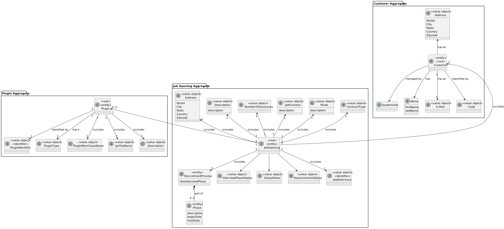
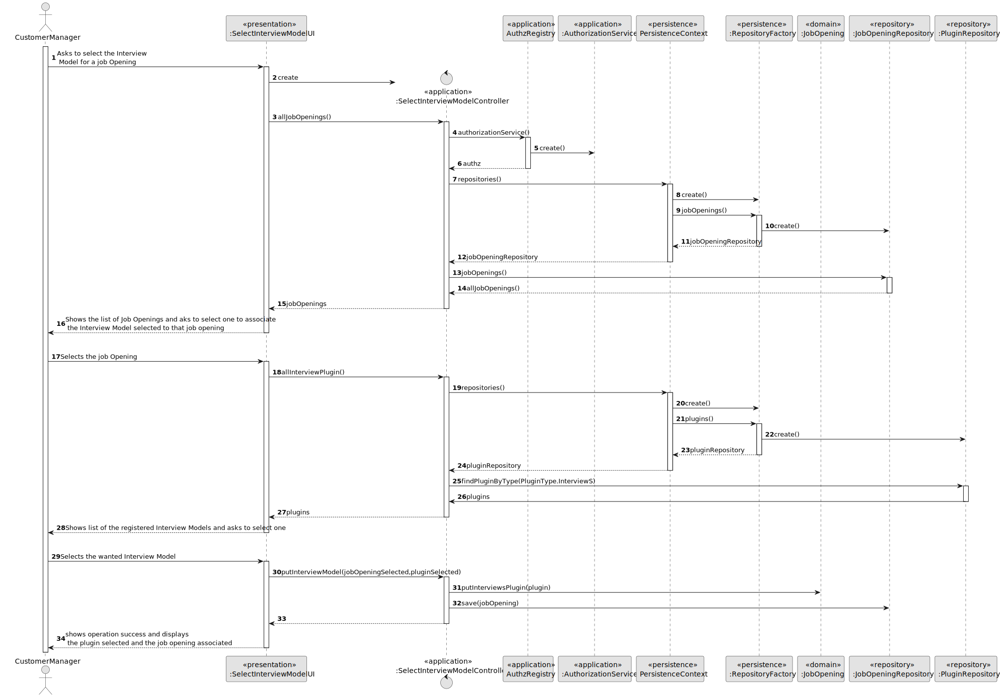
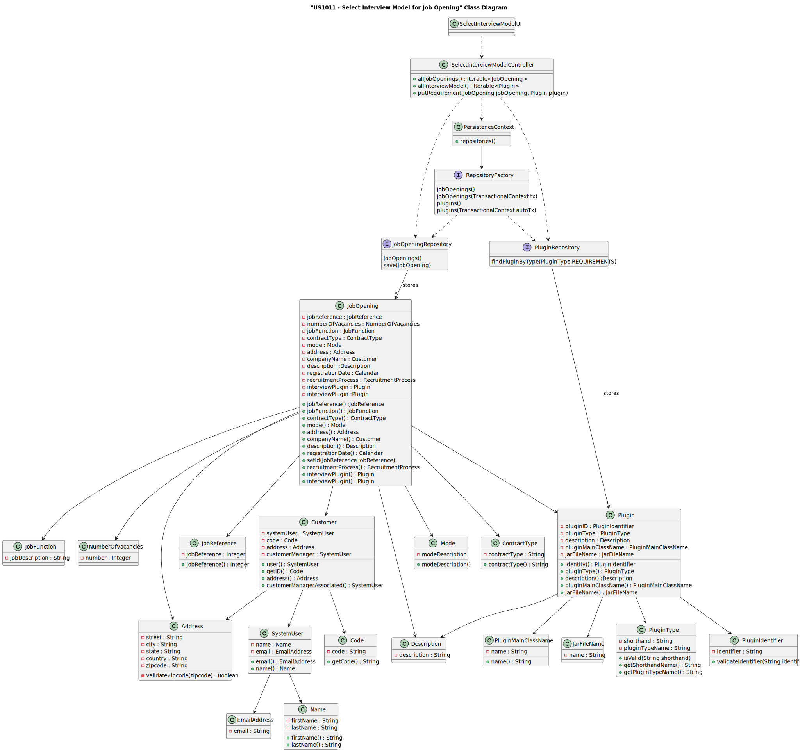
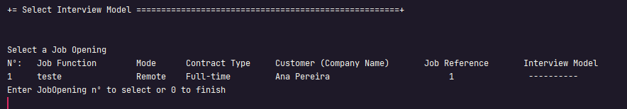
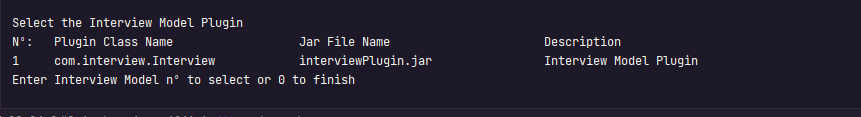
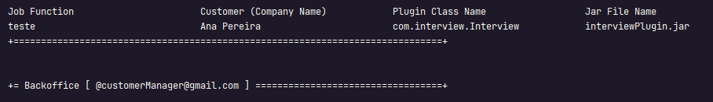

# US 1011


## 1. Context

The task entails providing Customer Managers with the ability to select the interview model to be utilized for evaluating and grading candidates during job openings. This marks the inaugural implementation of this feature, prompting us to develop a flexible system for seamlessly choosing and applying interview models to ensure efficient and tailored candidate assessments.

## 2. InterviewModel

**US 1011** As Customer Manager, I want to select the interview model to use for the interviews of a job opening (for their evaluation/grading).

**Acceptance Criteria:**

- 1011.1 See NFR09(LPROG).
- 1011.2 The Interview Model need to accept all the questions in the pdf file

**Customer Specifications and Clarifications:**

> **Question 41:** How does Language Engineer create the interview model and job InterviewModel? Is it text? Or does he select questions for the interview and InterviewModel for the job opening? And this is when you are creating an interview or a job opening or do you stop in the middle of doing that and then continue?
> 
> **Answer:** The language engineer, with information provided by the customer manager (which he obtained from the customer), will develop a jar in Java corresponding to the module/plugin. For this development you will have to use grammar/language development techniques such as antlr. This code will be in a jar that the language engineer then “installs/registers” in the application (US1008, for example, associating a name to the jar in a configuration file – “5 anos experiencia java”, “req-model-5-years-java .jar”). The application with this information dynamically loads this jar. The grammar used in the jar will reflect the structure of the questions to be used in this model and their evaluation. These activities must be done before US1008 can be done. This work is done “outside” the system, simply by registering the model (when ready) in US1008. US 1009 and US1011 allow you to select models to use (from those that have been duly registered in the system).

**Dependencies/References:**

* There is a dependency to "US1001: As Customer Manager, I want to register a job opening." since you need a customer to associate a jobOpening
* There is a dependency to "US1002: As Customer Manager, I want to register a job opening." since you need to create a jobOpening to give a plugin
* There is a dependency to "US1008 As Language Engineer, I want to deploy and configure a plugin (i.e., Job Requirement Specification or Interview Model) to be used by the system." since you need to create the plugin to associate to a specific jobOpening

**Input and Output Data**

**Input Data:**

* Typed data:
    * None


* Selected data:
    * Job Opening


**Output Data:**
* Display the success of the operation of the generation of the Interview Model's template file


## 3. Analysis

> **Question 18:** In US 1011, how does the Customer Manager select the model to use for interviews?
>
> **Answer:** It is accepted that when models are registered in the system (so-called “plugins”) they are identified with a name or description. For example “Interview Template for Supermarket Cashier Operator” or “Interview Template for Junior Backend Java Programmer”. In US 1011, the Customer manager is supposed to select a model from a possible list of models

> **Question 38:** Each question in an interview model accepts x types of answers (eg multiple choice) or does the interview model accept x types of answers in all its questions? Do we assume that a job opening only follows an interview model?
>
> **Answer:** Yes, each question/answer accepts a type of question/answer (one of the types that appears at the beginning of page 8). In US1011, the Customer manager selects the interview model to use in interviews for a job opening. In other words, there will only be one interview model to use in the interviews for this job opening.

### 3.1. Domain Model


## 4. Design

**Domain class/es:** JobOpening, Plugin, PluginType

**Controller:** SelectInterviewModelController

**UI:** SelectInterviewModelUI

**Repository:** PluginRepository, JobOpeningRepository

**Service**: AuthorizationService


### 4.1. Sequence Diagram

**List Interview Model**


### 4.2. Class Diagram



[//]: # (### 4.3. Applied Patterns)

[//]: # ()
[//]: # (### 4.4. Tests)

[//]: # ()
[//]: # (**Test 1:** *Verifies that it is not possible to ...*)

[//]: # ()
[//]: # (**Refers to Acceptance Criteria:** G002.1)

[//]: # ()
[//]: # ()
[//]: # (```)

[//]: # (@Test&#40;expected = IllegalArgumentException.class&#41;)

[//]: # (public void ensureXxxxYyyy&#40;&#41; {)

[//]: # (	...)

[//]: # (})

[//]: # (````)

## 5. Implementation

### Methods in the Controller

* **Iterable<JobOpening> allJobOpenings()** this method list all the jobOpenings to choose to attribute the plugin

* **Iterable<Plugin> allInterviewPlugin()** this method list all the plugins to choose to attribute the chosen jobOpening

* **public void putInterviewModel(JobOpening jobOpening, Plugin plugin)**  this method put the chosen plugin in the chosen jobOpening


## 6. Integration/Demonstration

>**After doing the log in process, to be able to perform this function you need to have admin or customer manager as your role. Then select the option that says “Select the interview Model for a Job Opening”.
The interview model selection process begins. The system will list all the jobOpenings and ask you to choose one of them:**



>**After that, the system will list all the plugins and ask you again to choose one of them.**




> **Finally,  if all is alright it will appear a message on the screen saying the information of the jobOpening and the plugin chosen**




[//]: # (## 7. Observations)

[//]: # ()
[//]: # (*This section should be used to include any content that does not fit any of the previous sections.*)

[//]: # ()
[//]: # (*The team should present here, for instance, a critical perspective on the developed work including the analysis of alternative solutions or related works*)

[//]: # ()
[//]: # (*The team should include in this section statements/references regarding third party works that were used in the development this work.*)