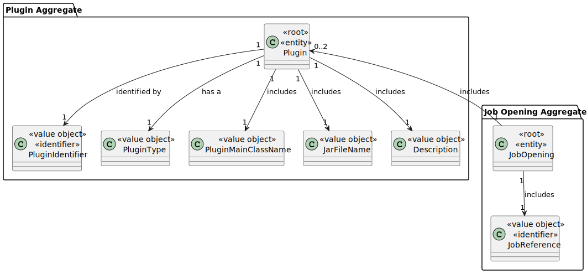
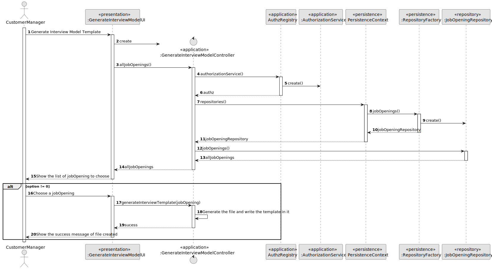
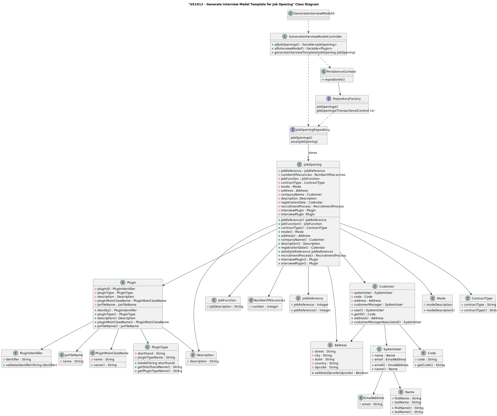
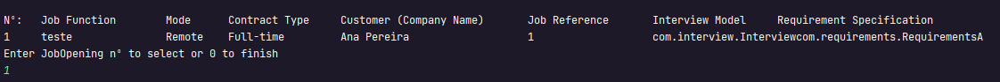
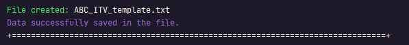

# US 1012


## 1. Context

The task involves empowering Customer Managers to generate and export template text files aimed at aiding in the collection of candidate answers during interviews. This marks the initial implementation of such a feature, prompting us to develop a streamlined solution that facilitates the creation and export of customizable templates to enhance the efficiency and consistency of candidate assessments.

## 2. Requirements

**US 1012** As Customer Manager, I want to generate and export a template text file to help collect the candidate answers during the interviews. 

**Acceptance Criteria:**

- 1012.1 See NFR09(LPROG).

**Customer Specifications and Clarifications:**

> **Question 38: Each question in an interview model accepts x types of answers (eg multiple choice) or does the interview model accept x types of answers in all its questions? Do we assume that a job opening only follows an interview model?** 
>
> **Answer: Yes, each question/answer accepts a type of question/answer (one of the types that appears at the beginning of page 8). In US1011, the Customer manager selects the interview model to use in interviews for a job opening. In other words, there will only be one interview model to use in the interviews for this job opening.**

> **Question 55: Following point "2.2.1 Recruitment Process", The customer manager is responsible for setting up the process, defining the phases and indicating whether it includes the interview. We hereby request that you tell us if it is expected that the phases of the recruitment process will always be the same fixed\watertight "application; screening; interviews; analysis; result;" (interview is not mandatory), or whether the phases can be dynamic (more, less, in a different order). If there is an interview, will there only be one for a JobOpening? We await clarification, to adapt the domain model if necessary.**
>
> **Answer: Regarding the first question, refer to question Q39, already answered. Regarding interviews, 1011 indicates that the customer manager selects the “interview model” to be used for the “job opening” interviews. Therefore, we are admitting that it will always be the same interview model for all interviews, that is, all interviews will have the same questions. In other words, it is appropriate to admit that there will only be one interview for a “job opening”.**

> **Question 92: [1007, 1011] - Job Opening Setup Process – Taking into account US1007, for the setup of the different phases of the recruitment process, we would like you to clarify whether, if an Interview phase is selected, there needs to be a connection directly with US1011, selection of an interview model, or will they be separate functionalities? In the event that they are separated, a recruitment process will only be valid after the selection of an interview model.**
>
> **Answer: I suppose my answer is similar to the previous question (Q91). I can say that we can consider that the company currently intends to always use an “automatic” interview evaluation process, so this must be defined in order to “execute/process” the interviews.**


**Dependencies/References:**


* There is a dependency to "US1001: As Customer Manager, I want to register a job opening." since you need a customer to associate a jobOpening
* There is a dependency to "US1002: As Customer Manager, I want to register a job opening." since you need to create a jobOpening to give a plugin
* There is a dependency to "US1008 As Language Engineer, I want to deploy and configure a plugin (i.e., Job Requirement Specification or Interview Model) to be used by the system." since you need to create the plugin to associate to a specific jobOpening 
* There is a dependency to "US1011: As Customer Manager, I want to select the interview model to use for the interviews of a job opening (for their evaluation/grading)" since you need to associate the plugin to a jobOpening


**Input and Output Data**

**Input Data:**

* Typed data:
    * None


* Selected data:
    * Job Opening
    * Interview Model Plugin


**Output Data:**
* Display the success of the operation and the data of the registered customer


## 3. Analysis

### 3.1. Domain Model


## 4. Design

**Domain Class/es:** JobOpening, Plugin, PluginIdentifier, PluginType, Description, PluginMainClassName, JarFileName

**Controller:** GenerateInterviewModelController

**UI:** GenerateInterviewModelUI

**Repository:**	JobOpeningRepository

**Service:** AuthorizationService


### 4.1. Sequence Diagram

**Export Interview Model Template**


### 4.2. Class Diagram



[//]: # (### 4.3. Applied Patterns)

[//]: # ()
[//]: # (### 4.4. Tests)

[//]: # ()
[//]: # (Include here the main tests used to validate the functionality. Focus on how they relate to the acceptance criteria.)

[//]: # ()
[//]: # (**Test 1:** *Verifies that it is not possible to ...*)

[//]: # ()
[//]: # (**Refers to Acceptance Criteria:** G002.1)

[//]: # ()
[//]: # ()
[//]: # (```)

[//]: # (@Test&#40;expected = IllegalArgumentException.class&#41;)

[//]: # (public void ensureXxxxYyyy&#40;&#41; {)

[//]: # (	...)

[//]: # (})

[//]: # (````)

## 5. Implementation

### Methods in the Controller

* **Iterable<JobOpening> allJobOpenings()** this method list all the jobOpenings to pick up in your plugin

* **void generateInterviewTemplate(JobOpening jobOpening)** this method take the plugin of the jobOpening chosen and generate the Interview Model Template File.


## 6. Integration/Demonstration

>**After doing the log in process, to be able to perform this function you need to have admin as your role. Then select the option that says “Generate/export a template file for interviews”.
The process of generate the template file will then begin. The system will list all the jobOpenings and ask you to choose one of them:**



> **After that, if all is alright it will appear a message on the screen saying the file was created and its name**




[//]: # (## 7. Observations)

[//]: # ()
[//]: # (*This section should be used to include any content that does not fit any of the previous sections.*)

[//]: # ()
[//]: # (*The team should present here, for instance, a critical perspective on the developed work including the analysis of alternative solutions or related works*)

[//]: # ()
[//]: # (*The team should include in this section statements/references regarding third party works that were used in the development this work.*)
