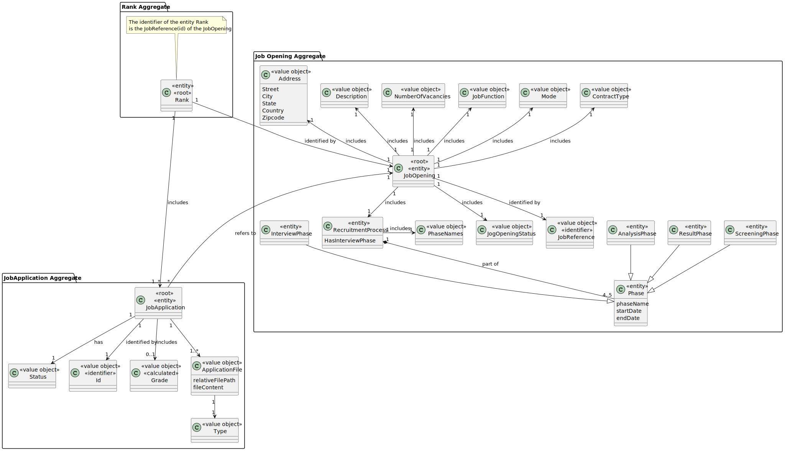

# US 1013


## 1. Context

The task involves Customer Managers to rank candidates for a job opening. This is the first time this feature is being implemented, requiring us to develop a system that allows for the effective evaluation and ranking of candidates based on predefined criteria to streamline the hiring process.

## 2. Requirements

**US 1013** As Customer Manager, I want to rank the candidates for a job opening.

**Acceptance Criteria:**


- 1013.1. Should be possible edit a rank of a candidate. 
- 1013.2. It's only possible start to ranking a jobOpening if is in the analysis phase. 

**Customer Specifications and Clarifications:**

> **Question 17: Regarding section 2.2.1, is it in the Analysis phase that interviews are evaluated and is this result what defines 
> the ranking of candidates? Furthermore, what is the CV for at this stage? Since interviews are not mandatory, what happens when they 
> do not take place?**
>
> **Answer: Interview scores are performed/calculated at the interview stage. 
> The CV and other data (such as the results of interviews) are used by the Customer manager 
> in the analysis phase to rank the candidates. But the ordering is the responsibility of the Customer Manager 
> (for example, you do not have to follow the order of scores in interviews). 
> US 1013 corresponds to the manual ordering of candidates carried out by the Customer Manager. 
> The fact that there are no interviews has no implications for the ordering of candidates as this does not 
> explicitly depend on the interviews**

> **Question 142: US1013 - Candidate Ranking – Mr Client mention a manual ranking (Q17). 
> If the pontuation of an interview is not essential for the candidate's rank, what criteria is to be used when ranking?**
>
> **Answer: Please view again Q17. The ranking is a decision of the Customer Manager based on all the data that he/she may 
> have during the process (including CV and other attached documents and the interviews as well as other data/information that 
> may not be part of the system)**


> **Question 155: Rank Entries - Is there a limit on rank entries? Let's say that 100 candidates apply for a job opening. 
> Does the Customer Manager have to sort all 100 candidates?**
>
> **Answer: The order of candidates should include at least all the first candidates within the vacancy number 
> and some following candidates. At the moment, I do not know exactly the number of the following candidates to 
> be ordered. Therefore, I would like for it to be a global configuration property in the system. 
> It could be a number representing a magnitude from the vacancy number. For instance, 1 could mean exactly the same number of vacancies,
> 2 the double, 0,5 half the number of vacancies. The remainder of the candidates could be just tagged as not ranked**


> **Question 157: US1013 - Rank the candidates for a job Opening is the same as rank the job Applications for a Job Opening, 
> knowing that I can only know the candidates throw the job application?**
>
> **Answer: In the context of a job opening, a candidate is someone that made an application to that job opening. 
> But the same person can be a candidate to other job openings.**


> **Question 160: US1013 - Edit ranking - The customer manager can change the rank of a candidate after assigning it?**
>
> **Answer: That should be possible if none of the interested parties were yet notified of the results.**


> **Question 192: Global Configurations – I'm struggling to understang the global configurations defined for US1013. All candidates must be ranked, so that all of them can be notified. Are the global configurations only for persistence purposes? Example: all candidates are ranked and notified, so if 0.5 is in the global definition, then only half of the number of vancancies must be persisted in the system. Is this the scenario that Mr. Client has in mind?**
> 
> **Answer: I am assuming you refer to Q155. Suppose you have 2 vacancies. You have 80 candidates. If you configure the property as 1 you need to rank (record in the system) the 2 first candidates plus 2 other candidates. If the property is 0,5 you should rank the 2 first candidates plus 1 third candidate. If the property is 2, you should rank the 2 first candidates plus 4 extra candidates. This is a way to assure that you do not have to record in the system the rank of all the possible candidates, but only a number that includes the ones required to fulfill the vacancies plus some extra (according to the property) for possible exceptions (such as someone leaving the application). But my suggestion was only to help in the UI/UX. You may use any other option.**

> **Question 241:** In US1013, it is supposed to give classification to candidates, but an issue arose for us: after completing this US, it must advance to the job opening phase, that is, move from the Analysis phase to the result phase ( Result)?
>
> **Answer:** In principle, the phase change should only be done within the scope of the respective US.


**Dependencies/References:**

* There is a dependency to "US1000:  "As Administrator, I want to be able to register, disable/enable, and list users of the backoffice.", since is necessary to be able to create a User when we create a Customer.

* There is a dependency to "US1001: As Customer Manager I want to register a customer and that the system automatically creates a user for that customer", since one attribute of Job Opening is the Customer(company), so in order to register the job opening, there must first be at least one customer.

* There is a dependency to "US1002:  As Customer Manager, I want to register a job opening.", since at least one job Opening must be registered in the system so that the operator can list a job opening.

* There is a dependency to "US2000a:  As Operator, I want to register a candidate and create a corresponding user", since at least one candidate must be registered in the system so that the operator can list all the candidates.
 
* There is a dependency to "US2002: As Operator, I want to register an application of a candidate for a job opening and import all files received.", since at least one job Application must be registered in the system so that the operator can list a job Application.

* There is a dependency to "US1007: As Customer Manager, I want to setup the phases of the process for a job opening.", since the jobOpening needs to be in the Analysis phase.


**Input and Output Data**

**Input Data:**

* Typed data:
    * Number of the rank


* Selected data:
    * JobOpening
    * JobApplication


**Output Data:**
* Display the success of the operation and the data of the candidates and if they are ranked or not until the actor choose to save in the repository


## 3. Analysis


[//]: # (TODO:Mini resumo do que acontece)


> **Question 148: My question is related to how the ranking is done. Does the customer manager give a grade to each application
> and the system sorts it in ascending order, thus assigning a ranking to each application? If so, what scale will the note have?
> If this is still the case, can he only assign a grade when he is aware of them all? Or you can place it and the ranking is only
> given when all applications have already been evaluated**
>
> **Answer: See Q17. The ordering of candidates (ranking) is the responsibility of the customer manager.
> It may be based on the results of interviews and other information, but the ranking is not automatic.
> There is no note or scale to use. Applications are ordered.**


> **Question 165: Mr. Client mentioned in Q155 that the system should have ranking configurations so that the Customer Manager doesn't have to rank all 
> the candidates for a job opening, and that the ones that haven't been manually ranked are to be tagged with "not ranked". However, in Q162, you've said 
> that all the candidates must be ranked before the result phase starts. Can you clarify this situation**
>
> **Answer: The customer manager must evaluate all the candidates. It is the only way he/she can produce a ranking/order for the candidates and select the “best” 
> candidates to be included in the vacancies for the job opening. In Q155 I was only proposing a way to avoid recording in the system a lot of details that will not 
> have any impact on the next activities. The term “not ranked” maybe is not the best. Maybe “rank not recorded” or something similar could be more appropriated.**


### 3.1. Domain Model


## 4. Design

**Domain Class/es:** JobOpening, JobApplication, Rank

**Controller:** RankCandidatesController

**UI:** RankCandidatesUI

**Repository:** RankRepository, JobApplicationRepository, JobOpeningRepository

### 4.1. Sequence Diagram

**Ranking Candidates**


### 4.2. Tests


**Before Tests** **Setup of Attributes**

```
    @BeforeEach
    void setUp() {
        jobReference = new JobReference(123);
        jobReference2 = new JobReference(456);
        candidatesRanking = new ArrayList<>();
        candidatesRanking.add(new Id(jobReference));
        candidatesRanking.add(new Id(jobReference2));
        rank = new Rank(jobReference, candidatesRanking);
    }

```

**Test 1:** *Job Reference*


```
@Test
public void testJobReference() {
    assertEquals(jobReference, rank.jobReference());
}

@Test
public void testNotEqualsJobReference() {
    assertNotEquals(jobReference2, rank.jobReference());
}

@Test
public void testChangeJobReference() {
    JobReference newJobReference = new JobReference(789);
    rank.changeJobReference(newJobReference);
    assertEquals(newJobReference, rank.jobReference());
}
````

**Test 2:** *Ranking List*


```
 @Test
public void testRankingList() {
    List<Id> rankingList = rank.rankingList();
    assertEquals(candidatesRanking, rankingList);
}

@Test
public void testNotEqualsRankingList() {
    List<Id> rankingList = new ArrayList<>();
    assertNotEquals(candidatesRanking, rankingList);
}

@Test
public void testChangeRankingList() {
    ArrayList<Id> newRankingList = new ArrayList<>();
    newRankingList.add(new Id(jobReference));
    newRankingList.add(new Id(jobReference2));
    rank.changeRankingList(newRankingList);
    assertEquals(newRankingList, rank.rankingList());
}
````

**Test 3:** *Equals and Not Equals*


```
 @Test
public void testEquals() {
    Rank sameRank = new Rank(jobReference, candidatesRanking);
    assertEquals(rank, sameRank);
}

@Test
public void testNotEquals() {
    Rank differentRank = new Rank(new JobReference(901), candidatesRanking);
    assertNotEquals(rank, differentRank);
}

````


**Test 4:** *HashCode*


```
@Test
public void testHashCode() {
    Rank sameRank = new Rank(jobReference, candidatesRanking);
    assertEquals(rank.hashCode(), sameRank.hashCode());
}

````

**Test 5:** *Same as*


```
 @Test
public void testSameAs() {
    Rank sameRank = new Rank(jobReference, candidatesRanking);
    assertTrue(rank.sameAs(sameRank));
}
````

**Test 6:** *Identity*


```
@Test
public void testIdentity() {
    assertEquals(jobReference, rank.identity());
}

@Test
public void testNotSameIdentity() {
    assertNotEquals(jobReference2, rank.identity());
}

````


**Test 7:** *Compare To*


```
    @Test
public void testCompareTo() {
    Rank otherRank = new Rank(new JobReference(123), new ArrayList<>());
    assertEquals(0, rank.compareTo(jobReference)); // Assuming jobReference.compareTo(jobReference) returns 0
}

````


**Test 8:** *Not Equals Different Object*


```
public void testNotEqualsDifferentObject() {
    assertNotEquals(rank, new Object());
}

````


**Test 9:** *Not Equals Different Candidates Ranking*


```
@Test
public void testNotEqualsDifferentCandidatesRanking() {
    ArrayList<Id> differentRankingList = new ArrayList<>();
    differentRankingList.add(new Id(new JobReference(789)));
    Rank differentRank = new Rank(jobReference, differentRankingList);
    assertNotEquals(rank, differentRank);
}

````


**Test 10:** *Empty Candidates Ranking List*


```
@Test
public void testEmptyCandidatesRankingList() {
    ArrayList<Id> emptyRankingList = new ArrayList<>();
    Rank emptyRank = new Rank(jobReference, emptyRankingList);
    assertEquals(emptyRankingList, emptyRank.rankingList());
}

````


**Test 11:** *Large Candidates Ranking List*


```
@Test
public void testLargeCandidatesRankingList() {
    ArrayList<Id> largeRankingList = new ArrayList<>();
    for (int i = 0; i < 1000; i++) {
        largeRankingList.add(new Id(new JobReference(i)));
    }
    Rank largeRank = new Rank(new JobReference(999), largeRankingList);
    assertEquals(1000, largeRank.rankingList().size());
}

````


## 5. Implementation

### Methods in the Controller

The US was implemented using the following methods:

* **Iterable<JobOpening> listAllJobOpenings()** this method list all the jobOpenings.

* **Iterable<Id> findRankByJobReference(JobReference jobReference)**  this method send the information to search by JobReference if already exists a rank .

* **Iterable<JobApplication> findCandidates(JobOpening jobOpeningSelected)**  this method send the information to search to find all the jobApplications by JobOpening .

* **void storeRank(JobReference jobReference, ArrayList<Id> candidateFinalRanks)** this method send the information of the rank to the database.


## 6. Integration/Demonstration


>**After doing the log in process, to be able to perform this function you need to have admin or customer manager as your role. Then select the option that says “Rank Candidates of a JobOpening”.
The process of ranking the candidates of a jobOpening will begin. The system will ask you to choose the a jobOpening, it's important to know you only can rank a jobOpening that is
in phase "ANALYSIS" :**


> **Then will be appear the jobApplications associated with this JobOpening.**


> **You will choose one or many applications to rank and next you will do the same for the positions you want to put the chosen applications**


> **Afterwards, the jobApplications will appear again but this time with a rank associated**


> **Finally, if you want to terminate you choose the option and next you can select to save in the repository/database to safeguard your progress **


[//]: # (## 7. Observations)

[//]: # ()
[//]: # (*This section should be used to include any content that does not fit any of the previous sections.*)

[//]: # ()
[//]: # (*The team should present here, for instance, a critical perspective on the developed work including the analysis of alternative solutions or related works*)

[//]: # ()
[//]: # (*The team should include in this section statements/references regarding third party works that were used in the development this work.*)