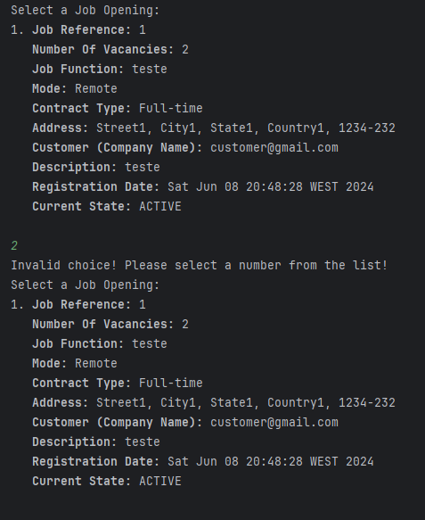

# US 1014

## 1. Context

In this User Story the goal is to record the time and date for an interview with a candidate.

## 2. Requirements

**US 1014**  As Customer Manager, I want to record the time and date for an interview with a candidate.

**Acceptance Criteria:**

- 1014.1. The date should not be in the past;
- 1014.2. The date must not be after the end date or before the start date of the Interview Phase defined in the Recruitment Process;
- 1014.3. The list of job openings to select from should only be job openings that contain the Interview Phase;
- 1014.4. The list of candidates to select one from should only be candidates whose application for the previously selected job opening has been accepted;
- 1014.5. The Candidates to select from, must have its Job Application accepted in the Screening Phase;
- 1014.6. The Job Openings to select from must be the ones that the current user (admin or customerManager) is responsible for;
- 1014.7. The Job Openings to select from must be active(have already started the Recruitment Process) and must be currently in the Interview Phase.

**Customer Specifications and Clarifications:**

> **Question1:** Time and date, means start date and not end date? Can there be parallel interviews?
>
> **Answer1:** US1014 refers to setting a date for an interview with a candidate.
> Something like indicating the day and time (e.g. April 23 at 14:00). With regard to scheduling “overlapping” interviews (with the same start date), 
> at the moment this would be something to allow (for example, the customer manager could delegate the conduct of the interview to someone else). 
> This does not mean that you should not validate that the interviews take place within the interview phase.

> **Question:** With regard to scheduling the interview, it should only be possible to schedule it when? 
> Is it only possible to book the interview when the recruitment phase is at the interview stage? Or is it possible to schedule it at other earlier stages?
>
> **Answer:**  I think it may be possible to schedule the interviews earlier, but you have to make sure that the candidate has “passed” the screening. 
> It doesn't make sense to schedule an interview for a candidate who has not been accepted. Keep this in mind.

> **Question:** Is it possible to schedule interviews for any day and time or do we have to take into account weekends, working hours and public holidays, for example?
>
> **Answer:** The system should display the day of the week for the selected date. But the system should accept any valid date.

> **Question:** When scheduling an interview with an applicant, should it be possible to schedule more than one interview per application?
>
> **Answer:** The system at this stage is designed to only support one interview per job opening, so it doesn't make much sense to schedule more than one interview for a candidate unless you want to reschedule the same interview (for example, the candidate has justifiably missed a previous interview). In this context, I would say that it makes more sense to be able to reschedule an interview than to schedule more than one interview for the same candidate.

> **Question:** Should we type an interviewer because of the possible parallels interviews or should we only set the date and time of the interview for this US and use this info only for future settings of data about the interview? 
>
> **Answer:** For the moment there is no requirement to register the name of the interviewer. However, the system should warn the user if he/she is scheduling an interview for a time already taken by other interview (for the same Customer Manager).

**Dependencies/References:**

* There is a dependency to "US1000: As Administrator, I want to be able to register, disable/enable, and list users of the backoffice", since there is a need to have users registered in the system to be able to do any kind of action.

* There is a dependency to "US2000a: As Operator, I want to register a candidate and create a corresponding user", since at least one candidate must be registered in the system so that the operator can list all the candidates.

* There is a dependency to "US2002: As Operator, I want to register an application of a candidate for a job opening and import all files received." 

* There is a dependency to "US1002: As Customer Manager, I want to register a job opening."

* There is a dependency to "US1007: As Customer Manager, I want to setup the phases of the process for a job opening"

* There is a dependency to "US1010: As Customer Manager, I want to open or close phases of the process for a job opening."

* There is a dependency to "US1015: As Customer Manager, I want to execute the process of verification of requirements of applications for a job opening"

**Input and Output Data**

**Input Data:**

* Typed data:
  * Date 
  * Hour

* Selected data:
    * Job Opening
    * Candidate
    * If the user wants to update the Interview Schedule (If there's's already an interview registered for that Job Opening and Job Application)

**Output Data:**
* Display of success of operation
* The registered Interview Schedule Date 

## 3. Analysis

### 3.1. Domain Model

## 4. Design

**Domain Class/es:** JobApplication, Candidate, SystemUser, EmailAddress, Name, JobOpening, RecruitmentProcess, TimePeriod, Phase, InterviewPhase, InterviewSchedule, Interview

**Controller:** RecordTimeDateForInterviewController

**UI:** RecordTimeDateForInterviewUI

**Repository:**	JobOpeningRepository, JobApplicationRepository, InterviewRepository

### 4.1. Sequence Diagram

## 5. Implementation

### Methods in the Controller

* **public List<JobOpening> findAllJobOpeningsWithInterview()** - this method gets all active Job Openings with the interview phase and that are currently in the InterviewPhase and that are managed by the current user.

* **public List<JobApplication> getAcceptedJobApplicationsByJobOpening(JobOpening jobOpening)** - this method gets all the job applications that were accepted in the phase screening and that are associated to the selected Job Opening 

* **public List<Interview> findEqualInterview(final JobOpening jobOpening, final Calendar date, final Calendar hour)** - this method finds equal interviews with the same JobApplication, Job Opening, date and hour.

* **public Interview registerInterview( final JobOpening jobOpening, final JobApplication jobApplication, final Calendar date, final Calendar hour)** - this method registers a new Interview object.

* **public Interview updateInterview(Interview existingInterview, Calendar date, Calendar hour) throws ConcurrencyException** - this method updates the date and hour of an existing Interview object.

* **public List<Interview> findInterviewsByJobApplication(JobApplication jobApplication)**- this method finds Interviews with for the same Application(with the same Id and JOb Opening)

## 6. Integration/Demonstration

After doing the log in process, to be able to perform this function you need to have admin or customer manager as your role. Then select the option that says “Record Interview with Candidate”.
Then the system will show a list of the active job openings that have the Interview phase and that are currently in the Screening or Interview Phase, registered in the system and that are managed by the current user logged in and will ask to select one of them.

if there's no Job opening that matches all this conditions, this will happen:  

if there is job openings available select the wanted one. If the submitted value is not valid (letter, a symbol or a number greater or smaller than the ones that appear on the list), then the system will ask again for the value until it is valid.

After selecting the wanted candidate, all of his/hers personal data will be shown(first name, last name, email and phone number):

Then the system will show a list of the accepted job applications in the Screening phase that are associated with the previous selected job opening and will ask to select one.
If the submitted value is not valid (letter, a symbol or a number greater or smaller than the ones that appear on the list), then the system will ask again for the value until it is valid.

If for the selected Job Opening and Job Application there is already a registered interview, the system will show the appointment made and a menu with options to exit or update the interview and will ask you to select an option.

If the option selected is 0 the program will close and go back to the Main Menu.

If the submitted value is not valid (letter, a symbol or a number greater or smaller than the ones that appear on the list), then the system will ask again for the value until it is valid.

If the option selected is 1 the program will ask the user to type the date and hour.
The date cannot be outside the time limit set for the Interview phase and the time is only valid for the time period set (08:00 to 19:00).
If the submitted value is not valid (letter, a symbol not in the date and hour format or an enter), then the system will ask again for the value until it is valid.

if there's no other interview for the same Job Opening, date and hour, then the system will show the interview appointment. 

For example this is a previous-recorded interview appointment. As you can see the Job Opening is the same, the date is 11-06-2024 and the hour 13:30.

So if you wanted to make an appointment for the same Job Opening, date ad hour, this would happen.

