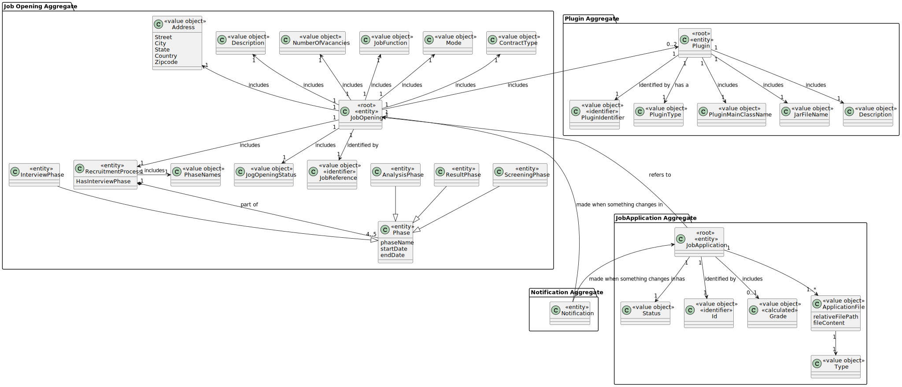
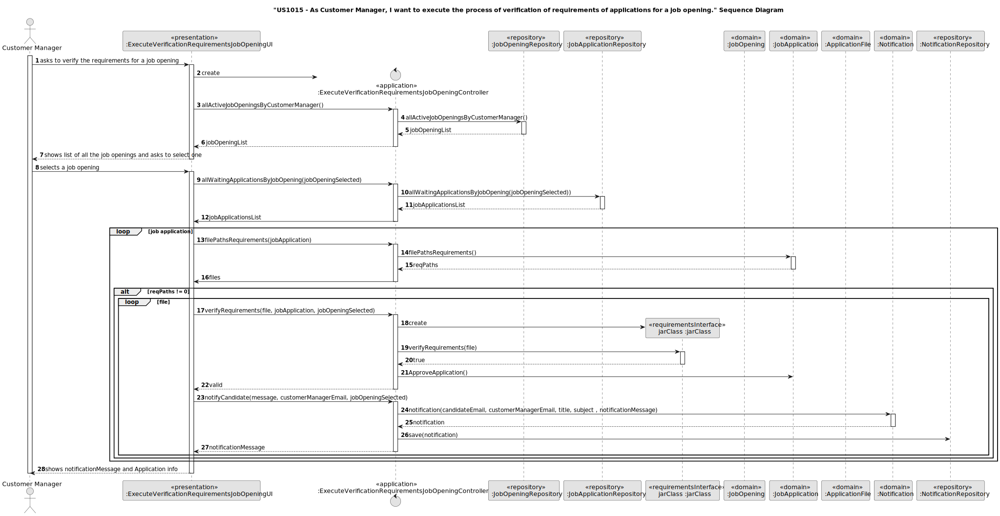
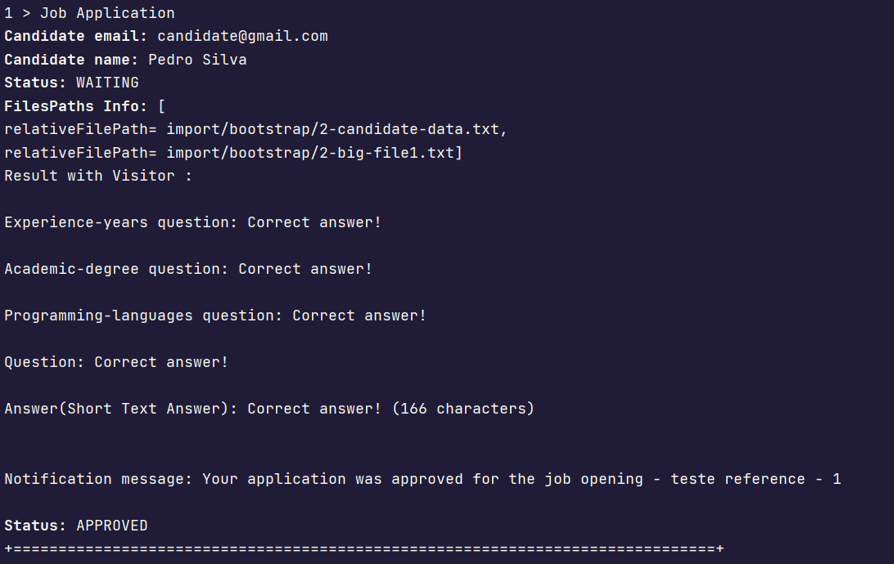

# US 1015

## 1. Context

The task at hand is to execute the process of verification of requirements of applications for a job opening, as a Customer Manager.
This is the first time this feature is being implemented,
so we're starting from scratch to design and develop a seamless process to execute the process of verification of requirements of applications for a job opening.

## 2. Requirements

**US 1015**  As Customer Manager, I want to execute the process of verification of requirements of applications for a job opening.

**Acceptance Criteria:**

- 1015.1. Verify the requirements to the candidates that submit the requirements files


**Customer Specifications and Clarifications:**

> **Question167:** US1015 - Should the process be carried out for all candidates or only for some (according to some criteria)?
> 
> **Answer167:** The files with the answers to the requirements enter the system gradually. It may be simpler for the process to run (i.e. check the requirements) for candidates for whom the requirements file has already been submitted. At some point, the process will run with all the candidates who have already submitted their requirements files.


**Dependencies/References:**

* There is a dependency to "US 1002: As Customer Manager, I want to register a job opening."

* There is a dependency to "US 2003: As Operator, I want to generate and export a template text file to help collect data fields for candidates of a job opening (so the data is used to verify the requirements of the job opening)."

* There is a dependency to "US 1009: As Customer Manager, I want to select the requirements specification to be used for a job opening."

* There is a dependency to "US 1008: As Language Engineer, I want to deploy and configure a plugin (i.e., Job Requirement Specification or Interview Model) to be used by the system."

* There is a dependency to "US 2004: As Operator, I want to upload a text file with the data fields (requirements ) of a candidate for its verification"

* There is a dependency to  "US 1017: As Customer Manager, I want to upload a text file with the candidate responses for an interview."

* There is a dependency to  "US 3001: As Candidate, I want to be notified in my application when the state of one of my applications changes."


**Input and Output Data**

**Input Data:**

* Typed data:
    * None
    

* Selected data:
    * Job Opening


**Output Data:**
* Message for each job application, approved or rejected.


## 3. Analysis

* In this User Story ANTLR and Visitors were used to run through the file and assess whether it met the necessary requirements to be approved.

### 3.1. Domain Model



## 4. Design

**Domain Class/es:** JobOpening, JobApplication, ApplicationFile, JarClass, Notification

**Controller:** ExecuteVerificationRequirementsJobOpeningController

**UI:** ExecuteVerificationRequirementsJobOpeningUI

**Repository:**	JobOpeningRepostiory, JobApplicationRepository, NotificationRepository


### 4.1. Sequence Diagram




[//]: # (### 4.3. Applied Patterns)


### 4.4. Tests

Include here the main tests used to validate the functionality. Focus on how they relate to the acceptance criteria.


**Test verifyRequirementsWithNoFiles:** Verifies that it is not possible to evaluate throught the jar file if the requirement file does not exist.


```

@Test(expected = NullPointerException.class)
    public void verifyRequirementsWithNoFiles() throws IOException, ClassNotFoundException, InvocationTargetException, NoSuchMethodException, IllegalAccessException {

        SystemUser user = getNewUserSecond();
        SystemUser userCustomerManager = getCustomerManager();
        Code code = new Code("ABC123");
        Address address = new Address("Street1", "City1", "State1", "Country1", "1234-232");

        JobReference jobReference = new JobReference(1);

        Customer customer = new Customer(user, code, address, userCustomerManager);
        JobOpening jo = new JobOpening(new NumberOfVacancies(1), new JobFunction("Testing Unit"), Modes.HYBRID, ContractType.valueOf(ContractTypes.FULL_TIME), new Address("Colorado", "United States of America", "Brownstone", "Willow Street", "4444-111")
                , customer, new Description("Testing Unit"), jobReference, Calendar.getInstance());
        Candidate c = new Candidate(getNewUserFirst(), phoneNumber);

        JobApplication jobApplication = new JobApplication(c, jo);


        String file = null;
        String message = "";


        Plugin requirementsPlugin = jo.requirementsPlugin();
        File filePlugin = new File(requirementsPlugin.jarFileName().toString());
        URL url = filePlugin.toURI().toURL();

        URLClassLoader classLoader = new URLClassLoader(new URL[]{url});
        Class<?> jarFile = classLoader.loadClass(requirementsPlugin.pluginMainClassName().name());
        Method method = jarFile.getMethod("verifyRequirements");
        assertFalse((Boolean) method.invoke(null, file));

    }

````

**Test ensureValidRequirements:** Verifies that the file can be validated thought the verifyRequirements method in the jar file.

```

 @Test
    public void ensureValidRequirements() throws Exception {
        String jarPath = "src/test/java/lapr4/jobs4u/candidatemanagement/domain/plugin/testRequirementsPlugin.jar";
        File filePlugin = new File(jarPath);
        URL url = filePlugin.toURI().toURL();

        URLClassLoader classLoader = new URLClassLoader(new URL[]{url});
        Class<?> jarFile = classLoader.loadClass("com.requirements.RequirementsA");
        Method method = jarFile.getMethod("verifyRequirements", String.class);

        assertTrue((Boolean) method.invoke(null, "src/test/java/lapr4/jobs4u/candidatemanagement/domain/txt/requirementTxtValid.txt"));

    }
````


**Test ensureValidRequirements:** Verifies that the invalid file is not be validated thought the verifyRequirements method in the jar file.

```

   @Test
    public void ensureInvalidRequirements() throws Exception {
        String jarPath = "src/test/java/lapr4/jobs4u/candidatemanagement/domain/plugin/testRequirementsPlugin.jar";
        File filePlugin = new File(jarPath);
        URL url = filePlugin.toURI().toURL();

        URLClassLoader classLoader = new URLClassLoader(new URL[]{url});
        Class<?> jarFile = classLoader.loadClass("com.requirements.RequirementsA");
        Method method = jarFile.getMethod("verifyRequirements", String.class);
        assertFalse((Boolean) method.invoke(null, "src/test/java/lapr4/jobs4u/candidatemanagement/domain/txt/requirementTxtInvalid.txt"));
    }
````


## 5. Implementation

### Methods in the Controller

* Iterable<JobOpening> allActiveJobOpeningsByCustomerManager() - this method returns a iterable of JobOpenings, associeted with the current Customer Manager.

* Iterable<JobApplication> allJobApplicationsByJobOpening(JobOpening jobOpeningSelected) - this method return a iterable of Job applications, according to the job opening selected by the user.

* String verifyRequirements(String file, JobApplication jobApplication, JobOpening jobOpeningSelected) - this method verifies if the file meets the requirements, for that, is necesssary to know the requirement plugin of that job opening. 
Besides that, the verification results in approving or rejecting the application. This method returns a sucess/insucess message.

## 6. Integration/Demonstration

After the main menu appears and select the option: "Check the requirements of applications for a job opening".

Choose a job opening from the list and it will appear an Approved or rejected message.



[//]: # (## 7. Observations)

[//]: # ()
[//]: # (*This section should be used to include any content that does not fit any of the previous sections.*)

[//]: # ()
[//]: # (*The team should present here, for instance, a critical perspective on the developed work including the analysis of alternative solutions or related works*)

[//]: # ()
[//]: # (*The team should include in this section statements/references regarding third party works that were used in the development this work.*)