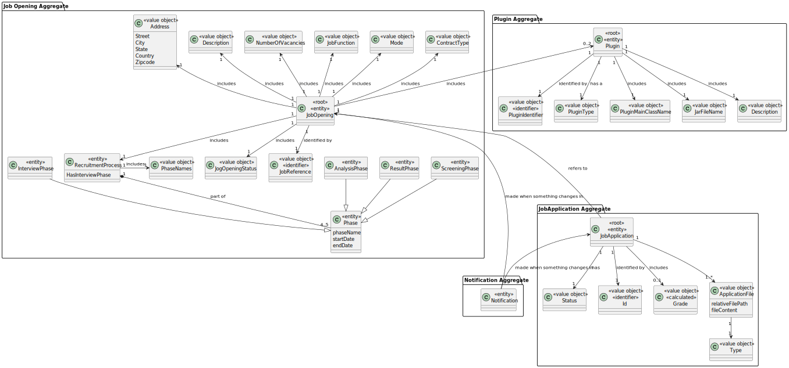
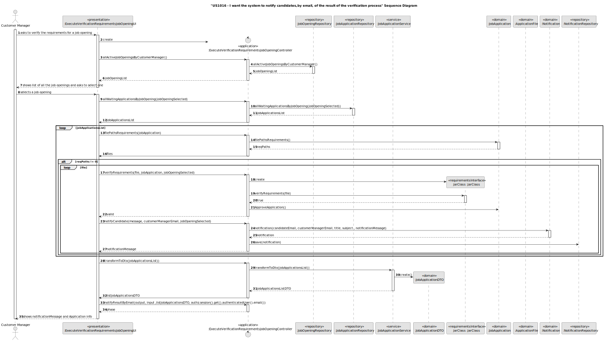
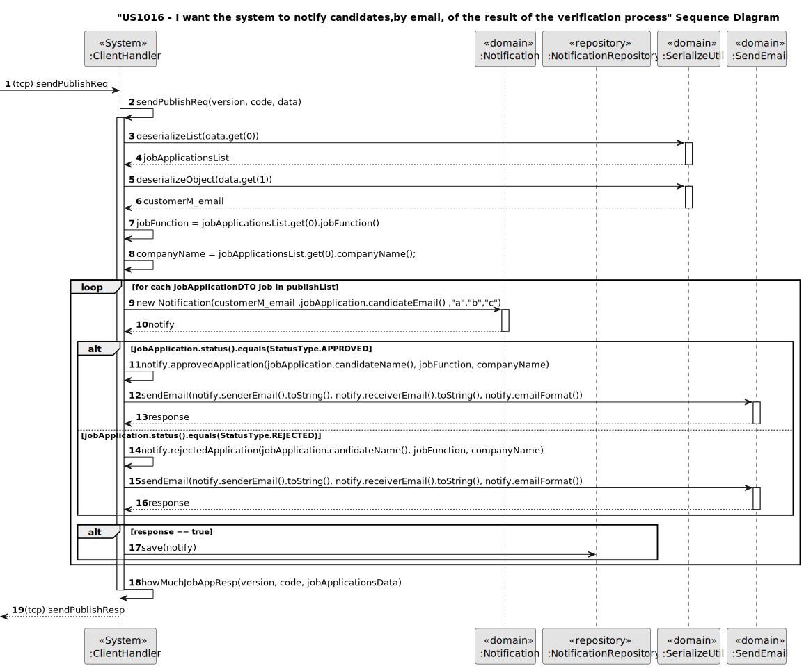
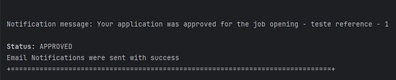
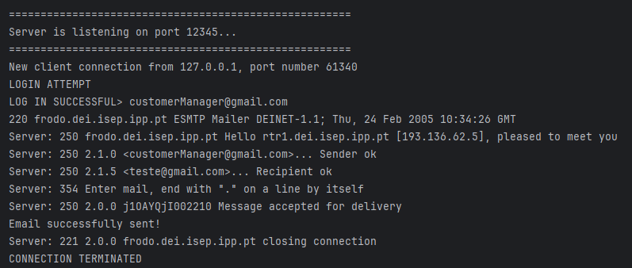

# US 1016

## 1. Context

In this User Story the goal is to notify the candidate by email, of the result of the verification process(if job application is approved or rejected).

## 2. Requirements

**US 10016** As Customer Manager, I want the system to notify candidates, by email, of the result of the verification process

**Acceptance Criteria:**

- 1016.1. Display the result of the Verification process in the body of the email;

**Customer Specifications and Clarifications:**

> **Question:** Regarding the sending of notifications by email, is it necessary to save that this has been done?
>
> **Answer:** Nothing explicit is said about this in the document. However, from the point of view of managing the jobs4u process, it seems appropriate to me that this information should be recorded.

> **Question:**  What is the process by which this notification is generated? After the Requirement Specification module has been evaluated, 
> it generates an “Approved” or “Rejected” result. Does this result automatically trigger a notification to the candidate or is it the Customer Manager's 
> responsibility to inform the candidate via the system of the verification result (e.g. after a negative result is generated, the Customer Manager goes 
> into the system to reject the candidate so that an email can be sent)?
>
> **Answer:** It's the second option you present. US1015 allows the Customer Manager to invoke the requirements verification process. After that, all applications must be accepted or rejected. It is then possible for the Customer Manager to invoke the notification via US1016.

> **Question:** in relation to US1016 which reads as follows: “As Client Manager, I want the system to notify candidates by email of the outcome of the verification process”. 
> I would like to know the format of the message to send to the client, it could be something like: “Dear [Candidate Name], I hope this email finds you well. 
> As Client Manager, I would like to inform you of the outcome of the verification process for the position you applied for. 
> After careful consideration of your application and qualifications, I am pleased to inform you that you have successfully passed the verification process. 
> Congratulations! Your application met our initial criteria, and we are impressed with your qualifications and experience. 
> We will move on to the next stage of the selection process, which may include interviews or additional assessments. 
> We will contact you shortly with more details about the next steps. Thank you for your interest in our company and for taking the time to apply for the position. 
> We appreciate your patience throughout the process. If you have any questions or need further assistance, please do not hesitate to contact us. 
> Best regards, [Your name] Client Manager [Your company name]” I would like to know the most important information when notifying the candidate, should the name of the 
> client manager appear, the job reference, the candidate's name. And whether the email should be in English or Portuguese.
>
> **Answer:** It can be as you present it. It can be in Portuguese or English.

> **Question:** I want to know when the client says "verification process" is the same about the screening phase.
>
> **Answer:** Yes.

> **Question:** This user story has a functional dependency with 1015. I would like to know if an error occurs, do I need to delete what happened in US 1015, as if it were a transaction?
>
> **Answer:** The process of notification (US1016) must be done after the verification (US1015) but an error in the notification does not invalidate the “results” of the verification process.

**Dependencies/References:**

* There is a dependency to "US1000: As Administrator, I want to be able to register, disable/enable, and list users of the backoffice", since there is a need to have users registered in the system to be able to do any kind of action.

* There is a dependency to "US2000a:  As Operator, I want to register a candidate and create a corresponding user", since at least one candidate must be registered in the system so that the operator can list all the candidates.

* There is a dependency to "US2000c:  As Operator, I want to list all candidates", since it helps list all the active candidates registered in the system, to then the user to select one.

* There is a dependency to "US1015:  As Customer Manager, I want to execute the process of verification of requirements of applications for a job opening."

**Input and Output Data**

**Input Data:**

* Typed data:
    * None
    

* Selected data:
    * Job Opening

**Output Data:**
* Display of all the personal data of the selected candidate

## 3. Analysis

### 3.1. Domain Model

## 4. Design

**Domain Class/es:** Candidate, SystemUser, EmailAddress, PhoneNumber, Name, JobApplication

**Controller:** ExecuteVerificationRequirementsJobOpeningController

**UI:** ExecuteVerificationRequirementsJobOpeningUI

**Repository:**	CandidateRepository

### 4.1. Sequence Diagram

## 5. Implementation

### Methods in the Controller

* **public boolean notifyResultByEmail(DataOutputStream output, DataInputStream input,  Iterable<JobApplicationResultDTO> jobApplications, EmailAddress publisherEmail) throws IOException** - this method send the information of the job Applications,the email of the company and the publisher, to the server and process the data.

## 6. Integration/Demonstration

