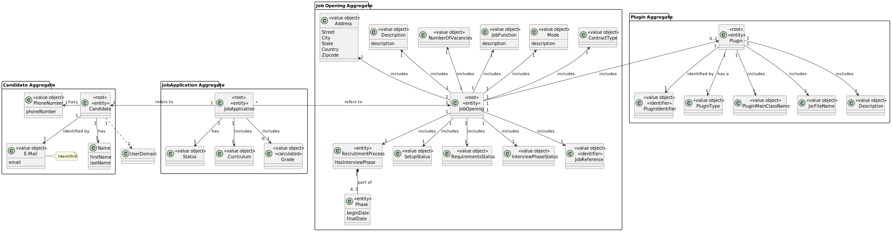
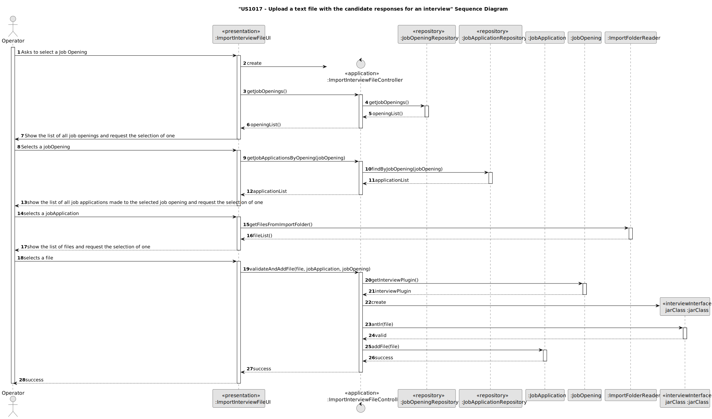
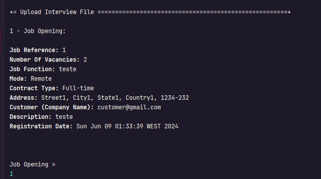
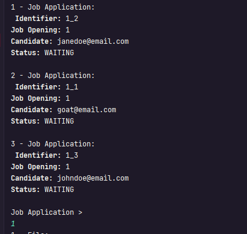
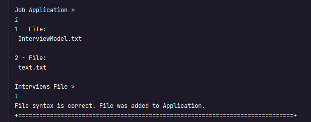

# US 1017

## 1. Context


The task involves allowing Customer Managers to upload a text file containing candidate responses for an interview. This is the first time this feature is being implemented, necessitating the development of a user-friendly system that supports the seamless upload and integration of candidate response data to facilitate the interview evaluation process.

## 2. Requirements

**US 1017**  As Customer Manager, I want to upload a text file with the candidate responses for an interview.

**Acceptance Criteria:**

- 1017.1. See NFR09(LPROG);
- 1017.2. The system must validate the syntax of the uploaded file

**Customer Specifications and Clarifications:**

> **Question 214:** US1017/1018 – Our group has a question regarding the processing of candidate response files for the interview.
> In the case of uploading a file, if the question that requires a number as an answer is filled in with an invalid format, for example,
> a letter, we must consider this as an invalid format in US 1017 (and ask the user to upload again to a valid file) or should we,
> in US1018, consider it to be incorrect and automatically assign 0 points to that invalid answer? That is, in US 1017, should we just check
> the file format or should we also check that the responses are filled with the correct data type?
>
> **Answer:** The mentioned case should be considered a file validation error (i.e. the submitted file does not correspond to the defined grammar).


**Dependencies/References:**

* There is a dependency to "US1000: As Administrator, I want to be able to register, disable/enable, and list users of the backoffice.", since is necessary to be able to create a User when we create a Customer.
* There is a dependency to "US1001: As Customer Manager, I want to register a job opening." since you need a customer to associate a jobOpening
* There is a dependency to "US1002: As Customer Manager, I want to register a job opening." since you need to create a jobOpening to give a plugin
* There is a dependency to "US1008: As Language Engineer, I want to deploy and configure a plugin (i.e., Job Requirement Specification or Interview Model) to be used by the system." since you need to create the plugin to associate to a specific jobOpening
* There is a dependency to "US1011: As Customer Manager, I want to select the interview model to use for the interviews of a job opening (for their evaluation/grading)" since you need to associate the plugin to a jobOpening
* There is a dependency to "US1012: As Customer Manager, I want to generate and export a template text file to help collect the candidate answers during the interviews.", since the file uploaded in this US is the result of filling out the one generated in US1012.


**Input and Output Data**

**Input Data:**

* Typed data:
  * None


* Selected data:
  * JobOpening
  * JobApplication
  * File


**Output Data:**
* Display the success of the operation about the syntax of the file was correct and it was added to the application. 


## 3. Analysis

* The system asks the user to select a Job Opening and then a Job Application
* The system should list the files in a folder, the user then selects one to import.
* Afterwards, the system verifies if the syntax of the file is correct per the interview plugin.
* If the syntax is valid, the file is added to the system, otherwise an error is thrown and the system informs the user of what is wrong.


> **Question 227:** US 1017 - In terms of "upload", it certainly goes through a grammar check and after success, placing the interview response file next to the folder with the "Application" files, right?
>
> **Answer:** Yes, the syntax must be checked and, if everything is correct, the file must be “imported” into the system so that it can be used later, for example, within the scope of US 1018. What is the
> solution to “import” it? It's part of your solution. Ideally, I think it would make sense for it to be integrated into the database. If this is not possible, I think it is acceptable for it to remain in a folder/directory on a server.


### 3.1. Domain Model


## 4. Design

**Domain Class/es:** JobOpening, JobApplication

**Controller:** ImportInterviewFileController

**UI:** ImportInterviewFileUI

**Repository:** JobApplicationRepository, JobOpeningRepository

**Auxiliar Class** ImportFolderReader

### 4.1. Sequence Diagram

**Upload file**



### 4.2. Tests


**Test 1:** *Ensure Invalid Syntax Interview*


```
@Test
    public void ensureInvalidSyntaxInterview() throws Exception {
        String jarPath = "src/test/java/lapr4/jobs4u/candidatemanagement/domain/plugin/testPlugin2Int.jar";
        File filePlugin = new File(jarPath);
        URL url = filePlugin.toURI().toURL();

        URLClassLoader classLoader = new URLClassLoader(new URL[]{url});
        Class<?> jarFile = classLoader.loadClass("com.interview.Interview");
        Method method = jarFile.getMethod("antlr", String.class);
        assertFalse((Boolean) method.invoke(null, "src/test/java/lapr4/jobs4u/candidatemanagement/domain/txt/textInvalid.txt"));
    }

````

**Test 2:** *Ensure Valid Syntax Interview*


```
@Test
    public void ensureValidSyntaxInterview() throws Exception {
        String jarPath = "src/test/java/lapr4/jobs4u/candidatemanagement/domain/plugin/testPlugin2Int.jar";
        File filePlugin = new File(jarPath);
        URL url = filePlugin.toURI().toURL();

        URLClassLoader classLoader = new URLClassLoader(new URL[]{url});
        Class<?> jarFile = classLoader.loadClass("com.interview.Interview");
        Method method = jarFile.getMethod("antlr", String.class);

        assertTrue((Boolean) method.invoke(null, "src/test/java/lapr4/jobs4u/candidatemanagement/domain/txt/InterviewModel.txt"));

    }

````


## 5. Implementation

### Methods in the Controller

The US was implemented using the following methods:
In ***ImportRequirementsFileController***:
* **public Iterable<JobOpening> getJobOpenings()** - this method retrieves all Job Openings.
* **public Iterable<JobApplication> getJobApplicationsByOpening(JobOpening jobOpening)** - this method retrieves all Job Application associated with the provided Job Opening.
* **public boolean validateAndAddFile(File file, JobApplication jobApplication, JobOpening jobOpening)** - this method calls upon the required methods to validate de syntax of the file and associate it with the jobApplication

In ***JobOpeningRepository***:
* **public Iterable<JobOpening> getJobOpenings()** - this method retrieves all Job Openings.

In ***JobApplicationRepository***:
* **public Iterable<JobApplication> findByJobOpening(JobOpening jobOpening)** - this method retrieves all Job Application associated with the provided Job Opening.

In ***ImportFolderReader***:
* **public Iterable<String> getFilesFromImportFolder()** - this method fetches all files in the import folder

In ***JobOpening***:
* **public Plugin getInterviewPlugin()** - this method retrieves the Interview Plugin associated with the JobOpening.

In ***JobApplication***:
* **public boolean addFile(File file)** - this method adds the file to the JobApplication.

In ***"Plugin"***:
* **public static void antlr(String file)** - this method recieves the contents of a file and validates its syntax.


## 6. Integration/Demonstration

>**After doing the log in process, to be able to perform this function you need to have admin or customer manager as your role. Then select the option that says “Upload Interview File”.
The process of upload a interview file will then begin. The system will ask to choose a jobOpening:**



>**After that, will ask to select a jobApplication.**


> **Finally, the system will ask to choose a file and if we are in the specified requirements of the interviewPlugin will appear a message of success**



[//]: # (## 7. Observations)

[//]: # ()
[//]: # (*This section should be used to include any content that does not fit any of the previous sections.*)

[//]: # ()
[//]: # (*The team should present here, for instance, a critical perspective on the developed work including the analysis of alternative solutions or related works*)

[//]: # ()
[//]: # (*The team should include in this section statements/references regarding third party works that were used in the development this work.*)