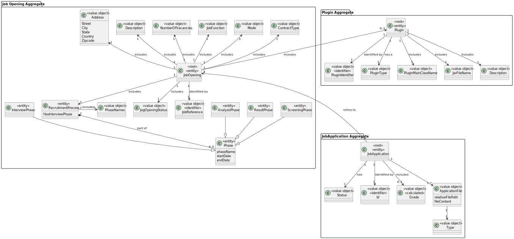
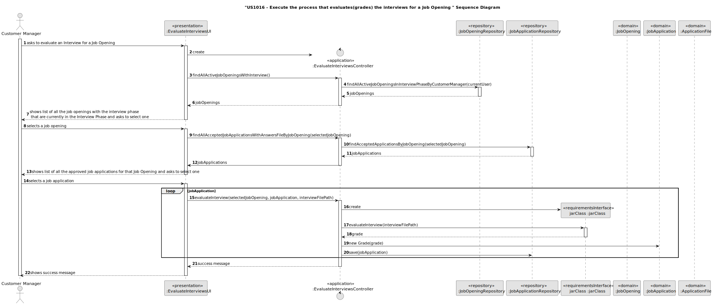
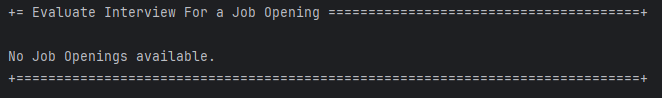
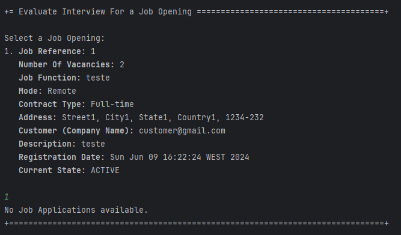
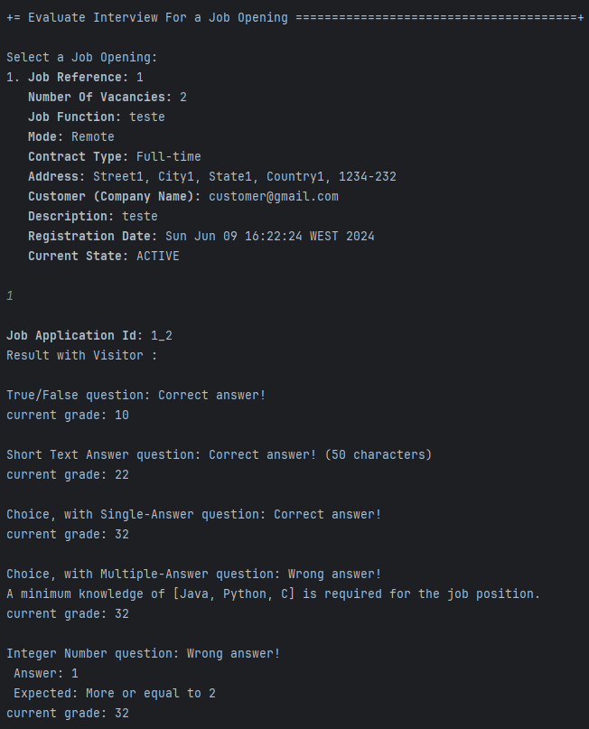
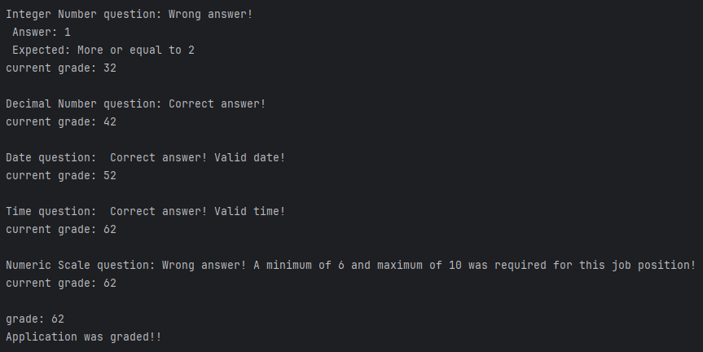
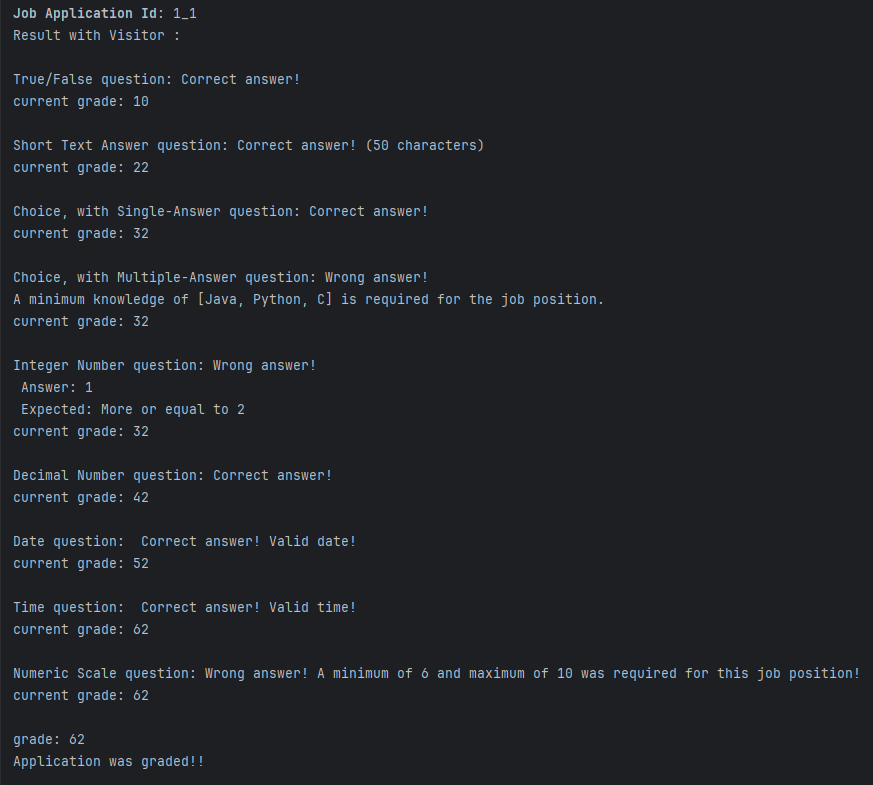
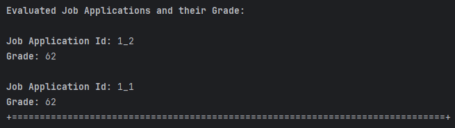

# US 1018

## 1. Context

In this User Story the goal is to evaluate job applications by giving it a grade from 0 to 100.

## 2. Requirements

**US 1018** As Customer Manager, I want to execute the process that evaluates (grades) the interviews for a job opening.

**Acceptance Criteria:**

- 1018.1. The Job Openings list must be the ones that have the Interview Phase and that are going through the Interview phase;
- 1018.2. The Job Applications to evaluate must be accepted ones and for a previous selected Job Opening;

**Customer Specifications and Clarifications:**

> **Question:** Once the process of evaluating all the job opening interviews has been carried out, should the phase it is in be automatically changed to “Result” or should it be kept at “Analysis” and can only be changed by carrying out US1010?
>
> **Answer:** US1018 should not change the current phase. US1010 allows you to change the phases of the recruitment process.

> **Question:** Regarding the processing of candidates' answer files for the interview. In the case of uploading a file, if the question that requires a number as an answer is filled in with an invalid format, for example a letter, should we consider this an invalid format in US 1017 (and ask the user to upload a valid file again) or should we, in US1018, consider it incorrect and automatically award 0 points for this invalid answer? That is, in US 1017, should we only check the file format or should we also check that the answers are filled in with the correct data type?
>
> **Answer:** The case mentioned should be considered a file validation error (i.e. the submitted file does not match the defined grammar).

> **Question:** Regarding the answer you provided in Q206, you said that a jobOpening only supports one interview, does this mean that only one candidate who has made an application can be interviewed at a time or that each application is associated with that specific interview? In addition, each application that undergoes an interview must have a response to that interview or will the interview for a job opening have a response? This question arises because in US1018 it is supposed to evaluate all the interviews of a jobOpening when it said that a jobOpening supports only one interview.
>
> **Answer:** The recruitment process is defined for each job opening. This may or may not have an interview phase. If it has an interview phase, then we can admit that it's just an interview. But when I say that, I mean one interview for each candidate and not one interview for all the candidates for that job opening. I think that was clear. Otherwise, it wouldn't make sense to have, for example, a US to schedule an interview with a candidate. Would you schedule an interview with “all” the candidates at the same time? Each candidate, when they are interviewed, the answers they gave in their interview are filled in on the document that is then submitted (US1017). So, if there is an interview phase, each candidate must have their interview and their “rating” in that interview.

> **Question:** Regarding the answer you provided in Q206, you said that a jobOpening only supports one interview, does this mean that only one candidate who has made an application can be interviewed at a time or that each application is associated with that specific interview? In addition, each application that undergoes an interview must have a response to that interview or will the interview for a job opening have a response instead? This question arises because in US1018 it is supposed to evaluate all the interviews of a jobOpening when it said that a jobOpening supports only one interview.
>
> **Answer:** I'm sorry if it wasn't clear, but you should have asked the question earlier. The recruitment process is defined for each job opening. This may or may not have an interview phase. If it has an interview phase, then we can admit that it's just an interview. But when I say that, I mean one interview for each candidate and not one interview for all the candidates for that job opening. I think that was clear. Otherwise it wouldn't make sense to have, for example, a US to schedule an interview with a candidate. Would you schedule an interview with “all” the candidates at the same time? Each candidate, when they are interviewed, the answers they gave in their interview are filled in on the document that is then submitted (US1017). Therefore, if there is an interview phase, each candidate must have their interview and their “rating” in that interview.

**Dependencies/References:**

* There is a dependency to "US1000: As Administrator, I want to be able to register, disable/enable, and list users of the backoffice", since there is a need to have users registered in the system to be able to do any kind of action.

* There is a dependency to "US2000a:  As Operator, I want to register a candidate and create a corresponding user", since at least one candidate must be registered in the system so that the operator can list all the candidates.

* There is a dependency to "US1017: As Customer Manager, I want to upload a text file with the candidate responses for an interview"

* There is a dependency to "US1010:As Customer Manager, I want to open or close phases of the process for a job opening."

* There is a dependency to "US1011:As Customer Manager, I want to select the interview model to use for the interviews of a job opening (for their evaluation/grading)"

* There is a dependency to "US1009: As Customer Manager, I want to select the requirements specification to be used "for a job opening.

* There is a dependency to "US1015: As Customer Manager, I want to execute the process of verification of requirements of applications for a job opening.

**Input and Output Data**

**Input Data:**

* Typed data:
  * None

* Selected data:
  * Job Opening

**Output Data:**
* Display of all grades given to the applications for the selected job opening

**References:** NFR09(LPROG)
Requirement Specifications and Interview Models The support
for this functionality must follow specific technical requirements, specified in LPROG.
The ANTLR tool should be used (https://www.antlr.org/).

## 3. Analysis

### 3.1. Domain Model

## 4. Design

**Domain Class/es:** JobOpening, JobApplication, Grade

**Controller:** EvaluateInterviewsController

**UI:** EvaluateInterviewsUI

**Repository:**	JobOpeningRepository, JobApplicationRepository

### 4.1. Sequence Diagram

## 5. Implementation

### Methods in the Controller

* **public List<JobOpening> findAllActiveJobOpeningsWithInterview()** - this method gets all active candidates registered in the system.

* **public List<JobApplication> findAllAcceptedJobApplicationsWithAnswersFileByJobOpening(JobOpening selectedJobOpening)** -

* **public String evaluateInterview(JobOpening selectedJobOpening, JobApplication jobApplication, String interviewFilePath) throws IOException, ClassNotFoundException, NoSuchMethodException, InvocationTargetException, IllegalAccessException)** -
## 6. Integration/Demonstration

After doing the log in process, to be able to perform this function you need to have admin or customer manager as your role. Then select the option that says “Evaluate Interview For a Job Opening”.
Then the system will show a list of the active job openings that have the Interview phase and that are currently in the Interview Phase, registered in the system and that are managed by the current user logged in and will ask to select one of them.

if there's no Job opening that matches all this conditions, this will happen:  

 

if there is job openings available select the wanted one. If the submitted value is not valid (letter, a symbol or a number greater or smaller than the ones that appear on the list), then the system will ask again for the value until it is valid.

then the system will show the evaluation process for each application

if there is job applications available select the wanted one. If the submitted value is not valid (letter, a symbol or a number greater or smaller than the ones that appear on the list), then the system will ask again for the value until it is valid.

And finally it will show the evaluated applications and their grades.

