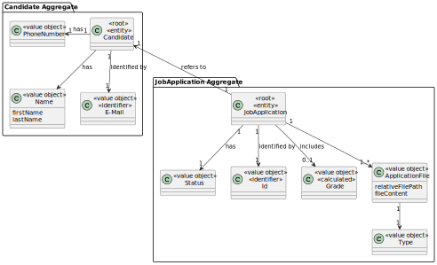
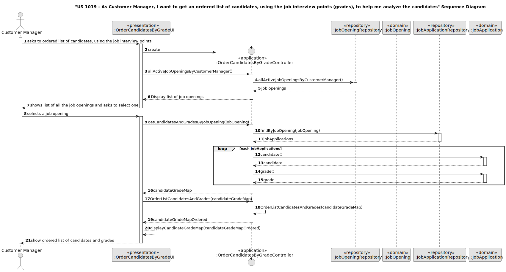
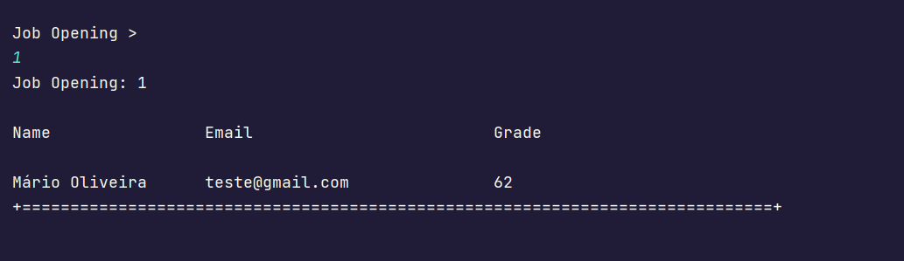

# US 1019

## 1. Context


The task at hand is to be able to open or close phases of a job opening, as a Customer Manager.
This is the first time this feature is being implemented,
so we're starting from scratch to design and develop a seamless process for setting up the process to open or close phases of the process for a job opening

## 2. Requirements

**US 1019** As Customer Manager, I want to get an ordered list of candidates, using the job interview points (grades), to help me analyze the candidates

**Acceptance Criteria:**

- 1019.1. The sorting should be descending, the highest grade to lowest. 


**Customer Specifications and Clarifications:**

> **Question169:**  US1019 - Regarding this user story, “US 1019 - As Customer Manager, I want to get an ordered list of candidates, using the job interview points (grades), to help me analyze the candidates.”, the list you want is related to a job opening, correct? Is the sorting method ascending or do you want an option that includes ascending and descending?
>
> **Answer169:** Yes, the sorting is related to applications for a job opening. The sorting should be descending, from the one with the highest score to the one with the lowest score.


> **Question198:**  US1013 -  The ranking of candidates should be save in an array to be able to do easier the result phase?
>
> **Answer198:** This question is about the design/implementation of the solution. I have no specific opinion regarding this specific question.


> **Question204:** US 1019 - according to answer A197, should we then only allow the listing of job openings that have an interview?
> 
> **Answer204:** I think I misunderstood the reference to listing job openings. This US doesn't make sense for job openings that don't have interviews, since it's based on listing candidates and their interview points.


> **Question226:** US 1019 - In the description of the user story: “As Customer Manager, I want to get an ordered list of candidates, using the job interview points (grades), to help me analyze the candidates”. Does the intention “analyze the candidates” impose any change/removal of candidates in the system?
> 
> **Answer204:** The reference to “analyze the candidates” is just to convey the idea that this US intends for the system to provide a way for the Customer Manager to be able to consult the results of the interviews in order to help decide the ranking of the candidates. Nothing more. The ranking of the candidates is recorded in the system via US 1013.


**Dependencies/References:**

* There is a dependency to "US 1002: As Customer Manager, I want to register a job opening."

* There is a dependency to "US 1007: As Customer Manager, I want to setup the phases of the process for a job opening."

* There is a dependency to "US 1014 As Customer Manager, I want to record the time and date for an interview with a candidate."

* There is a dependency to "US 1017 As Customer Manager, I want to upload a text file with the candidate responses for an interview."

* There is a dependency to "US 1018 As Customer Manager, I want to execute the process that evaluates (grades) the interviews for a job opening."


**Input and Output Data**

**Input Data:**

* Typed data:
    * none
    

* Selected data:
    * job opening


**Output Data:**
* ordered list of candidates and grades


## 3. Analysis


> **Question177:**  US 1019 Clarification - In US 1019: As Customer Manager, I want to get an ordered list of candidates, using the job interview points (grades), to help me analyze the candidates. I plan to implement this functionality as follows:
>
>Job Opening : XXX
>
>Name | Email | Grade
>
>Jane Doe| jane@doe.pt | 85
>
>John Doe | john@doe.pt | 70
>
>In other words, with descending sorting.
>
>As Q153 says, you can see this list in one instance, and in another instance you can make the ranking you think is appropriate.
>
>Is that OK?
>
> **Answer177:** I think you mean Q163. With regard to the example you present, I think it meets my requirements


### 3.1. Domain Model



## 4. Design

**Domain Class/es:** Candidate, JobOpening, JobApplication

**Controller:** OrderCandidatesByGradeController

**UI:** OrderCandidatesByGradeUI

**Repository:**	JobOpeningRepository, JobApplicationRepository


### 4.1. Sequence Diagram



[//]: # (### 4.2. Class Diagram)

[//]: # ()
[//]: # (![a class diagram]&#40;us1019_class_diagram.svg &#41;)

[//]: # (### 4.3. Applied Patterns)

[//]: # ()
[//]: # (### 4.4. Tests)

[//]: # ()
[//]: # (Include here the main tests used to validate the functionality. Focus on how they relate to the acceptance criteria.)

[//]: # ()
[//]: # (**Test 1:** *Verifies that it is not possible to ...*)

[//]: # ()
[//]: # (**Refers to Acceptance Criteria:** G002.1)

[//]: # ()
[//]: # ()
[//]: # (```)

[//]: # (@Test&#40;expected = IllegalArgumentException.class&#41;)

[//]: # (public void ensureXxxxYyyy&#40;&#41; {)

[//]: # (	...)

[//]: # (})

[//]: # (````)

## 5. Implementation

### Methods in the OrderCandidatesByGradeController

* **public List<JobOpening> allActiveJobOpeningsByCustomerManager()** - this method returns the list of job openings filtered my the customer manager.

* **public Map<Candidate, Grade> getCandidatesAndGradesByJobOpening(JobOpening jobOpening)** - this method returns the map with all the candidates and the respective grade.

* **public Map<Candidate, Grade> OrderListCandidatesAndGrades(Map<Candidate, Grade> candidateGradeMap)** - this method returns a ordered map with all the candidates and the respective grade.

## 6. Integration/Demonstration


After the main menu appears and select the option: "Display list of candidates, using the job interview points".

Choose a job opening from the list and it will appear the candidate and their grade.



[//]: # (## 7. Observations)

[//]: # ()
[//]: # (*This section should be used to include any content that does not fit any of the previous sections.*)

[//]: # ()
[//]: # (*The team should present here, for instance, a critical perspective on the developed work including the analysis of alternative solutions or related works*)

[//]: # ()
[//]: # (*The team should include in this section statements/references regarding third party works that were used in the development this work.*)