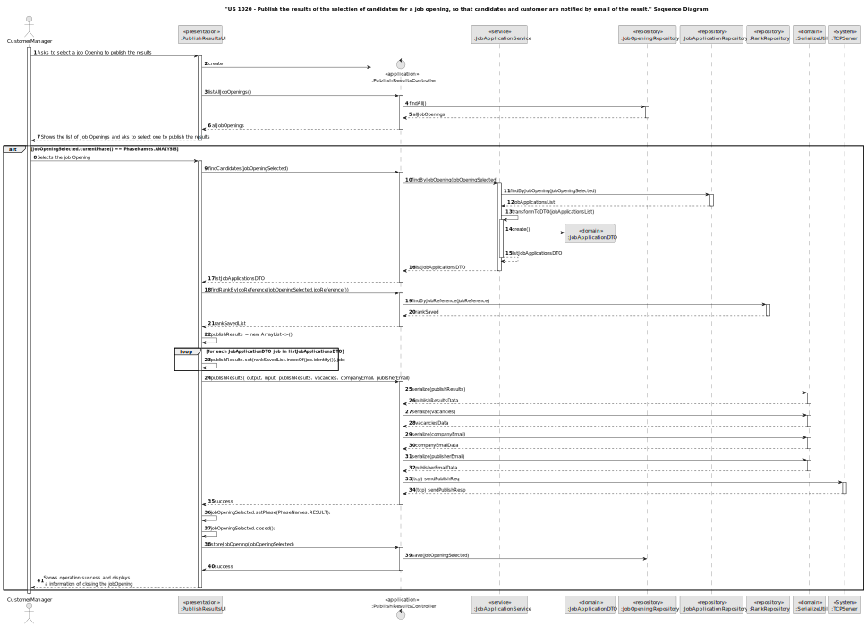

# US 1020

## 1. Context

The task involves enabling Customer Managers to publish the results of candidate selections for a job opening and ensuring that both the candidates and the customer are notified of the results via email. This is the first time this feature is being implemented, requiring the development of a system that automates the publication and notification process to keep all parties informed efficiently.

## 2. Requirements

**US 1020**  As Customer Manager, I want to publish the results of the selection of candidates for a job opening, so that candidates and customer are notified by email of the result.

**Acceptance Criteria:**

- 1020.1. It's only possible start to publish the results if a jobOpening if is in the analysis phase.
- 1020.2. It's necessary have all the candidates ranked to publish the results.

**Customer Specifications and Clarifications:**

> **Question 48:** US1016 and US1020, regarding the sending of notifications by email, is it necessary to remember that this sending was made?
>
> **Answer:** Nothing explicit is said in the document on this subject. However, from the point of view of managing the jobs4u process, it seems appropriate to me that this information is recorded.

> **Question 51:** US 1020, what is the format for this publication?
>
> **Answer:** The publication refers to informing candidates and the client, via email. Candidates who are selected must receive an email indicating that they have been selected for 
> their application for the job opening and will be contacted by the company. As far as the company is concerned, it must receive an email with the list of selected candidates, which 
> must include the candidate's name and contact details.

> **Question 190:** US1020 – Regarding the selection of candidates, should we assume that the first N candidates in 
> the ranking (where N is the number of job vacancies) are chosen, or should we allow the customer manager to select the N candidates?
>
> **Answer:** The first option (using the results from US1013

**Dependencies/References:**

* There is a dependency to "US1000:  "As Administrator, I want to be able to register, disable/enable, and list users of the backoffice.", since is necessary to be able to create a User when we create a Customer.

* There is a dependency to "US1001: As Customer Manager I want to register a customer and that the system automatically creates a user for that customer", since one attribute of Job Opening is the Customer(company), so in order to register the job opening, there must first be at least one customer.

* There is a dependency to "US1002:  As Customer Manager, I want to register a job opening.", since at least one job Opening must be registered in the system so that the operator can list a job opening.

* There is a dependency to "US2000a:  As Operator, I want to register a candidate and create a corresponding user", since at least one candidate must be registered in the system so that the operator can list all the candidates.

* There is a dependency to "US2002: As Operator, I want to register an application of a candidate for a job opening and import all files received.", since at least one job Application must be registered in the system so that the operator can list a job Application.

* There is a dependency to "US1007: As Customer Manager, I want to setup the phases of the process for a job opening.", since the jobOpening needs to be in the Analysis phase.

* There is a dependency to "US1013: As Customer Manager, I want to rank the candidates for a job opening.", since there is necessary to rank the candidates to have defined results.

**Input and Output Data**

**Input Data:**

* Typed data:
    * None
    

* Selected data:
    * JobOpening

**Output Data:**
* Display of the success of the operation about notifying the candidates and the customer about the results and change the JobOpening to Result and Closed. 

## 3. Analysis

* First, all the Job Openings will appear to select one
* If the job Opening meets the requirements, it will pass the validations
* Then the applications will be fetched from the database, we will order them according to their rank. 
* They will then be sent to the server to generate notifications that will be sent by email. 
* Finally, if everything is successful, we will finish the Job Opening and consider it closed

### 3.1. Domain Model

## 4. Design

**Domain Class/es:** JobApplication, JobApplicationDTO, JobOpening, Rank, Notification

**Controller:** PublishResultsController

**UI:** PublishResultsUI

**Repository:**	JobApplicationRepository, JobOpeningRepository, NotificationRepository

**Service:** AuthorizationService

### 4.1. Sequence Diagram

### **BackOffice Side**

### **Server Side**

## 5. Implementation

### Methods in the Controller

* **Iterable<JobOpening> listAllJobOpenings()** this method list all the jobOpenings.

* **Iterable<Id> findRankByJobReference(JobReference jobReference)**  this method send the information to search by JobReference if already exists a rank .

* **Iterable<JobApplication> findCandidates(JobOpening jobOpeningSelected)**  this method send the information to search to find all the jobApplications by JobOpening .

* **JobOpening storeJobOpening(JobOpening jobOpeningSelected)** this method send the information of the jobOpening to the database.

* **boolean publishResults(DataOutputStream output, DataInputStream input, List<JobApplicationDTO> publishResults, Integer vacancies, EmailAddress companyEmail, EmailAddress publisherEmail)** this method send the information of results to be publish, the number of vacancies,
the email of the company and the publisher, to the server and process the data.

## 6. Integration/Demonstration

>**After doing the log in process, to be able to perform this function you need to have admin or customer manager as your role. Then select the option that says "Publish Results of the Selection"
The process of publish the results of the candidates about a jobOpening will begin. The system will ask you to choose the a jobOpening, it's important to know you only can rank a jobOpening that is
in phase "ANALYSIS" :**

> **If all was correct in ther server side, will appear a message of success and the system will update the jobOpening to closed**

> **In the server side we can see the sending of emails to the candidates about their collocation and to the customer to know who are the
new employees who can hire**

