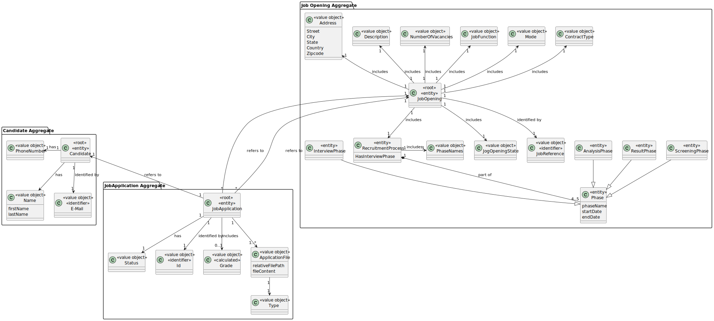
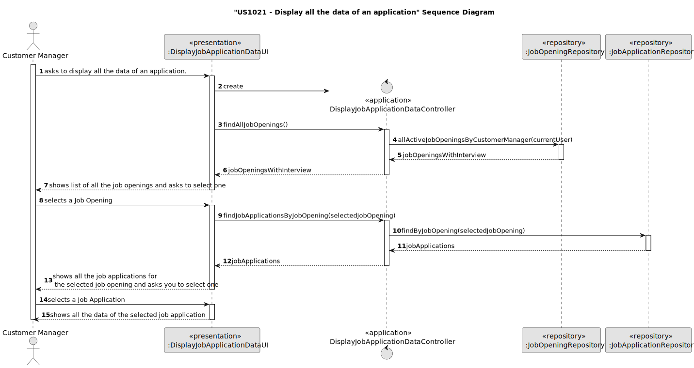
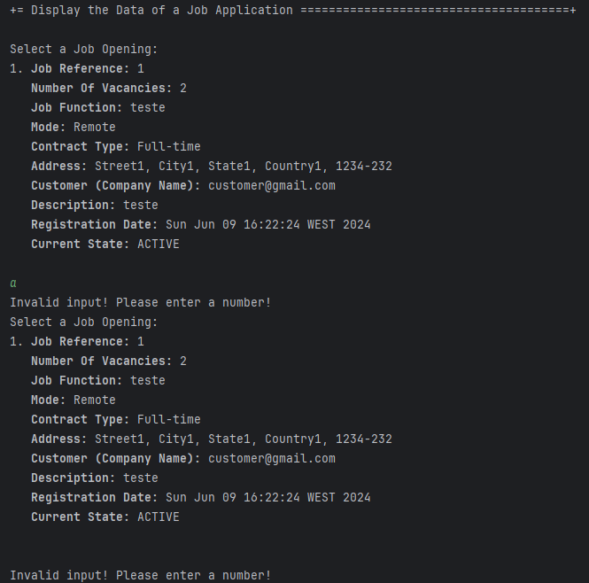
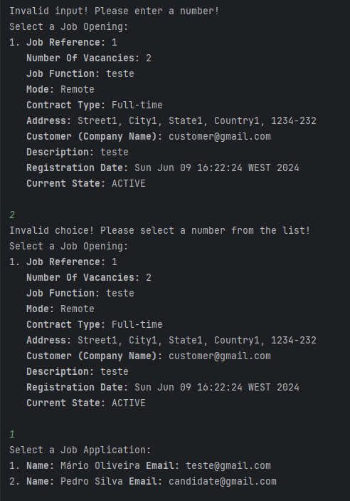
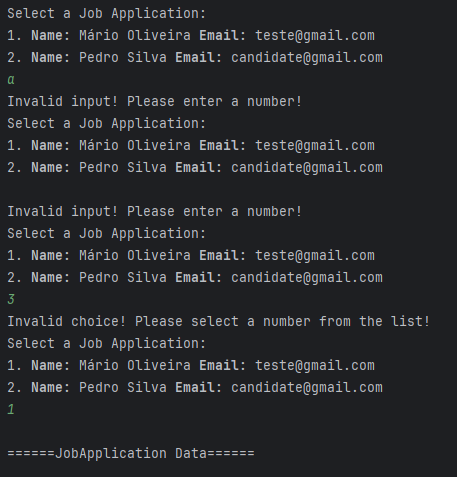
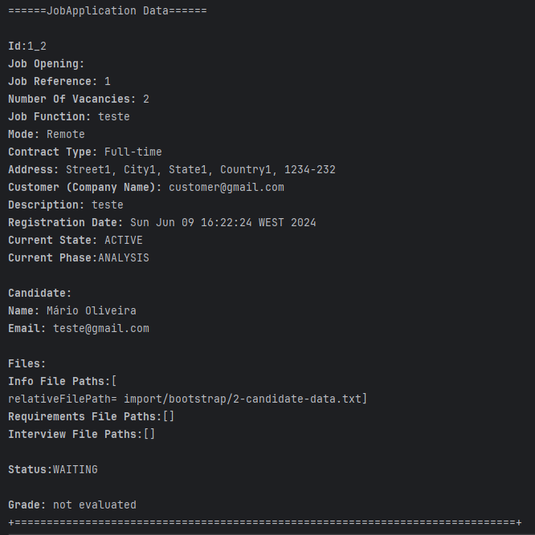

# US 1021

## 1. Context

In this User Story the goal is to display all the data of an application. That includes data collected from the files submitted by the candidate and data generated during the process (such as interviews and processing of requirements).

## 2. Requirements

**US 1021**  As Customer Manager, I want to display all the data of an application.

**Acceptance Criteria:**

- 1021.1. The JobOpenings to select from, must have the Interview phase and must be the ones that the current user (admin or customerManager) is responsible for;
- 1021.2. includes data collected from the files submitted by the candidate and data generated during the process (such as interviews and processing of requirements) ;

**Customer Specifications and Clarifications:**

> **Question:** what is “all data of an application”? What is a job application?
>
> **Answer:** A job application is an application (by a candidate) for a job opening. The “all data of an application” refers to all the data in an application, 
> namely the files submitted by the candidate as well as data collected or generated during the process (such as interviews and processing of requirements).

> **Question:** how is the Application to be displayed chosen? Can the user start by selecting a Job Reference and then the e-mail address of one of the candidates? Or do you recommend another approach?
>
> **Answer:** You should apply UX/UI best practices. There have been previous questions on similar subjects (e.g. Q150). Note that there is a US to list all the applications for a job opening, for example

> **Question:** With regard to listing the data for a particular jobApplication, will a customer manager have access to all the jobApplications in the system or only the jobApplications made for a job opening for a customer who is managed by that customer manager?
>
> **Answer:** Only the ones he is managing.

> **Question:** Listing of applications - I would like to address a specific point related to UI/UX User Story 1021. I know that the client has been saying that we should apply UX/UI best practices and that they would prefer not to constrain the way we design the UI/UX. However, our concern is that, in this US, if there are a large number of applications, displaying all this information at once could be confusing for the user. So I just wanted to ask if we could adopt a slightly more practical solution, such as asking the user to select a job opening and only then listing the applications associated with that job opening and the data from those applications or if, in your view, this approach could restrict the options offered by this feature too much.
>
> **Answer:**  See Q36. This US is for showing the data for one (1) application. There should be a way for the Customer Manager to indicate (including, possibly, a way to select/“know”/“search”) which application (i.e., application) and the system shows the data for that application.

**Dependencies/References:**

* There is a dependency to "US1000: As Administrator, I want to be able to register, disable/enable, and list users of the backoffice", since there is a need to have users registered in the system to be able to do any kind of action.

* There is a dependency to "US2000a:  As Operator, I want to register a candidate and create a corresponding user", since 

* There is a dependency to "US2002: As Operator, I want to register an application of a candidate for a job opening and import all files received.", since at least one application must be registered in the system so that the customer manager can display its data.

* There is a dependency to "US1018: As Customer Manager, I want to execute the process that evaluates (grades) the interviews for a job opening.", since

* There is a dependency to "US1017: As Customer Manager, I want to setup the phases of the process for a job opening"

* There is a dependency to "US1010: As Customer Manager, I want to open or close phases of the process for a job opening."

**Input and Output Data**

**Input Data:**

* Typed data:
    * None

* Selected data:
    * Jop Opening
    * Job Application

**Output Data:**
* Display of all the data of the selected job application

## 3. Analysis

### 3.1. Domain Model

## 4. Design

**Domain Class/es:** Candidate, SystemUser, EmailAddress, PhoneNumber, Name, JobOpening, JobApplication, Grade, StatusType

**Controller:** DisplayJobApplicationDataController

**UI:** DisplayJobApplicationDataUI

**Repository:**	JobApplicationRepository, JobOpeningRepository

### 4.1. Sequence Diagram

## 5. Implementation

### Methods in the Controller

* **public List<JobOpening> findAllJobOpenings()** - this method gets all active job Openings with the Interview phase managed by the current user, registered in the system.

* **public List<JobApplication> findJobApplicationsByJobOpening(JobOpening selectedJobOpening)** - this method geta all the job applications associated with the previous selected job Opening.

## 6. Integration/Demonstration

After doing the log in process, to be able to perform this function you need to have admin or customer manager as your role. Then select the option that says “Display the Data of a Job Application”.
Then the system will show a list of the active job openings that have the Interview phase and that are currently in the Screening or Interview Phase, registered in the system and that are managed by the current user logged in and will ask to select one of them.
Then the system will show a list of the active job openings that have the Interview phase and that are currently in the Screening or Interview Phase, registered in the system and that are managed by the current user logged in and will ask to select one of them.

Then the system will show a list of the job applications that are associated with that job Opening and will ask to select one of them.
Then the system will show a list of the active job openings that have the Interview phase and that are currently in the Screening or Interview Phase, registered in the system and that are managed by the current user logged in and will ask to select one of them.

Then the system will show all the data of the selected job application.

