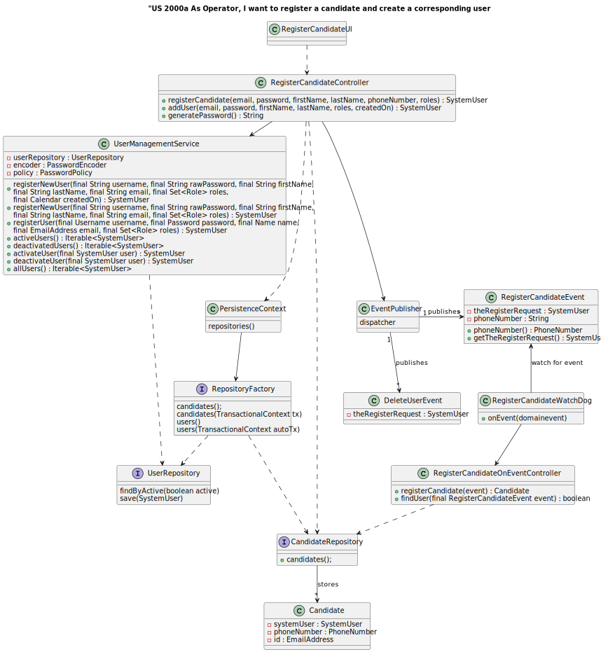
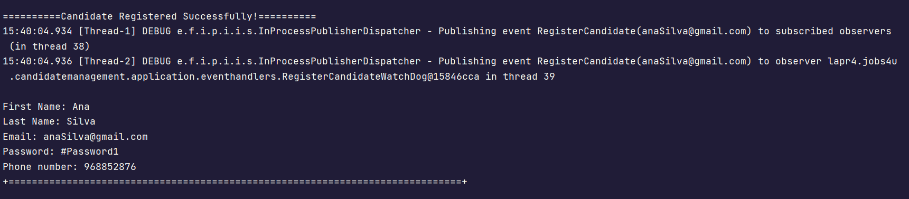

# US 2000a


## 1. Context

For this user story was needed to step up and understand the code from **US G007** in order to create a user and generate his password.

## 2. Requirements

**US 2000a**  As Operator, I want to register a candidate and create a corresponding user

**Acceptance Criteria:**

- 2000a.1. Alternatively this can be achieved by a bootstrap process.


**Customer Specifications and Clarifications:**
> **Question11:** Isn't the statement explicit about the information to be collected for Customers? What information is needed? What about company employees?
> 
> **Answer11:** It's not explicit. However, they are mentioned in the name of the company and its address in the context of a job opening. As for the users (company representatives accessing the Customer App), I'd say that this would be similar to the Candidate data. As for company employees, I'd say it's important to ensure that email is used to identify any user of the system. I think it will be important for each user to have their full name as well as a short username (which should be unique). Update on 2024-03-21: The Product Owner has reconsidered and decided that the short username is dispensable since only the email and password should be used to authenticate users.


> **Question19:** When creating a user in the system, is the name set by the user or is it the person's name (first and last) and is the password set by the user or generated by the system?
> 
> **Answer19:** Under US 2000a the Operator creates system users for applicants who are not yet in the system. He has to do this on the basis of the data received in the application (which includes email and name). The email will serve to identify the person. In this context, it is necessary to have a password for this new user. Since this information is not transmitted by the applicant, I suppose the most "advisable" solution is for the system to generate a password for this user. How the user/applicant will receive this information (the form of authentication in the app) is out of scope, in the sense that there is no US that refers to this. US 1000 and 1001 also refer to the creation of users. Here, you could think about entering passwords manually, but it could be through the same automatic password setting mechanism described above. Regarding the name, see Q11 again.


> **Question54:** Regarding the US2000a requirement which states "As an Operator, I want to register a candidate and create a corresponding user," I would like to know how a candidate will be registered in the system, i.e., understand the processes for registering a candidate. Since the candidate has their name, email, and phone number, how should their username be formatted to avoid conflicts with other candidates' names? Additionally, how should the candidate be notified of their username and password?
> 
> **Answer54:** here is no need for a username (See Q11). Regarding the password, I think the system can generate a unique password. You may assume the candidate will be informed of his/her password by means that are outside the scope of what is to be developed for this version of the system.


**Dependencies/References:**

G007 - "As a Project Manager, I want the system to support and apply authentication and
authorization for all its users and functionalities."

**Input and Output Data**

**Input Data:**

* Typed data:
    * email
    * first name
    * last name
    * phone number


**Output Data:**
* Display the success of the operation  and the data of the registered candidate


## 3. Analysis

> **Question56:** Are the phone number and postal code checks only made for Portuguese domains, or do we have to program according to the country concerned?
>
> **Answer56:** That's enough for the Portuguese case.


> **Question57:** What are the business policies for registering a candidate, what are the characteristics of the password, email, cell phone?
>
> **Answer57:** Regarding the cell phone, follow the Q56. Regarding the email, it would be any valid email. About the password, we can follow something like: at least 8 characters, uppercase and lowercase letters, digits and at least one non-alphanumeric character.


> **Question74:** US2000a - With regard to candidate registration, the data must be entered manually or imported from the file with the candidate's data?
>
> **Answer74:** It makes sense for them to be imported from the file under US2002. If necessary, give the user the opportunity to make changes. US2000a refers to a functionality for the Operator to manually register candidates. (Note: answer updated on 2024/04/18, in bold)


> **Question78:** US2000a - The operator can register a candidate: does he put the info manually or has to be read of the file generated by the bot? This user will appear then in the backoffice...enable as default I think. Then the admin, can also register manually a candidate as the operator, did it? I don't understand at all the different between a registration of the candidate made by the admin or made by the operator.
> 
> **Answer78:** US2000a is for the Operator to manually register a candidate and his/her user in the system. US2002 is for import of the applications from the data iin the files produced by the application file bot. If the candidate does not exist, it should be created. I think there is no registration of a candidate by the admin.


> **Question78:** US2000a - The operator can register a candidate: does he put the info manually or has to be read of the file generated by the bot? This user will appear then in the backoffice...enable as default I think. Then the admin, can also register manually a candidate as the operator, did it? I don't understand at all the different between a registration of the candidate made by the admin or made by the operator.
>
> **Answer78:** See Q74. US2000a is for the Operator to manually register a candidate and his/her user in the system. US2002 is for import of the applications from the data iin the files produced by the application file bot. If the candidate does not exist, it should be created. I think there is no registration of a candidate by the admin.


> **Question106:** US200a - I was thinking about if the candidate could change his/her email. In older questions you said the email was the identifier of the candidate, isn't it? Should we put another id made by sequence numbers or by his NIF, for example, to identify him/her in the system? Could we say the same for the user who is managing the app of the customer?
> 
> **Answer106:** The field/data that identifies the user in the system is always the email (it must be unique). For the moment there is no need for supporting the possibility of changing the email or add any other identification possibility

### 3.1. Domain Model


## 4. Design


**Domain Class/es:** Candidate, SystemUser

**Events** RegisterCandidateEvent, DeleteUserEvent

**Controller:** RegisterCandidateController, RegisterCandidateOnEventController

**UI:** RegisterCandidateUI

**Repository:**	CandidateRepository


### 4.1. Sequence Diagram


### 4.2. Class Diagram



### 4.3. Applied Patterns

### 4.4. Tests

**testCandidateConstructor:** Verifies that it is possible to create a candidate with a system user and a valid phone number.

**Refers to Acceptance Criteria:** 2000a.1

```
@Test
public void testCandidateConstructor() {
    SystemUser user = getNewDummyUser();
    PhoneNumber phoneNumber1 =new PhoneNumber("966866522");
    
    Candidate candidate = new Candidate(user, phoneNumber1);
    
    assertNotNull(candidate);
    assertEquals(user, candidate.user());
    assertEquals(phoneNumber1, candidate.phoneNumber());
    assertEquals(candidate.getId(), candidate.identity());

}
````

**ensureCandidateFailsForDifferentEmail:** Verifies that for different emails, the Candidate registered is different.


````
@Test
public void ensureCandidateFailsForDifferentEmail() throws Exception {

    final Candidate aCandidate = new Candidate(getNewDummyUser(), phoneNumber);


    PhoneNumber phoneNumber1 = new PhoneNumber("966888555");
    final Candidate anotherCandidate = new Candidate(getNewDummyUser(), phoneNumber1);

    final boolean expected = aCandidate.equals(anotherCandidate);


    assertFalse(expected);
}

````
**ensureCandidateFailsForDifferentPhoneNumbers:** Verifies that for different phone numbers, the Candidate registered is different.


````
@Test
public void ensureCandidateFailsForDifferentePhoneNumbers() throws Exception {

    final Candidate aCandidate = new Candidate(getNewDummyUser(), phoneNumber);

    final Candidate anotherCandidate = new Candidate(getNewDummyUser(), phoneNumber);

    final boolean expected = aCandidate.equals(anotherCandidate);

    assertFalse(expected);
}
````


## 5. Implementation

In RegisterCandidateController:

* SystemUser registerCandidate(email, password, firstName, lastName, phoneNumber, roles) - this method registers a System User and publishes an event to register the candidate.

* SystemUser addUser(email, password, firstName, lastName, roles, createdOn) - this method creates a System User and returns it.
 
* String generatePassword() - this method generated and returns a password;


In RegisterCandidateOnEventController:

* Candidate registerCandidate(event) - this method registers a new candidate in the system from a RegisterCandidateEvent. It checks whether the user already exists in the system, and if so, creates a new candidate associated with that user, saving it in the candidate repository. 
If an error occurs during the process, such as an exception when trying to save the candidate, a DeleteUserEvent is published to undo the registration.


* boolean findUser(final RegisterCandidateEvent event) - this method  checks whether a user is already registered in the system by trying to find the user in the repository. It uses a retry strategy to deal with possible temporary connection or persistence failures. 
If the user is found, it returns true; otherwise, it returns false.


## 6. Integration/Demonstration

After the main menu appears and select the option: "Register Candidate".


Then type the candidate info (email, first name, last name and phone number).


It will appear a success message with the candidate's info. 
If an error occurs it will appear the error (like: "Something unexpected has happened and the application will terminate. Please check the logs.")
or/and that the DeleteUserEvent was called. 




[//]: # ()
[//]: # (## 7. Observations)

[//]: # ()
[//]: # (*This section should be used to include any content that does not fit any of the previous sections.*)

[//]: # ()
[//]: # (*The team should present here, for instance, a critical perspective on the developed work including the analysis of alternative solutions or related works*)

[//]: # ()
[//]: # (*The team should include in this section statements/references regarding third party works that were used in the development this work.*)