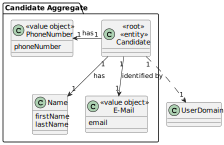
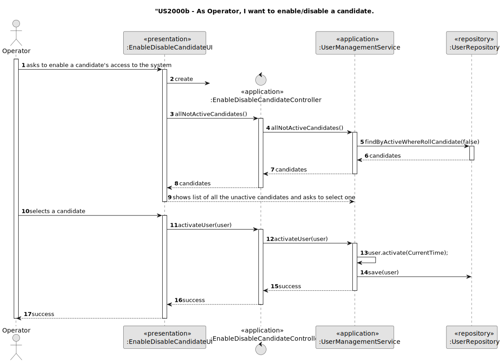
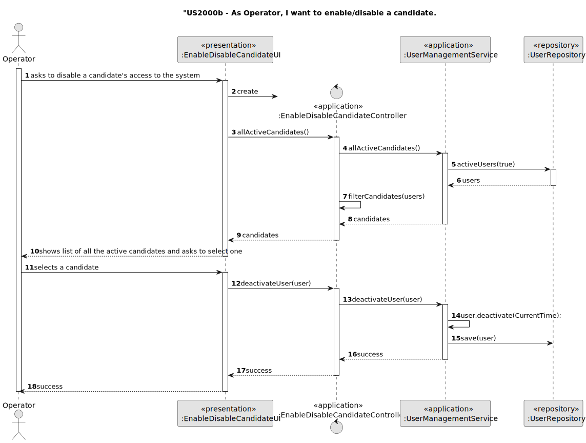
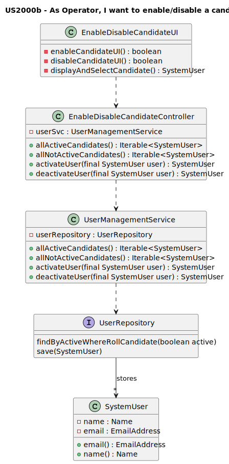
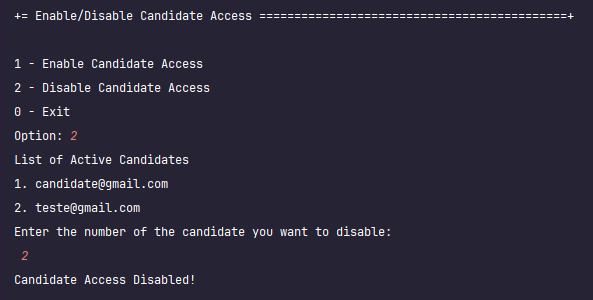
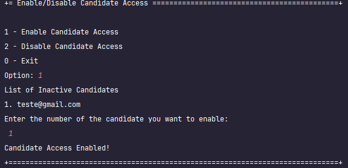

# US 2000b

## 1. Context

In this User Story the goal is to list Candidates, select one of them enable/disable them.

## 2. Requirements

**US 2000b**  As Operator, I want to enable/disable a candidate.

**Acceptance Criteria:**


**Customer Specifications and Clarifications:**


> **Question:** US2000b, what is the candidate enable/disable?
>
> **Answer:** Refers to disabling the candidate's access to the system (i.e., Candidate App)

> **Question:** US 2000b – for the use case 2000b which states "As Operator, I want to enable/disable a candidate". I would like to know if the client would like two different menus to be created, with each menu responsible for either activating or deactivating candidates.
>
> **Answer:** I have no specific requirements for the UX/UI, but I want you to follow best practices.

> **Question:** In US 2000b, when deactivating a candidate, is it supposed to just remove their role and leave them as a user when deactivating them completely?
>
> **Answer:** See [first question]. I consider that the purpose of this US is to allow blocking and unblocking a candidate's access to the system. This should not invalidate that person's applications, only that candidate's access to the system.


**Dependencies/References:**

* There is a reference to "US1000: As Administrator, I want to be able to register, disable/enable, and list users of the backoffice", since it contains function to enable/disable users of the backoffice and to list Users. This US will control access to the Candidate App through similar functions.


* There is a dependency to "US2000a:  As Operator, I want to register a candidate and create a corresponding user", since at least one candidate must be registered in the system so that the operator can edit their access to the system.


[//]: # (* There is a reference to "US2000c:  As Operator, I want to list all candidates", since it provides a list of all the active candidates registered in the system, for the user to then select one.)


**Input and Output Data**

**Input Data:**

* Typed data:
    * None
    

* Selected data:
    * candidate


**Output Data:**
* Success of the operation


## 3. Analysis


### 3.1. Domain Model



## 4. Design

**Domain Class/es:** SystemUser

**Controller:** EnableDisableCandidateController

**UI:** EnableDisableCandidateUI

**Repository:**	UserRepository

**Service:** UserManagementService

### 4.1. Sequence Diagram




### 4.2. Class Diagram



[//]: # (### 4.3. Applied Patterns)

[//]: # ()
### 4.4. Tests

**Test 1:** *Ensures that a Candidate's access can be revoked and reinstated*
```
@Test
    public void testActivateDeactivateCandidate() {
        SystemUser user = getNewUserThird();
        user.deactivate(Calendar.getInstance());
        assertFalse(user.isActive());
        user.activate();
        assertTrue(user.isActive());
    }
````

[//]: # ()
[//]: # ()
[//]: # (```)

[//]: # (@Test&#40;expected = IllegalArgumentException.class&#41;)

[//]: # (public void ensureXxxxYyyy&#40;&#41; {)

[//]: # (	...)

[//]: # (})

[//]: # (````)

## 5. Implementation


The US was implemented using the following methods:
In *EnableDisableCandidateController*:
* **public Iterable<SystemUser> allActiveCandidates()** - this method gets all active candidates registered in the system.
* **public Iterable<SystemUser> allNotActiveCandidates()** - this method gets all inactive candidates registered in the system.
* **private Iterable<SystemUser> filterCandidates(Iterable<SystemUser> users)** - this method filters out the candidates from the rest of the users
* **public SystemUser activateUser(final SystemUser user)** - this method activates the given user
* **public SystemUser deactivateUser(final SystemUser user)** - this method deactivates the given user

In *UserManagementService* [PremadeClass]:
* **public Iterable<SystemUser> activeUsers()** [PremadeMethod] - this method gets all active users registered in the system.
* **public Iterable<SystemUser> deactivatedUsers()** [PremadeMethod] - this method gets all inactive users registered in the system.
* **public SystemUser activateUser(final SystemUser user)** [PremadeMethod] - this method activates the given user
* **public SystemUser deactivateUser(final SystemUser user)** [PremadeMethod] - this method deactivates the given user

In *UserRepository* [PremadeClass]:
* **Iterable<SystemUser> findByActive(boolean active)** [PremadeMethod] - this method gets all users registered in the system where the "active" attribute is equal to the one provided.


## 6. Integration/Demonstration

After doing the log in process, to be able to perform this function you need to have Operator or higher as your role. Then select the option that says “Enable/Disable Candidate Access”.
Then the system will ask if you want to enable or disable a candidate's access. Selecting either option will provide a filtered list of the candidates: "Enable" will provide one with only disabled Candidates and "Disable" will do the reverse.
Selecting one of the Candidate will the alter his access to the candidate app.



[//]: # (## 7. Observations)

[//]: # ()
[//]: # (*This section should be used to include any content that does not fit any of the previous sections.*)

[//]: # ()
[//]: # (*The team should present here, for instance, a critical perspective on the developed work including the analysis of alternative solutions or related works*)

[//]: # ()
[//]: # (*The team should include in this section statements/references regarding third party works that were used in the development this work.*)