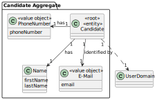

# US 2000c

## 1. Context

In this User Story, the goal is to List all the active candidates registered in the system.

## 2. Requirements

**US 2000c**  As Operator, I want to list all candidates.

**Acceptance Criteria:**

- 2000c.1. When displaying the candidates, show for each their name and email;
- 2000c.2. The list of the candidates must be in the alphabetical order by name;
- 2000c.3. The list of the candidates must be of the active candidates at the moment

**Customer Specifications and Clarifications:**

> **Question:** In US 2000c we are asked to implement the function of listing all the candidates. Is it necessary to sort the candidates (for example, alphabetically by name)? If so, what criteria should we follow?
>
> **Answer:** Yes, the list can be in alphabetical order by name.


> **Question:** Are there business policies regarding listing candidates?
> 
> **Answer:** They must follow any conditions relating to the possible status of the candidate.


> **Question:** When you list the candidates, do you just list the emails?
> 
> **Answer:** I'd say it makes sense to give each candidate their email address and their name.


**Dependencies/References:**

* There is a dependency to "US1000: As Administrator, I want to be able to register, disable/enable, and list users of the backoffice", since there is a need to have users registered in the system to be able to do any kind of action.


* There is a dependency to "US2000a:  As Operator, I want to register a candidate and create a corresponding user", since at least one candidate must be registered in the system so that the operator can list all the candidates.

**Input and Output Data**

**Input Data:**

* Typed data:
    * none


* Selected data:
    * none


**Output Data:**
* List of all registered candidates.


## 3. Analysis

*   When listing the candidates it should appear hers/his first and last name and email

* The list should also be ordered alphabetically by the first name.


### 3.1. Domain Model



## 4. Design

**Domain Class/es:** Candidate, Email, Name, SystemUser

**Controller:** ListAllCandidatesController

**UI:** ListAllCandidatesUI

**Repository:**	CandidateRepository

**Service:** AuthorizationService

### 4.1. Sequence Diagram


### 4.2. Class Diagram


[//]: # (### 4.3. Applied Patterns)

[//]: # (### 4.4. Tests)

[//]: # ()
[//]: # (Include here the main tests used to validate the functionality. Focus on how they relate to the acceptance criteria.)

[//]: # ()
[//]: # (**Test 1:** *Verifies that it is not possible to ...*)

[//]: # ()
[//]: # (**Refers to Acceptance Criteria:** G002.1)

[//]: # ()
[//]: # ()
[//]: # (```)

[//]: # (@Test&#40;expected = IllegalArgumentException.class&#41;)

[//]: # (public void ensureXxxxYyyy&#40;&#41; {)

[//]: # (	...)

[//]: # (})

[//]: # (````)

## 5. Implementation

### Methods in the Controller

* **public Iterable<Candidate> allActiveCandidates()** - this method gets all the active candidates registered in the system

## 6. Integration/Demonstration

After doing the log in process, to be able to perform this function you need to have admin, customer manager or operator as your role. Then select the option that says “List all Candidates”.
Then the system will show all the candidates registered in the system that are active at the moment.


The list of candidates will be displayed in alphabetical order(by his/hers first name).

[//]: # (## 7. Observations)

[//]: # ()
[//]: # (*This section should be used to include any content that does not fit any of the previous sections.*)

[//]: # ()
[//]: # (*The team should present here, for instance, a critical perspective on the developed work including the analysis of alternative solutions or related works*)

[//]: # ()
[//]: # (*The team should include in this section statements/references regarding third party works that were used in the development this work.*)