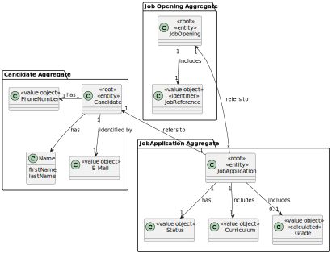
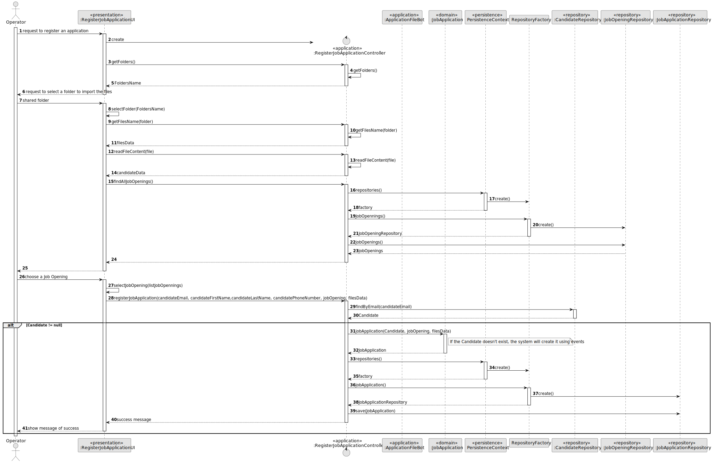
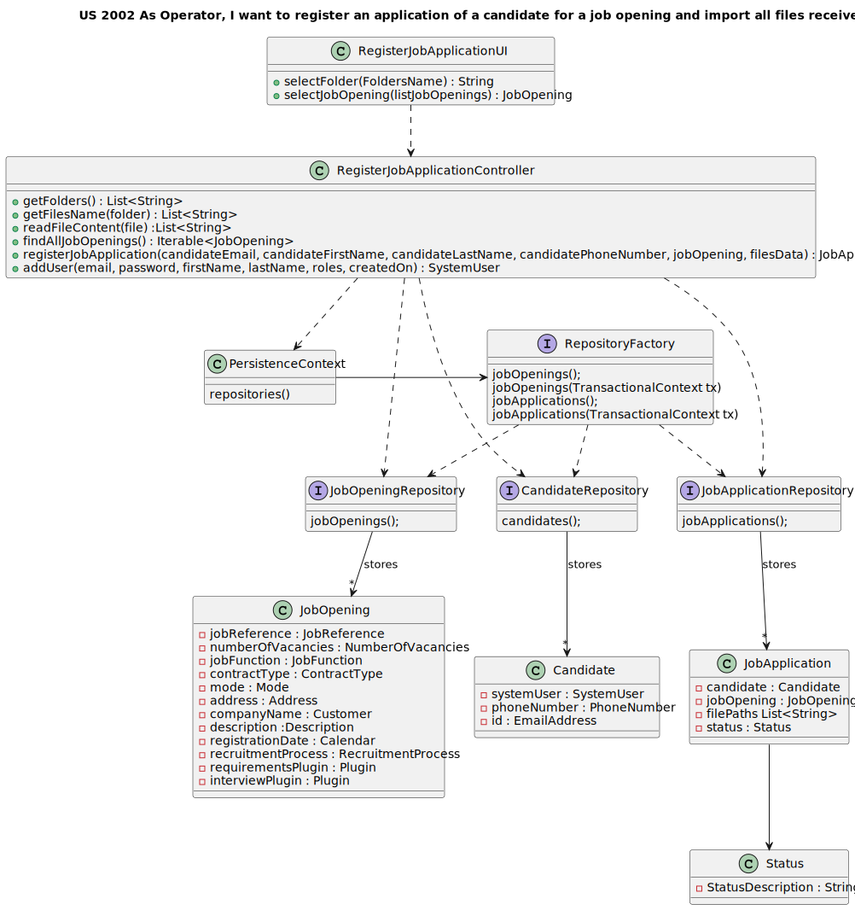
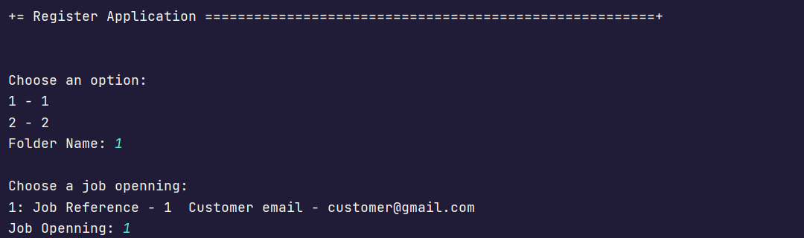
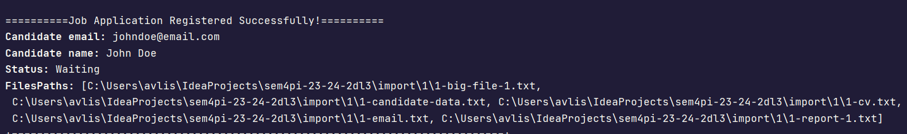

# US 2002


## 1. Context

The task at hand is to register an application of a candidate for a job opening and import all files received, as an Operator.
This is the first time this feature is being implemented,
so we're starting from scratch to design and develop a seamless process for register an application of a candidate for a job opening and import all files received.


## 2. Requirements

**US 2002**  As Operator, I want to register an application of a candidate for a job opening and import all files received.

**Acceptance Criteria:**

- 2002.1. Import the data from the file that was processed by the Application File Bot in Req 2001.
The files should be kept in the shared folder, but the Backoffice application needs to know the references to the file locations.
- 2002.2. The id corresponds to the job reference plus a sequential number

**Customer Specifications and Clarifications:**

> **Question44:** Regarding section 2.2.3 and the fact that the application email bot is out of scope but produces the information described in that section, will examples of this information be made available?
> 
> **Answer44:** Yes. An example of the information produced by the application email bot will be made available.


**Dependencies/References:**

-  US 2001 - "As Product Owner, I want the system to, continuously, process the files produced
by the Applications Email Bot, so that they can be imported into the system by initiative
of the Operator." 
- US 2000a - "As Operator, I want to register a candidate and create a corresponding user."
- US 1002 - "As Customer Manager, I want to register a job opening."


**Input and Output Data**

**Input Data:**

* Typed data:
  * email
  * first name
  * last name
  * phone number


**Output Data:**
* Display the success of the operation  and the data of the registered candidate


## 3. Analysis

> **Question15:** Does the operator register an application or does the system do it automatically? And how does the application verification plugin fit into this process
>
> **Answer15:** In US 2002, the Operator registers the application. To do this, it is the Operator who initiates the process, but the system must import the data resulting from the Application File Bot "automatically" (See US 2002 References). The aforementioned plugin enters this process through US 2003, in which the Operator generates a template file with the data to be entered to validate an application. In US 2004, the Operator, after filling in the specific application data (based on the previous template file), submits this file to the system, which will be used for the system to evaluate/verify the application. If the criteria are not met, the application is rejected.


> **Question50:** With regard to the files generated by the email file bot, what identifies what each file contains?
>
> **Answer50:** According to the example sent, you should consider that each file always has a unique prefix that identifies an application (an integer before the first "-"). All files with the same prefix belong to the same application. After the prefix, if it has "cv" it is a CV, if it has "email" it is the email sent by the candidate, if it has "candidate-data" it is the 4 identifying data of the application, as described in 2.2.3. All other files with the same prefix should be considered attachments.


> **Question65:** US2002 - UI and UX. I'd like to know what is the expected flow of executing US2002 (application registration and files import, by the operator). Can you reproduce step by step which actions should the operator execute? Example: 1. The system asks the operator for the candidate's email. 2. The operator enters the candidate's email. 3. The system asks for the job reference. 4. The operator enters the job reference. 5. The system creates the job application, if there is data for it in the shared folder.
> 
> **Answer65:** There are no specific requirements for the UI/UX, but I think it will be more user-friendly if the Operator could start the process by selecting the shared folder for the application to be imported.


> **Question83:** US2002 - In the description of the US the PO refers to an import of files and then in the reference to it the import of the file data. Could you clarify what the import refers to? Are they separate imports? Do they have different destinations?
> 
> **Answer83:** In this US I'm referring to the import of the files generated by Application File Bot. When I refer to the data, it will be the data in the text file "A text file with the data of the application and candidate", section 2.2.3, one of the files generated.


> **Question84:**  US2002 - After the files in the shared folder have been used by the Operator to register an application, should they remain in the folder or be deleted? If they are not deleted, how do we determine which ones have not yet been "used"?
> 
> **Answer84:** Assuming that they have already been imported into the system, I have no additional requirements regarding the files. The second question is a problem that should be solved by the proposed solution. I don't have anything to say about that.


> **Question100:** US2002 - What needs to be registered in the system?
> 
> **Answer100:** There must be a record indicating that the candidate in question has applied and all the files submitted must be recorded/imported into the system.


> **Question137:** US2002 - Email Bot Options - what options are available in the email bot, i.e. what files can we find?
>
> **Answer137:** The files are always similar to the example provided. There may be more files, but they will always be of the same "type" as the one illustrated in the example. In particular, for each application there is only one file with the email sent, one file with the application details and one file with the CV. There may be more files with additional documents (that were attached to the original email), such as reports, letters of recommendation, etc.


### 3.1. Domain Model



## 4. Design

**Domain Class/es:** JobOpening, Candidate, JobApplication

**Controller:** RegisterJobApplicationController

**UI:** RegisterJobApplicationUI

**Repository:**	JobOpeningRepository, CandidateRepository, JobOpeningRepository


### 4.1. Sequence Diagram



### 4.2. Class Diagram



### 4.3. Applied Patterns

### 4.4. Tests


**testCreate:** Verifies that it is possible to create a job Application, with the files's path (from Email Application bot import).

```
@Test
public void testCreate() {
    SystemUser user = getNewUserSecond();
    SystemUser userCustomerManager = getCustomerManager();
    Code code = new Code("ABC123");
    Address address = new Address("Street1", "City1", "State1", "Country1", "1234-232");


    JobReference jobReference = new JobReference(1);


    Customer customer = new Customer(user, code, address, userCustomerManager);
    JobOpening jo = new JobOpening(new NumberOfVacancies(1), new JobFunction("Testing Unit"), Modes.HYBRID, ContractType.valueOf(ContractTypes.FULL_TIME), new Address("Colorado", "United States of America", "Brownstone", "Willow Street", "4444-111")
    , customer, new Description("Testing Unit"), jobReference, Calendar.getInstance());
    Candidate c = new Candidate(getNewUserFirst(), phoneNumber);
    FilePath fp =  new FilePath();

    JobApplication first = new JobApplication(c, jo);
    Type type = Types.INFO;
    first.FilePaths(type, fp);


    assertNotNull(first);
    assertEquals(jo, first.JobOpening());
    assertEquals(fp, first.filePathsInfo());
}
````


**testEquals:** Verifies that for two job Application with the same attributes are equals.

```` 
@Test
public void testEquals() {
    SystemUser user = getNewUserSecond();
    SystemUser userCustomerManager = getCustomerManager();
    Code code = new Code("ABC123");
    Address address = new Address("Street1", "City1", "State1", "Country1", "1234-232");

    Customer customer = new Customer(user, code, address, userCustomerManager);
    JobOpening jo = new JobOpening(new NumberOfVacancies(1), new JobFunction("Testing Unit"), Modes.HYBRID, ContractType.valueOf(ContractTypes.FULL_TIME), new Address("Colorado", "United States of America", "Brownstone", "Willow Street", "4444-111")
            , customer, new Description("Testing Unit"), Calendar.getInstance());
    Candidate c = new Candidate(getNewUserFirst(), phoneNumber);
    List<String> fp =  new ArrayList<>();
    JobApplication first = new JobApplication(c, jo, fp);
    JobApplication second = new JobApplication(c, jo, fp);


    assertEquals(first, second);
}
````


**testNotEquals:** Verifies that for two job Application with a different job Opening, the objects are different.

````
@Test
public void testNotEquals() {
    SystemUser user = getNewUserSecond();
    SystemUser userCustomerManager = getCustomerManager();
    Code code = new Code("ABC123");
    Address address = new Address("Street1", "City1", "State1", "Country1", "1234-232");
    Address address2 = new Address("Street2", "City2", "State2", "Country2", "1234-232");

    Customer customer = new Customer(user, code, address, userCustomerManager);
    Customer customer2 = new Customer(user, code, address2, userCustomerManager);

    JobReference jobReference = new JobReference(1);

    JobReference jobReference2 = new JobReference(2);


    JobOpening jo = new JobOpening(new NumberOfVacancies(1), new JobFunction("Testing Unit"), Modes.HYBRID, ContractType.valueOf(ContractTypes.FULL_TIME), new Address("Colorado", "United States of America", "Brownstone", "Willow Street", "4444-111")
            , customer, new Description("Testing Unit"),jobReference, Calendar.getInstance());
    JobOpening jo2 = new JobOpening(new NumberOfVacancies(1), new JobFunction("Testing Unit"), Modes.HYBRID, ContractType.valueOf(ContractTypes.FULL_TIME), new Address("Colorado", "United States of America", "Brownstone", "Willow Street", "4444-111")
            , customer2, new Description("Testing Unit"), jobReference2, Calendar.getInstance());
    Candidate c = new Candidate(getNewUserFirst(), phoneNumber);
    FilePath fp =  new FilePath();
    JobApplication first = new JobApplication(c, jo);
    Type type = Types.INFO;
    first.FilePaths(type, fp);
    JobApplication second = new JobApplication(c, jo);
    first.FilePaths(type, fp);


    assertNotEquals(first, second);
}
````


**testError:** Verifies that for attributes null, it is not possible create a job Application. 

````
@Test(expected = IllegalArgumentException.class)
public void testError() {
    JobApplication first = new JobApplication(null, null);
}

````


**testNullCandidateError:** Verifies that for candidate null, it is not possible create a job Application.

````
@Test(expected = IllegalArgumentException.class)
public void testNullCandidateError() {
    SystemUser user = getNewUserSecond();
    SystemUser userCustomerManager = getCustomerManager();
    Code code = new Code("ABC123");
    Address address = new Address("Street1", "City1", "State1", "Country1", "1234-232");

    Customer customer = new Customer(user, code, address, userCustomerManager);

    JobReference jobReference = new JobReference(1);

    JobOpening jo = new JobOpening(new NumberOfVacancies(1), new JobFunction("Testing Unit"), Modes.HYBRID, ContractType.valueOf(ContractTypes.FULL_TIME), new Address("Colorado", "United States of America", "Brownstone", "Willow Street", "4444-111")
            , customer, new Description("Testing Unit"), jobReference, Calendar.getInstance());

    FilePath fp =  new FilePath();


    JobApplication first = new JobApplication(null, jo);

}
````


**testNullJobOpeningError:** Verifies that for job opening null, it is not possible create a job Application.

````
@Test(expected = IllegalArgumentException.class)
public void testNullJobOpeningError() {
    Candidate c = new Candidate(getNewUserFirst(), phoneNumber);

    FilePath fp =  new FilePath();

    JobApplication first = new JobApplication(c, null);
    Type type = Types.INFO;
    first.FilePaths(type, fp);
}
````


## 5. Implementation

* JobApplication registerJobApplication(EmailAddress candidateEmail, String candidateFirstName, String candidateLastName,  PhoneNumber candidatePhoneNumber, JobOpening jobOpening, List<String> filesData) -
  this method registers a job application by checking whether the candidate already exists in the system using the e-mail address provided.
If the candidate is already registered, it creates a new application associated with that applicant. 
Otherwise, it creates a new candidate with the provided info (candidateEmail candidateFirstName, candidateLastName and candidatePhoneNumber)
and then an application. 


* SystemUser addUser(final String email, final String password, final String firstName,
final String lastName, final Set<Role> roles, final Calendar createdOn) - this method creates a System User and returns it.


* Iterable<JobOpening> findAllJobOpenings() - this method fetches all the job openings registered in the job opening Repository.


* List<String> getFolders() - this method returns a list of folder names in the system's “import” directory.


* List<String> getFilesName(String folder) - this method takes the name of a folder as a parameter and returns a list of file names in that folder.


* List<String> readFileContent(File file) - this method reads the contents of a file and returns a list of strings representing the lines in the file.


## 6. Integration/Demonstration

After the main menu appears and select the option: "Register Application".

Then select a folder, from the list, to import the data, and select a job opening from the list.





It will appear a success message and the info of the job application, like this:





[//]: # ()
[//]: # (## 7. Observations)

[//]: # ()
[//]: # (*This section should be used to include any content that does not fit any of the previous sections.*)

[//]: # ()
[//]: # (*The team should present here, for instance, a critical perspective on the developed work including the analysis of alternative solutions or related works*)

[//]: # ()
[//]: # (*The team should include in this section statements/references regarding third party works that were used in the development this work.*)