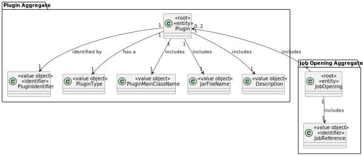
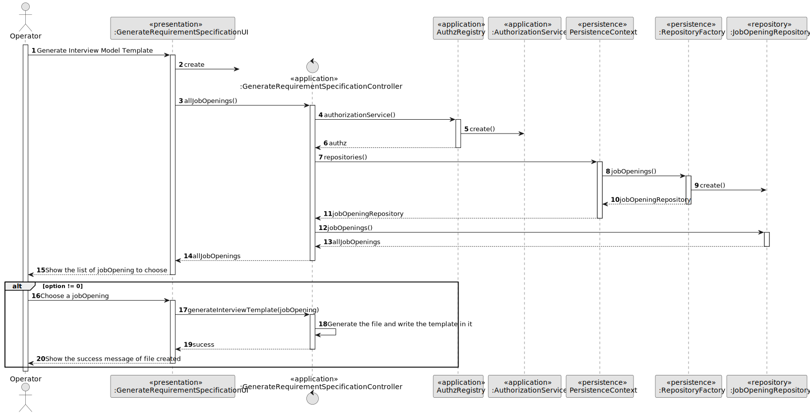
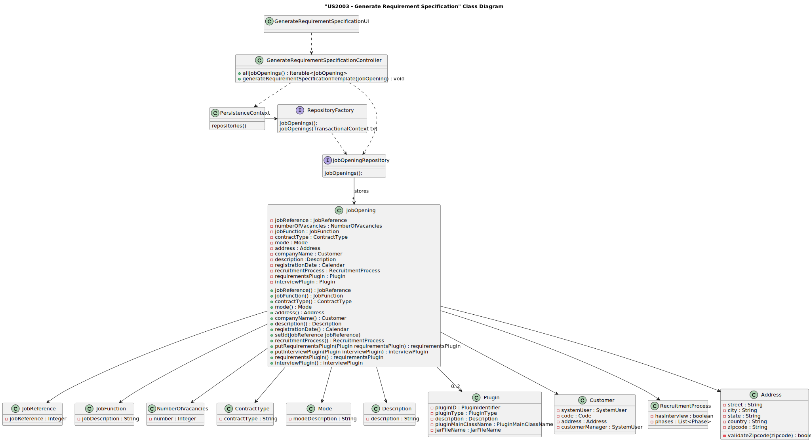
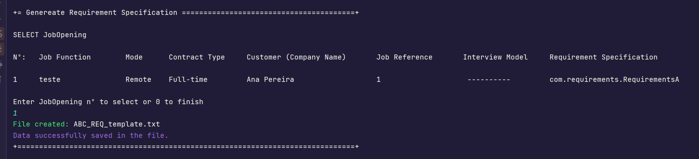

# US 2003


## 1. Context

The task at hand is to generate and export a template text file to help collect data fields for candidates of a job opening, as an Operator.
This is the first time this feature is being implemented,
so we're starting from scratch to design and develop a seamless process for generate and export the template text file.


## 2. Requirements


**US 2003**  As Operator, I want to generate and export a template text file to help collect data fields for candidates of a job opening (so the data is used to verify the requirements of the job opening).

[//]: # (**Acceptance Criteria:**)

[//]: # ()
[//]: # (- 2003.1. )

**Customer Specifications and Clarifications:**
> **Question18:** How does the Customer Manager select the model to use for the interviews?
>
> **Answer18:** It is accepted that when templates are registered in the system (the "plugins") they are identified with a name or description. For example, "Supermarket Cashier Interview Template" or "Junior Backend Java Programmer Interview Template". The Customer manager is supposed to select a template from a possible list of templates.

> **Question101:** US2003 - What fields/information must be extracted from the candidate in order to verify the requirements of a job opening?
> 
> **Answer101:** It will depend on what is designed/specified in the Requirements Specification template used for that job opening.

**Dependencies/References:**


* There is a dependency to "US1001: As Customer Manager, I want to register a job opening." since you need a customer to associate a jobOpening
* There is a dependency to "US1002: As Customer Manager, I want to register a job opening." since you need to create a jobOpening to give a plugin
* There is a dependency to "US1008 As Language Engineer, I want to deploy and configure a plugin (i.e., Job Requirement Specification or Interview Model) to be used by the system." since you need to create the plugin to associate to a specific jobOpening
* There is a dependency to "US 1009" As Customer Manager, I want to select the requirements specification to be used for a job opening.

**Input and Output Data**

**Input Data:**

* Typed data:
  * None


* Selected data:
  * Job Opening
  * Requirement Model Plugin


**Output Data:**
* Display the success of the operation and the data of the registered plugin


## 3. Analysis

> **Question15:** Does the operator register an application or does the system do it automatically? And how does the application verification plugin fit into this process
>
> **Answer15:** In US 2002, the Operator registers the application. To do this, it is the Operator who initiates the process, but the system must import the data resulting from the Application File Bot "automatically" (See US 2002 References). The aforementioned plugin enters this process through US 2003, in which the Operator generates a template file with the data to be entered to validate an application. In US 2004, the Operator, after filling in the specific application data (based on the previous template file), submits this file to the system, which will be used for the system to evaluate/verify the application. If the criteria are not met, the application is rejected.

> **Question119:** Management of screening data - We have a question about the management of the screen phase of the recruitment process. Specifically, after the applications are filtered during the screening process, I'm unsure about who manages the results and oversees this phase. Could you please clarify if the responsibility for managing the screening results falls under the customer manager, the operators, or both?
> 
> **Answer119:** In US2003 and US2004 it is the Operator that “downloads” a template file to register the requirements, registers the answers for the requirements in the file, and then uploads the file. It is then the Costumer manager that executes the verification process (US1015) and executes the notification of the results (US1016)

> **Question130:** Question about the candidate's file - We'd like to ask you about a question our group still has about the file sent by the candidate in their application for a Job Opening. Will this file, which will contain their data, including some you've already revealed such as email, telephone number and name, always be the same, for the same candidate, or is it possible for a candidate to apply with a file with a different email, a different telephone number and/or a different name?
>
> **Answer130:** If the file arrives with different data from all those received before, I don't think there's any way of knowing that it comes from the same person, right? But the answer to your question probably lies in the way a candidate is identified.


### 3.1. Domain Model



## 4. Design

**Domain Class/es:** JobOpening, Plugin, PluginIdentifier, PluginType, Description, PluginMainClassName, JarFileName 

**Controller:** GenerateRequirementSpecificationController

**UI:** GenerateRequirementSpecificationUI

**Repository:**	JobOpeningRepository

### 4.1. Sequence Diagram



### 4.2. Class Diagram



[//]: # (### 4.3. Applied Patterns)

[//]: # ()
[//]: # (### 4.4. Tests)

[//]: # ()
[//]: # (Include here the main tests used to validate the functionality. Focus on how they relate to the acceptance criteria.)

[//]: # ()
[//]: # (**Test 1:** *Verifies that it is not possible to ...*)

[//]: # ()
[//]: # (**Refers to Acceptance Criteria:** G002.1)

[//]: # ()
[//]: # ()
[//]: # (```)

[//]: # (@Test&#40;expected = IllegalArgumentException.class&#41;)

[//]: # (public void ensureXxxxYyyy&#40;&#41; {)

[//]: # (	...)

[//]: # (})

[//]: # (````)

[//]: # ()
## 5. Implementation

It was implemented a method to generate the interview template.

* void generateRequirementSpecificationTemplate(JobOpening jobOpening) - this method creates a requirements specification file based on a template provided by a specific plugin, using reflection to dynamically invoke the required method.

* Iterable<JobOpening> allJobOpenings() - this method returns all job openings, ensuring that the authenticated user has permission as an operator, customer manager or admin.


## 6. Integration/Demonstration

After the main menu appears and select the option: "Generate/export a template file for requirement specification".
Select an option from the JobOpenings's list, and will be created a requirements specification file based on a template provided by a specific plugin.





[//]: # (## 7. Observations)

[//]: # ()
[//]: # ()
[//]: # (*This section should be used to include any content that does not fit any of the previous sections.*)

[//]: # ()
[//]: # ()
[//]: # (*The team should present here, for instance, a critical perspective on the developed work including the analysis of alternative solutions or related works*)

[//]: # ()
[//]: # ()
[//]: # ()
[//]: # (*The team should include in this section statements/references regarding third party works that were used in the development this work.*)


