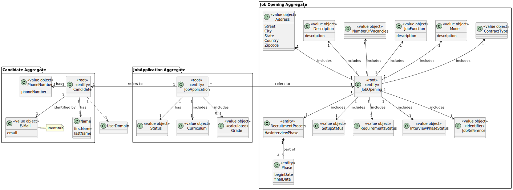
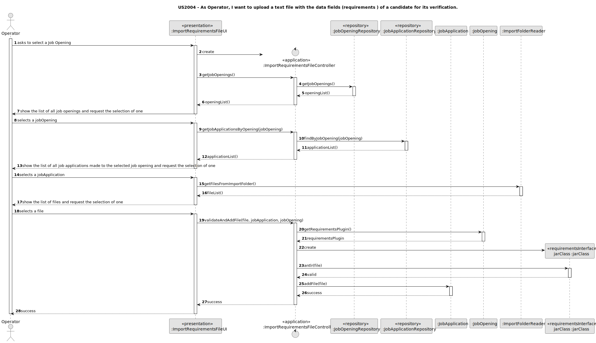
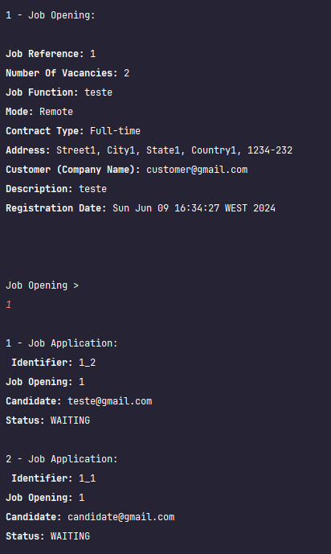
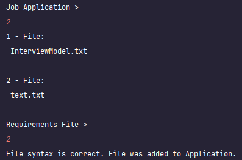
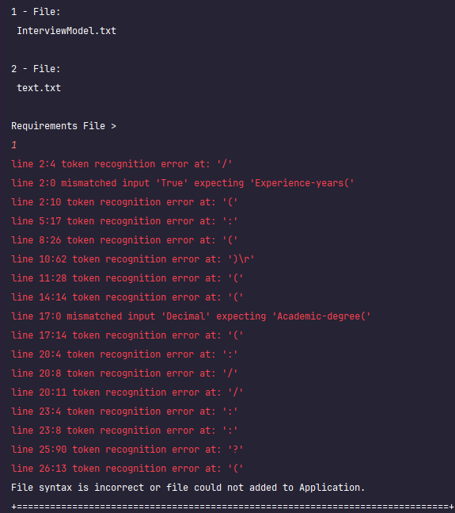
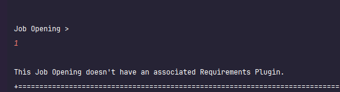

# US 2004

## 1. Context

The goal of this User Story is to upload a filled requirements file for future validation.

## 2. Requirements

**US 2004**  As Operator, I want to upload a text file with the data fields (requirements ) of a candidate for its verification.

**Acceptance Criteria:**

2004.1. The system must validate the syntax of the uploaded file

**Customer Specifications and Clarifications:**

> **Question:** Requirements Answers - I'm having trouble understading where are the requirements answer obtained from the candidates, so that the operator can then register their answers in the template previously generated and submit them to the system. Are these answers already within the files processed by tge application fie bot?
> 
> **Answer:** We can assume that the operator has access to all the files submitted by the candidates (since he/she is the one that imports the files into the system – US2002). He/she can than consult these files in order to answer the questions in the requirements template file. She/he then submits the file with the answers (US2004).


> **Question:**  Candidate Answers - Does US2004 only deals with the upload of the file to the system or also the registration of the candidate's answer by the Operator? I've seen many mentions about the file's answers but I want to understand if that aspect is also part of US2004.
> 
> **Answer:**  In US2003 the Operator downloads a template file that he/she uses to register the candidate requirements. In US 2004, the Operator uploads a file with the requirements and the system should validate the file (verify of the syntax is correct). US 1015 is the one that executes the verification of requirements for the candidates (based on the previously uploaded files)

> **Question:** Submitting a file for verification – My group has a question regarding US2004, namely about the file submission process. We would like to know whether "submitting the file for verification" in US 2004 simply involves saving the file path in the system and carrying out its syntactic analysis (as mentioned in Q180) or whether it also involves extracting and storing the information contained in the file in structures specific for later verification. We have this doubt because there are User Stories in which it is explicit that it is supposed to import the information from the files, as for example in US2002: "As Operator, I want to register an application of a candidate for a job opening and import all files received". However, in US2004 it is not clear what "submitting the file" means.
>
> **Answer:** Submitting the file means “importing” the file into the system, checking whether it is syntactically correct. The file becomes part of the system, making subsequent operations on this file/data possible, such as US1015. I don't want/should condition how this is done in terms of a solution.

> **Question:** About the Us2004, in A180 you previously stated that "the Operator uploads a file with the requirements and the system should validate the file (verify of the syntax is correct). US 1015 is the one that executes the verification...". What should happen if the file failes this verification? Is the application instantly refused or do you have something else in mind?
>
> **Answer:** A file that fails the verification means that that file has an error (syntactic error) it does not mean that the application does not meet the requirements. The user should fix the error and submit again. Only US 1015 results in approving or rejecting an application.


**Dependencies/References:**

* There is a dependency to "US1000: As Administrator, I want to be able to register, disable/enable, and list users of the backoffice", since there is a need to have users registered in the system to be able to do any kind of action.

* There is a dependency to "US2003: As Operator, I want to generate and export a template text file to help collect data fields for candidates of a job opening (so the data is used to verify the requirements of the job opening)", since the file uploaded in this US is the result of filling out the one generated in US2003.


**Input and Output Data**

**Input Data:**

* Typed data:
    * None
    

* Selected data:
  * jobOpening
  * jobApplication
  * file


**Output Data:**
* Operation success


## 3. Analysis

* The system asks the user to select a Job Opening and then a Job Application
* The system should list the files in a folder, the user then selects one to import.
* Afterwards, the system verifies if the syntax of the file is correct per the requirements plugin.
* If the syntax is valid, the file is added to the system, otherwise an error is thrown and the system informs the user of what is wrong.

### 3.1. Domain Model



## 4. Design

**Domain Class/es:** JobApplication, JobOpening

**Controller:** ImportRequirementsFileController

**UI:** ImportRequirementsFileUI

**Repository:**	JobApplicationRepository

**Interface:** RequirementsInterface

**Auxiliary:** 

[//]: # (**Reflection:** JarFileMainClass)

### 4.1. Sequence Diagram



[//]: # (### 4.2. Class Diagram)

[//]: # ()
[//]: # (![a class diagram]&#40;us1006_class_diagram.svg &#41;)

### 4.3. Applied Patterns

### 4.4. Tests


[//]: # (Include here the main tests used to validate the functionality. Focus on how they relate to the acceptance criteria.)

[//]: # ()
**Test 1:** *Verifies that a valid-syntax file is, in fact, valid*
**Refers to Acceptance Criteria:** 2004.1
```
    public void ensureValidSyntax() throws Exception {
        String jarPath = "src/test/java/lapr4/jobs4u/candidatemanagement/domain/plugin/testPlugin.jar";
        File filePlugin = new File(jarPath);
        URL url = filePlugin.toURI().toURL();

        URLClassLoader classLoader = new URLClassLoader(new URL[]{url});
        Class<?> jarFile = classLoader.loadClass("com.requirements.RequirementsA");
        Method method = jarFile.getMethod("antlr", String.class);

        assertTrue((Boolean) method.invoke(null, "src/test/java/lapr4/jobs4u/candidatemanagement/domain/txt/textValid.txt"));
    }
````
**Test 2:** *Verifies that an invalid-syntax file is, in fact, invalid*
**Refers to Acceptance Criteria:** 2004.1
```
    public void ensureInvalidSyntax() throws Exception {
        String jarPath = "src/test/java/lapr4/jobs4u/candidatemanagement/domain/plugin/testPlugin.jar";
        File filePlugin = new File(jarPath);
        URL url = filePlugin.toURI().toURL();

        URLClassLoader classLoader = new URLClassLoader(new URL[]{url});
        Class<?> jarFile = classLoader.loadClass("com.requirements.RequirementsA");
        Method method = jarFile.getMethod("antlr", String.class);
        assertFalse((Boolean) method.invoke(null, "src/test/java/lapr4/jobs4u/candidatemanagement/domain/txt/textInvalid.txt"));
    }
````
## 5. Implementation

The US was implemented using the following methods:
In ***ImportRequirementsFileController***:

* **public Iterable<JobOpening> getJobOpenings()** - this method retrieves all Job Openings.
* **public Iterable<JobApplication> getJobApplicationsByOpening(JobOpening jobOpening)** - this method retrieves all Job Application associated with the provided Job Opening.
* **public boolean validateAndAddFile(File file, JobApplication jobApplication, JobOpening jobOpening)** - this method calls upon the required methods to validate de syntax of the file and associate it with the jobApplication

In ***JobOpeningRepository***:
* **public Iterable<JobOpening> getJobOpenings()** - this method retrieves all Job Openings.

In ***JobApplicationRepository***:
* **public Iterable<JobApplication> findByJobOpening(JobOpening jobOpening)** - this method retrieves all Job Application associated with the provided Job Opening.

In ***ImportFolderReader***:
* **public Iterable<String> getFilesFromImportFolder()** - this method fetches all files in the import folder

In ***JobOpening***:
* **public Plugin getRequirementsPlugin()** - this method retrieves the Requirements Plugin associated with the JobOpening.

In ***JobApplication***:
* **public boolean addFile(File file)** - this method adds the file to the JobApplication.

In ***"Plugin"***:
* **public static void antlr(String file)** - this method recieves the contents of a file and validates its syntax.

## 6. Integration/Demonstration
After doing the log in process, to be able to perform this function you need to have operator or higher as your role. Then select the option that says “Upload Requirements File”.

Then the system will show a list of the available job Openings and prompt the user to select one. Then, the system will show a list of the job applications associated with it. After selecting one, it will provide a list of files to validate.
If the file is valid it will be added to the application's filePaths otherwise nothing will happen.




If the job opening does not have a requirements plugin, the process will end before showing the list of applications.



[//]: # (## 7. Observations)

[//]: # ()
[//]: # (*This section should be used to include any content that does not fit any of the previous sections.*)

[//]: # ()
[//]: # (*The team should present here, for instance, a critical perspective on the developed work including the analysis of alternative solutions or related works*)

[//]: # ()
[//]: # (*The team should include in this section statements/references regarding third party works that were used in the development this work.*)