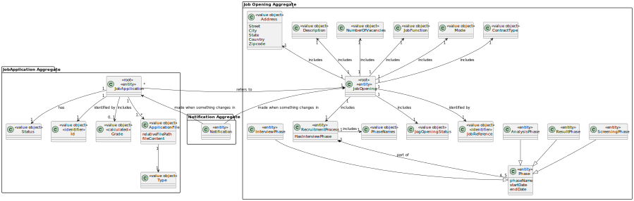
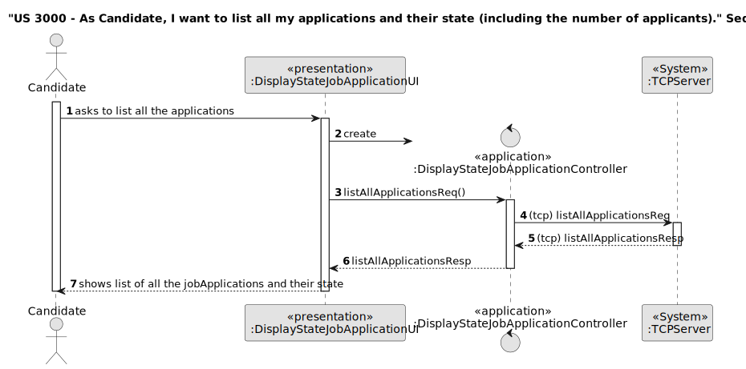
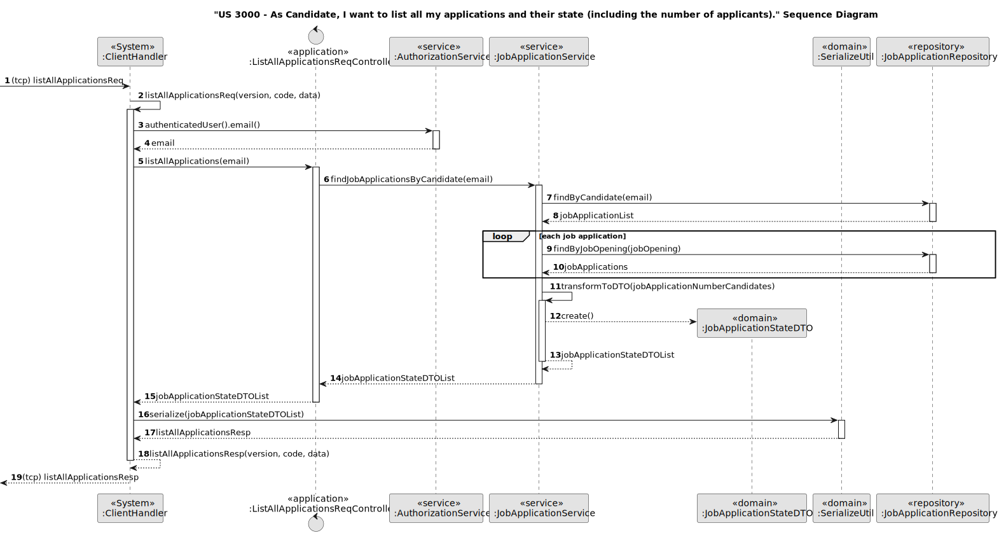
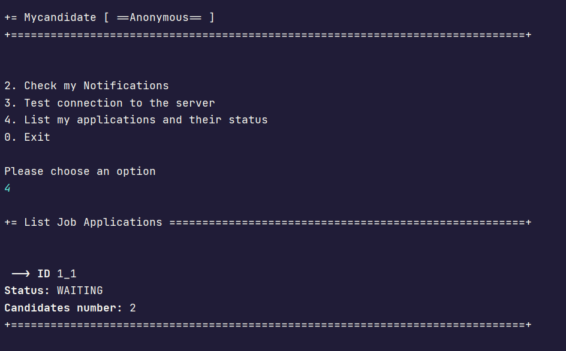

# US 3000

## 1. Context

The task at hand is to list all my applications and their state (including the number of applicants), as a Candidate.
This is the first time this feature is being implemented,
so we're starting from scratch to design and develop a seamless process for setting up the process to list all my applications and their state (including the number of applicants).

## 2. Requirements

**US 3000** As Candidate, I want to list all my applications and their state (including the number of applicants).

**Acceptance Criteria:**

- 3000.1. List all applications: along with their status and the number of applications each job opening has.


**Customer Specifications and Clarifications:**

> **Question176:** US3000 - US3000 asks you to list the number of applicants in addition to the number of applications and their status. Is this number of applicants a sum of the number of applicants who have applied for the same Job Openings as this first applicant (who is executing the use case)?
> 
> **Answer176:** All the candidate's applications should be listed, along with their status and the number of applications each job opening has had (so the candidate has an idea of the “competition” they have had for each of their applications).


**Dependencies/References:**

* There is a dependency to "US 2002: As Operator, I want to register an application of a candidate for a job opening and import all files received."


**Input and Output Data**

**Input Data:**

* Typed data:
    * none 
    

* Selected data:
    * job opening 


**Output Data:**
*  list candiate´s applications and their state (including the number of applicants)


## 3. Analysis

* 

### 3.1. Domain Model



## 4. Design

**Domain Class/es:** ClientHandler,JobApplication, TCPServer, JobApplicationStateDTO

**Controller:** DisplayStateJobApplicationController, ListAllApplicationsReqController

**UI:** DisplayStateJobApplicationUI, 

**Repository:**	JobApplicationRepository

**Service:** JobApplicationService

## 4.1. Sequence Diagram CandidateApp and Server


### 4.2. Sequence Diagram CandidateApp




### 4.3. Sequence Diagram Server Notify




[//]: # (### 4.3. Applied Patterns)

[//]: # ()
[//]: # (### 4.4. Tests)

[//]: # ()
[//]: # (Include here the main tests used to validate the functionality. Focus on how they relate to the acceptance criteria.)

[//]: # ()
[//]: # (**Test 1:** *Verifies that it is not possible to ...*)

[//]: # ()
[//]: # (**Refers to Acceptance Criteria:** G002.1)

[//]: # ()
[//]: # ()
[//]: # (```)

[//]: # (@Test&#40;expected = IllegalArgumentException.class&#41;)

[//]: # (public void ensureXxxxYyyy&#40;&#41; {)

[//]: # (	...)

[//]: # (})

[//]: # (````)

## 5. Implementation


### Methods in the Controller

The US was implemented using the following methods:

In *DisplayStateJobApplicationController* (Candidate App):
* **public CustomMessage listAllApplications()** - this method sends a request to the FollowUpServer to list all the applications.

In *ListAllApplicationsReqController* (FollowUpServer):
* **public List<JobApplicationStateDTO> listAllApplications(EmailAddress email)** - this method fetches the list of applications for user.

In *JobApplicationService* (FollowUpServer):
* **public List<JobApplicationStateDTO> findJobApplicationsStateAndApplicants(EmailAddress email)** - this method finds the applications made to a given user and returns a list of jobApplicationsStateDTO.
* **private List<JobApplicationStateDTO> transformToDTO(final Map<JobApplication, Integer> types)** - this method iterates thought the applications and returns a list of jobApplicationsStateDTO.

## 6. Integration/Demonstration

After the main menu appears and select the option: "List my applications and their status".

It will appear a list of applications, with their state and number of candidates.



[//]: # (## 7. Observations)

[//]: # ()
[//]: # (*This section should be used to include any content that does not fit any of the previous sections.*)

[//]: # ()
[//]: # (*The team should present here, for instance, a critical perspective on the developed work including the analysis of alternative solutions or related works*)

[//]: # ()
[//]: # (*The team should include in this section statements/references regarding third party works that were used in the development this work.*)