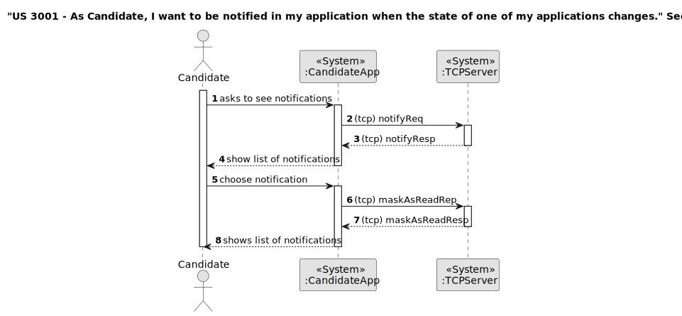
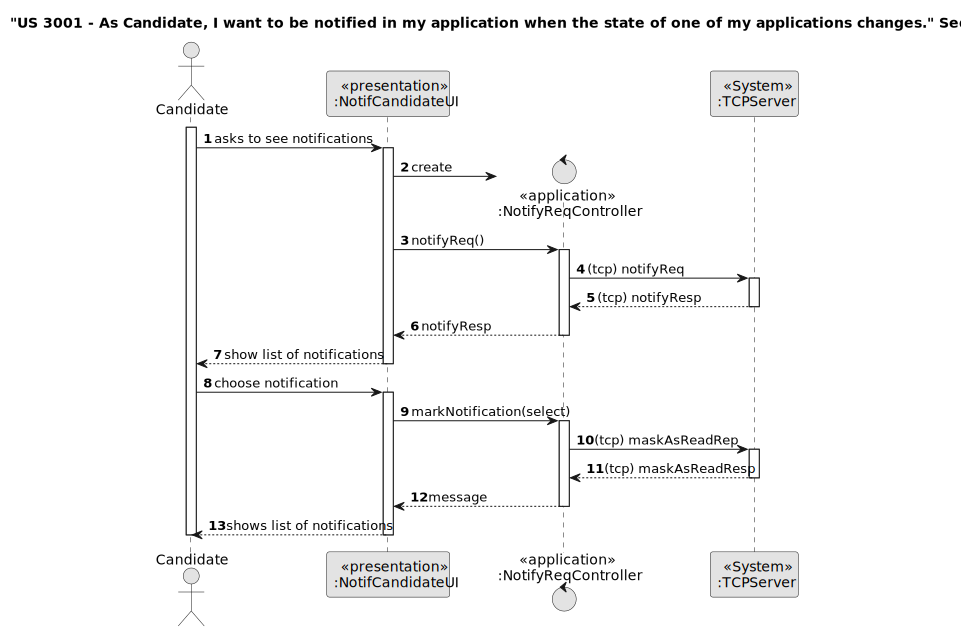
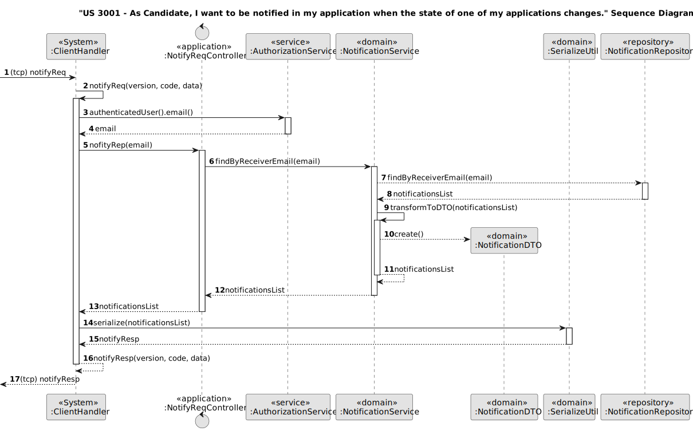
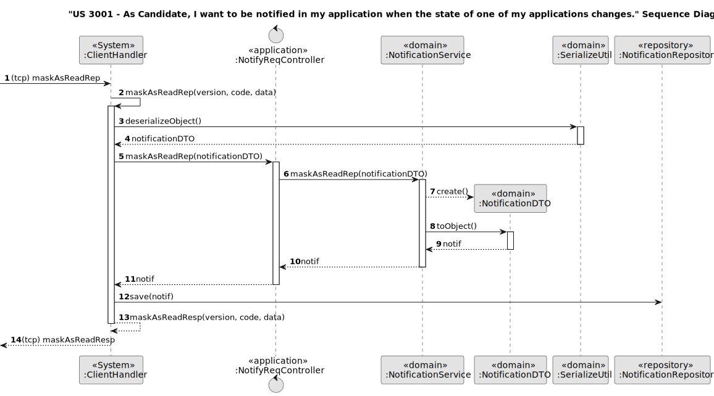
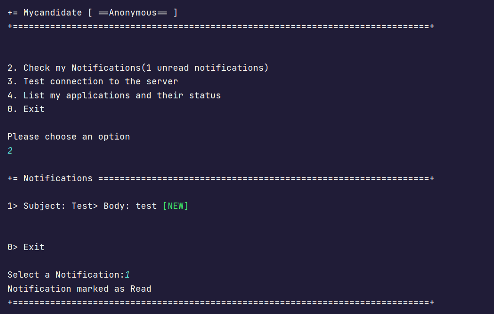

# US 3001

## 1. Context

The task at hand is to be able to be notified in my application when the state of one of my applications changes, as a Candidate.
This is the first time this feature is being implemented,
so we're starting from scratch to design and develop a seamless process for setting up the process to recive a notification in my application when the state of one of my applications changes.

## 2. Requirements

**US 3001** As Candidate, I want to be notified in my application when the state of one of my applications changes.

**Acceptance Criteria:**

- 3001.1. The applicant should be notified when their app is running.
- 3001.2. The notifications can be recivied the next time the application is runned.
- 3001.3. A notification if the application was received. If was accepted or not and, finally, if I was selected or not (after the ranking, if it is within the vacancies for the job opening).


**Customer Specifications and Clarifications:**

> **Question174:** US3001 - In US 3001 you want the applicant to be notified in their application when the status of an application changes. How do you want the applicant to be notified? And if the applicant is not running the application, is this notification lost?
> 
> **Answer174:** The applicant should be notified when their app is running. With regard to notifications that “happen” when you're not running the application, it would be interesting if you received them the next time you ran the application.


> **Question175:** US3001 - Question about notifications - The applicant will be notified when their application changes status. What is meant by notified, is it receiving an email, when entering the application does it have an 'inbox' queue? When the application is connected, do I receive an email? It's the applicant who makes the request (client) (Pop) thus initiates the communication, and receives the response/notification (server). And how do I fit into the push notification scenario?
> 
> **Answer175:**  See Q174. In this case the notifications are in the applicant's application, not by email.


> **Question189:** US3001 – Application State – I'd like some clarifications regarding the state that US3001 mentions. Is it the "accepted/not accepted" state, or a state regarding the phases of the recruitment process of which the application is associated to?
>
> **Answer189:** This US is focused on the Candidate perspective. He/she may not be aware of the internal phases of the recruitment process. But he/she is interested in knowing the “external” state of his/her applications. For instance, as a candidate I would like to know if my application was received. Then I would like to know if my application was accepted or not and, finally, if I was selected or not.


> **Question229:** US 3001 - From our perspective on this feature, we thought it would be better for the user to have a kind of notification inbox in their application. When the user is in the notifications feature, they receive the notifications they had that weren't sent because they weren't in the app, and then they wait for new notifications to appear in the meantime, until the user asks to leave the feature. Is this approach in line with your expectations?
>
> **Answer229:** That may be so. But wouldn't it be possible to receive notifications even if you weren't in that “menu option”? Being a “console” application limits the UI a little, but wouldn't it be possible to receive notifications as long as you have the application running but only show those notifications when the user selects the option? In terms of UI the difference is minimal, in terms of implementation it could be significant. Perhaps this is another question for RCOMP.


**Dependencies/References:**

* There is a dependency to "US 2002: As Operator, I want to register an application of a candidate for a job opening and import all files received."

* There is a dependency to "US 1015: As Customer Manager, I want to execute the process of verification of requirements of applications for a job opening."

* There is a dependency to "US 1013: As Customer Manager, I want to rank the candidates for a job opening".


**Input and Output Data**

**Input Data:**

* Typed data:
  * None


* Selected data:
  * Notification


**Output Data:**
* notifications of the state of each application.


## 3. Analysis


> **Question229:** US 3001 - From our perspective on this feature, we thought it would be better for the user to have a kind of notification inbox in their application. When the user is in the notifications feature, they receive the notifications they had that weren't sent because they weren't in the app, and then they wait for new notifications to appear in the meantime, until the user asks to leave the feature. Is this approach in line with your expectations?
>
> **Answer229:** That may be so. But wouldn't it be possible to receive notifications even if you weren't in that “menu option”? Being a “console” application limits the UI a little, but wouldn't it be possible to receive notifications as long as you have the application running but only show those notifications when the user selects the option? In terms of UI the difference is minimal, in terms of implementation it could be significant. Perhaps this is another question for RCOMP.


> **Question233:** US 3001 - Notifications - In previous questions about this feature you mentioned that as an applicant you would like to know if your application has been received, accepted and chosen. Please describe what you mean when you say that an application has been accepted, and when it has been chosen.
>
> **Answer233:** It is accepted if it passes the requirements verification process. It is chosen if after the ranking it is within the vacancies for the job opening.


### 3.1. Domain Model


## 4. Design

**Domain Class/es:** ClientHandler, Notification, NotificationDTO, SerializeUtil

**Controller:** NotifyReqController, NotifyReqController

**UI:** NotifCandidateUI

**Repository:** NotificationRepository

**Service:** NotificationService

### 4.1. Sequence Diagram CandidateApp and Server



### 4.2. Sequence Diagram CandidateApp 




### 4.3. Sequence Diagram Server Notify




### 4.3. Sequence Diagram Server Mark as read




[//]: # (### 4.3. Applied Patterns)

[//]: # ()
[//]: # (### 4.4. Tests)

[//]: # ()
[//]: # (Include here the main tests used to validate the functionality. Focus on how they relate to the acceptance criteria.)

[//]: # ()
[//]: # (**Test 1:** *Verifies that it is not possible to ...*)

[//]: # ()
[//]: # (**Refers to Acceptance Criteria:** G002.1)

[//]: # ()
[//]: # ()
[//]: # (```)

[//]: # (@Test&#40;expected = IllegalArgumentException.class&#41;)

[//]: # (public void ensureXxxxYyyy&#40;&#41; {)

[//]: # (	...)

[//]: # (})

[//]: # (````)

## 5. Implementation


### Methods in the Controller

The US was implemented using the following methods:

In *NotifCandidateController* (Candidate App):
* **public List<NotificationDTO> notifyReq()** - this method sends a request to the FollowUpServer to fetch the notifications of the authenticated user and returns a list provided by its response.
* **public CustomMessage maskAsReadRep(NotificationDTO selected)** - this method sends a request to the FollowUpServer to mark a given notification as Read and returns its response.

In *NotifReqController* (FollowUpServer):
* **public List<NotificationDTO> nofityRep(EmailAddress email)** - this method fetches the notifications made to a given user.
* **public Notification maskAsReadRep(NotificationDTO notificationDTO)** - this method marks a given notification as Read

In *NotificationService* (FollowUpServer):
* **public List<NotificationDTO> findByReceiverEmail(EmailAddress email)** - this method fetches the notifications made to a given user.
* **public Notification maskAsReadRep(NotificationDTO notificationDTO)** - this method marks a given notification as read.

## 6. Integration/Demonstration

After the main menu appears and select the option: "Check my Notifications".

Choose a notification and mark it as read.




[//]: # (## 7. Observations)

[//]: # ()
[//]: # (*This section should be used to include any content that does not fit any of the previous sections.*)

[//]: # ()
[//]: # (*The team should present here, for instance, a critical perspective on the developed work including the analysis of alternative solutions or related works*)

[//]: # ()
[//]: # (*The team should include in this section statements/references regarding third party works that were used in the development this work.*)