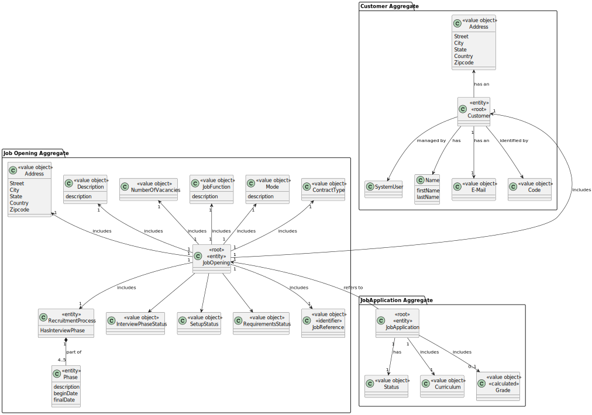
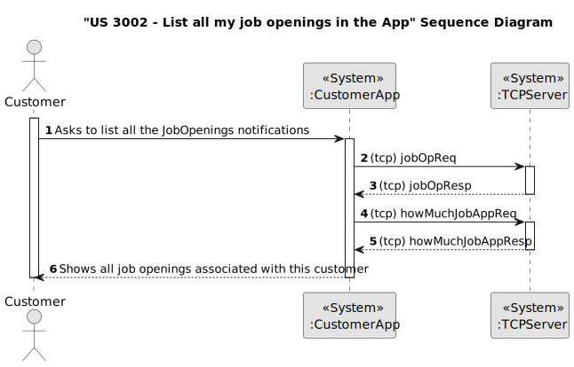
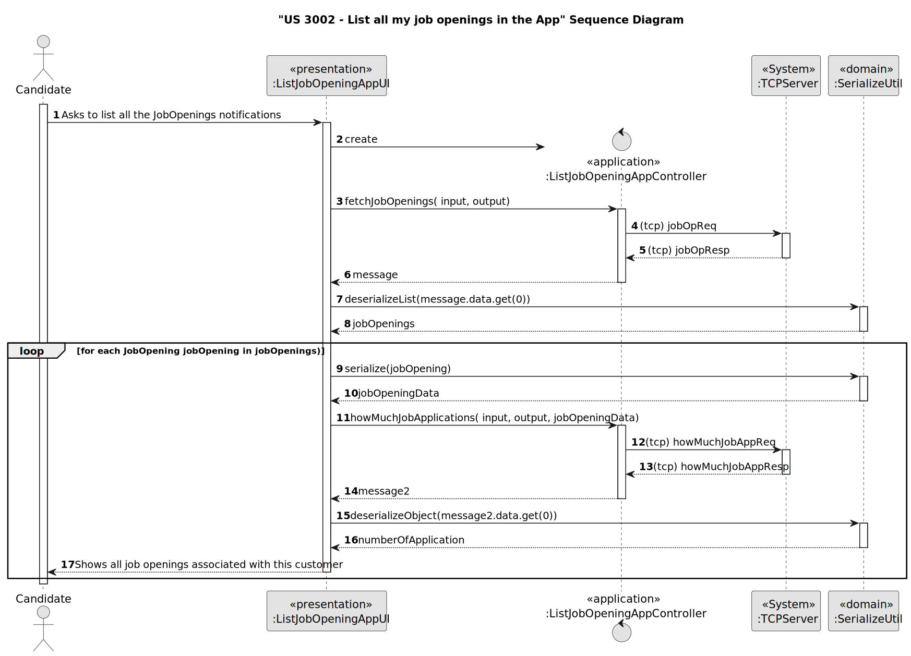
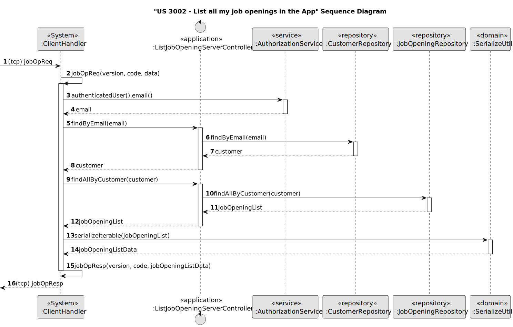
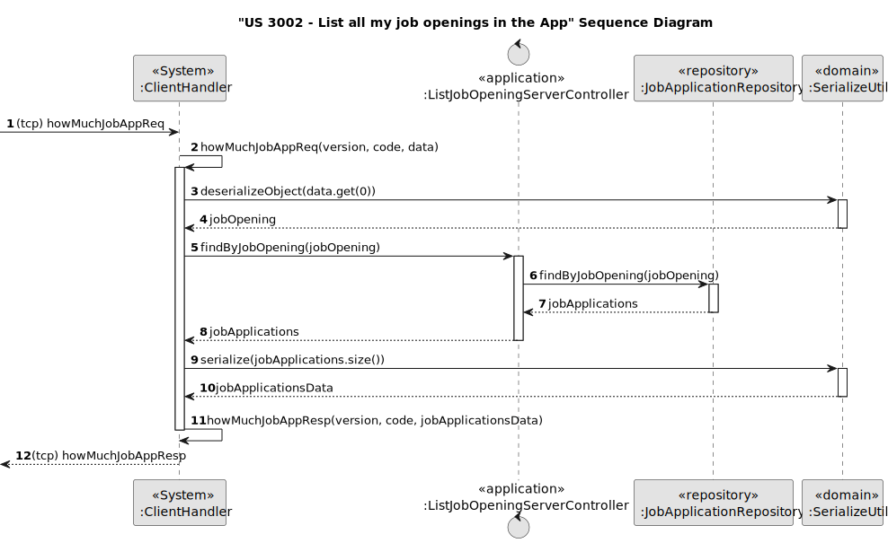
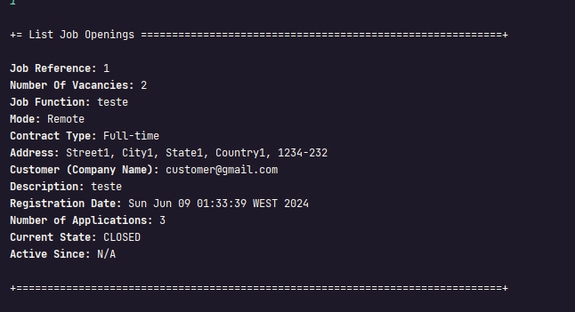
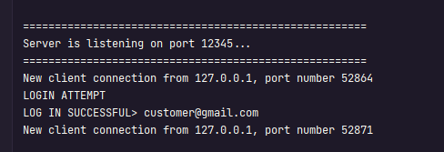

# US 3002

## 1. Context

The customer wants a functionality to list all their job openings, including various details like job reference, position, active since, and number of applicants. This is the first time this feature is being implemented, requiring us to develop a system that allows for the effective evaluation and ranking of candidates based on predefined criteria to streamline the hiring process.

## 2. Requirements

**US 3002** As Customer, I want to list all my job openings, including job reference, position, active since, number of applicants

**Acceptance Criteria:**

- 3002.1. Needs to have a jobOpening to be possible to list;

**Customer Specifications and Clarifications:**

> **Question 34:** US3002, job openings list, position what is it??
>
> **Answer:** In this US, when we refer to “position” it has the same meaning as “title or function” in section 2.2.2.

**Dependencies/References:**

* There is a dependency to "US1000:  "As Administrator, I want to be able to register, disable/enable, and list users of the backoffice.", since is necessary to be able to create a User when we create a Customer.

* There is a dependency to "US1001: As Customer Manager I want to register a customer and that the system automatically creates a user for that customer", since one attribute of Job Opening is the Customer(company), so in order to register the job opening, there must first be at least one customer.

* There is a dependency to "US1002:  As Customer Manager, I want to register a job opening.", since at least one job Opening must be registered in the system so that the operator can list a job opening.

* There is a dependency to "US2000a:  As Operator, I want to register a candidate and create a corresponding user", since at least one candidate must be registered in the system so that the operator can list all the candidates.

* There is a dependency to "US2002: As Operator, I want to register an application of a candidate for a job opening and import all files received.", since at least one job Application must be registered in the system so that the user can list a job Application.

**Input and Output Data**

**Input Data:**

* Selected data:
  * JobOpening

**Output Data:**
* Display the success of the operation and the data of the jobOpenings

## 3. Analysis

* Choosing the option to list all the jobOpening will send a request to the server
* That request will use the email of the authenticated customer and will search if exists associated a jobOpening to them. 
* After that the server will respond with the jobOpeningData
* Then the app will send another request to the server asking to return the amount of jobApplications that jobOpening has.
* Subsequently the server will respond with the jobApplicationData
* Finally, if everything is successful, we will see all the information about all the jobOpenings

> **Question 172:** US3002 - Job Openings Clarifications - You stated that one of the this to show in the listing of job openings is "active since". You've clarified that an active job opening is the one where its recruitment process is on-going. Are the job openings listed in this funcionality only the ones with recruitment process on-going? Or also the ones without recruitment processes, the ones with processes that haven't yet started or have ended
>
> **Answer:** In the context of this US, “active since” means the date from the start of the process, the “application” phase (since that date, candidates can apply). This functionality should include all the “active” job openings.

### 3.1. Domain Model

## 4. Design

**Domain Class/es:** JobOpening, JobApplication, Rank

**Controller:** ListJobApplicationAppController, ListJobApplicationServerController

**UI:** ListJobApplicationAppUI

**Repository:** JobApplicationRepository, JobOpeningRepository, CustomerRepository

**Server:** TCPServer

**Auxiliary Class:** SerializeUtil 

**App:** CustomerApp

**Service:** AuthorizationService

### 4.1. Sequence Diagram

### **Customer App and Server**

### **Customer App**

### **Server getting the jobOpenings**

### **Server getting how much application the jobOpening have**

## 5. Implementation

### Methods in the Controller

* **Iterable<JobApplication> findByJobOpening(JobOpening jobOpening)**  this method send the information to search by JobOpening all the candidates .

* **Iterable<JobOpening> findAllByCustomer(Customer customer)**  this method send the information to search to find all the JobOpenings by Customer .

* **public Customer findByEmail(EmailAddress email)** this method send the information to find a customer by email.

* **public CustomMessage fetchJobOpenings(DataInputStream input, DataOutputStream output)** this method send the input and output DataStream to be able to send a code to the server to find all the jobOpenings returning in a CustomMessage with the information

* **public CustomMessage howMuchJobApplications(DataInputStream input, DataOutputStream output, byte[] jobOpeningData)** this method send the jobOpeningData, inputa and output DataStream to be able to send a code to the server to find all the jobApplications associated with this jobOpening returning in a CustomMessage with the information

## 6. Integration/Demonstration

>**After doing the log in process, to be able to perform this function you need to in the customerApp as a customer. Then select the option that says "List Job Openings"
The process of list all the jobOpenings will begin. The system will show all the jobOpening associated with it:**

> **In the server side we can see that is was a success the connection of the customer App**

[//]: # (## 7. Observations)

[//]: # ()
[//]: # (*This section should be used to include any content that does not fit any of the previous sections.*)

[//]: # ()
[//]: # (*The team should present here, for instance, a critical perspective on the developed work including the analysis of alternative solutions or related works*)

[//]: # ()
[//]: # (*The team should include in this section statements/references regarding third party works that were used in the development this work.*)