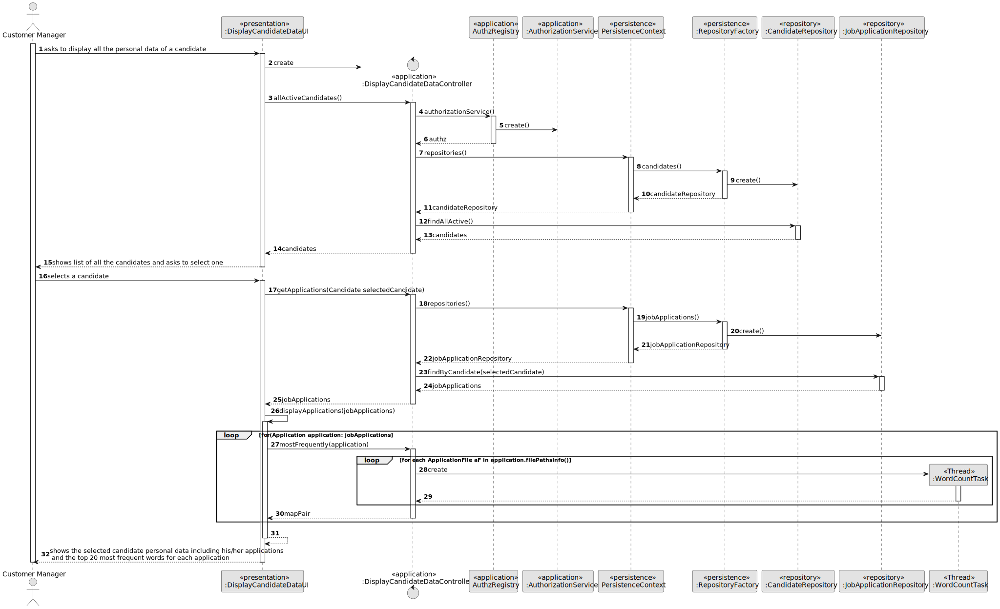
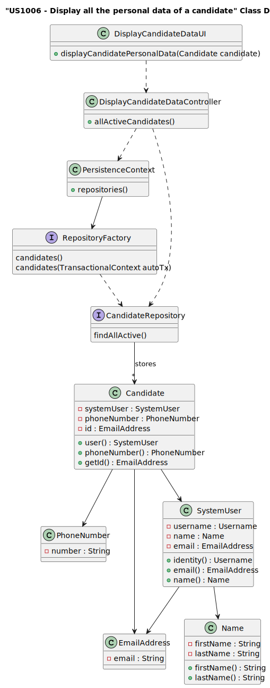

# US 4000

## 1. Context

This User Story's goal is for the system to, when displaying the candidate's data, automatically fetch and present the top 20 list of the most frequent words from the files uploaded by the candidate as well as their origins.

## 2. Requirements

**US 4000**  As a Customer Manager, when displaying the candidate data, I expect the system to present a top 20 list of the most frequently referenced words from files uploaded by a candidate. Additionally, I require a comprehensive list of the files in which these words appear.

**Acceptance Criteria:**

- 4000.1. Display the 20 most frequent words across all files of a candidate for each of the applications managed by the authenticated Customer Manager.
- 4000.2. The list must be ordered from most to least frequent. 

**Customer Specifications and Clarifications:**

> **Question:** I would like to know if in the US4000, there is creation of a list of the most common words, present in the files uploaded by the candidate, do you intend to choose an application from that same candidate and create the respective list, or if you want this list to be created, taking into account all the applications associated with that candidate.
>
> **Answer:** The list of words is relative to a particular application.

> **Question:**  Files for word count evaluation - When making the Top 20 Used Words by a candidate, the files subject to word counting are all files of all the chosen candidate's applications? Or can the Customer Manager choose a candidate's specific application and from there get the top 20 words from those files?
>
> **Answer:** See [Previous Question]

> **Question:**  The order of the list is important? Does it need to be ordered by the number of occurrences of the words?
>
> **Answer:**  Yes, the order is important. The system must present a top 20 list, from most referenced words to less referenced words.

> **Question:** - For the word count, should all types of words be counted, or are there words that don't make sense to count, such as conjunctions?
>
> **Answer:** For the moment there are no restrictions like the one you mention since they depend on the language used in the text (the solution could/would be complex)

> **Question:** When displaying the candidate info is expected to show the list of words for each application of the candidate, or the customer manager needs to select a specific application to see the list of words?
>
> **Answer:**  See [First Question]. This regards all the possible applications of a candidate that the customer manager is managing.

> **Question:**  Word Count – I think it makes sense to ignore words with less than 3 letters, or something like this, because it makes no sense to have words like as, I, am... Can we make this assumption or should we count any word?
> 
> **Answer:** See [Two Questions Back]. If you want, you may use a configuration file to configure the minimum number of sequence of characters to be counted as a word in the process. However, this is a temporary exception, accepted, but not considered as a good solution (a good solution should be one that takes into account the used language).

> **Question:** Lately, I have answered the following functional questions that I have listed as the top 20 most common questions in the Candidatures section (Q170 and Q187). As per the analysis, it is important to understand how these questions are interpreted and how they are handled, that is, how the functional question is answered by all questions such as Candidatures (Q187), or if the Customer Manager asks 1 Candidature and then the functional question is answered by none.(Q170)
>
> **Answer:** Candidate data sources (“candidate data”) refer to candidate data sources that cover various candidacies. In this context, we present the data sources for each candidacies application in the top 20.

> **Question:** We have 4000 references: "Additionally, I need a comprehensive list of the files in which these words appear." How can I find out what files exist or any other information I can find?
>
> **Answer:** It's like India, for which I have some questions regarding fish.


**Dependencies/References:**

* There is a dependency to "US1000: As Administrator, I want to be able to register, disable/enable, and list users of the backoffice", since there is a need to have users registered in the system to be able to do any kind of action.

* There is a dependency to "1006b: As Customer Manager, I want to display all the personal data of a candidate, including his/her applications.", as this User Story is an extension of its functionality.

**Input and Output Data**

**Input Data:**

* Same as US1006/1006b


**Output Data:**

* Same as US1006/1006b
* List of the top 20 most frequent words for each application and their origin files


## 3. Analysis

* When showing the candidate data, it should appear the First and Last Name, his/hers Phone number and Email.

### 3.1. Domain Model


## 4. Design

**Domain Class/es:** Candidate, SystemUser, EmailAddress, PhoneNumber, Name

**Controller:** DisplayCandidateDataController

**UI:** DisplayCandidateDataUI

**Repository:**	CandidateRepository

**Service:** AuthorizationService

**Thread:** WordCountTask

### 4.1. Sequence Diagram



### 4.2. Class Diagram



[//]: # (### 4.3. Applied Patterns)


### 4.4. Tests


[//]: # (Include here the main tests used to validate the functionality. Focus on how they relate to the acceptance criteria.)


**Test 1:** *Verifies that the thread does not return null*

```

@Test
    public void ensureThreadResultNotNull() throws Exception {
        List<ApplicationFile> files = new ArrayList<>();
        files.add(new ApplicationFile(Types.INFO, "file1", "ab cd ab dd ad cd aba ab ab"));
        List<Thread> threads = new ArrayList<>();
        List<WordCountTask> tasks = new ArrayList<>();
        Map<String, Integer> counter = new HashMap<>();
        Map<String, List<String>> fileAppearances = new HashMap<>();
        for (ApplicationFile file : files) {
            WordCountTask task = new WordCountTask(file, counter, fileAppearances);
            tasks.add(task);
            Thread thread = new Thread(task);
            threads.add(thread);
            thread.start();
        }

        for (Thread thread : threads) {
            try {
                thread.join();
            } catch (InterruptedException e) {

            }
        }
        assertNotNull(counter);
    }

````


**Test 2:** *Verifies that the thread's return value coincides with a precalculated one*

```

@Test
    public void ensureThreadIsValid() throws Exception {
        List<ApplicationFile> files = new ArrayList<>();
        files.add(new ApplicationFile(Types.INFO, "file1", "ab cd ab dd ad cd aba ab ab"));
        files.add(new ApplicationFile(Types.INFO, "file2", "ab cd ab dd ad cd aba ab ab xyz xasd asdf"));
        files.add(new ApplicationFile(Types.INFO, "file3", "1 2 3 4 2 12 54 13 040404 5 19 20 21 22"));
        List<Thread> threads = new ArrayList<>();
        List<WordCountTask> tasks = new ArrayList<>();
        Map<String, Integer> counter = new HashMap<>();
        Map<String, Integer> counterExpected = new HashMap<>();
        counterExpected.put("dd",2);
        counterExpected.put("12",1);
        counterExpected.put("ab",8);
        counterExpected.put("cd",4);
        counterExpected.put("aba",2);
        counterExpected.put("13",1);
        counterExpected.put("xasd",1);
        counterExpected.put("ad",2);
        counterExpected.put("1",1);
        counterExpected.put("2",2);
        counterExpected.put("3",1);
        counterExpected.put("4",1);
        counterExpected.put("5",1);
        counterExpected.put("040404",1);
        counterExpected.put("xyz",1);
        counterExpected.put("asdf",1);
        counterExpected.put("54",1);
        counterExpected.put("19",1);
        counterExpected.put("20",1);
        counterExpected.put("21",1);
        counterExpected.put("22",1);
        Map<String, List<String>> fileAppearances = new HashMap<>();
        for (ApplicationFile file : files) {
            WordCountTask task = new WordCountTask(file, counter, fileAppearances);
            tasks.add(task);
            Thread thread = new Thread(task);
            threads.add(thread);
            thread.start();
        }

        for (Thread thread : threads) {
            try {
                thread.join();
            } catch (InterruptedException e) {

            }
        }
        System.out.println(counter);
        boolean counterEqual = true;
        for (String s : counter.keySet()) {
            if (!Objects.equals(counter.get(s), counterExpected.get(s))) counterEqual = false;
        }
        assertTrue(counterEqual);
    }

````

## 5. Implementation

The US was implemented using the following methods:
Specific to this US, in *DisplayCandidateDataController*:
- public Iterable<JobApplication> getApplications(Candidate selectedCandidate) - this method returns a list of JobApplication
- public Pair<Map<String, Integer>, Map<String, List<String>>> mostFrequently(JobApplication jA) - this method receives a jobApplication and returns a pair os Maps, one containing how many times a given word appeared, the other in what files it appeared. It reaches these values via the use of threads.

In *JobApplicationRepository*:
- Iterable<JobApplication> findByCandidate(Candidate email) - this method returns a list of JobApplication

In *WordCountTask*:
- public WordCountTask(ApplicationFile file, Map<String, Integer> counter, Map<String, List<String>> fileAppearances) - this method sets up the thread
- public void run() - this method executes the thread. It scans through the provided ApplicationFile and fills out the Counter and FileAppearances Map overtime. It includes a synchronization clause in case another thread is also filling out the Maps

## 6. Integration/Demonstration

After doing the log in process, to be able to perform this function you need to have admin or customer manager as your role. Then select the option that says “Display all the personal Data if a Candidate”.
Then the system will show a list of the candidates registered in the system that are active at the moment and will ask to select one of them.
After selecting the wanted candidate, all of his/hers personal data will be shown(first name, last name, email and phone number):


As well as their applications:


After each application the Top 20 (or less if there aren't enough) most frequently used words will be presented:


If the submitted value is not valid (letter, a symbol or a number greater or smaller than the ones that appear on the list), then the system will ask again for the value until it is valid.
The list of candidates will be displayed in alphabetical order(by his/hers first name).

[//]: # (## 7. Observations)

[//]: # ()
[//]: # (*This section should be used to include any content that does not fit any of the previous sections.*)

[//]: # ()
[//]: # (*The team should present here, for instance, a critical perspective on the developed work including the analysis of alternative solutions or related works*)

[//]: # ()
[//]: # (*The team should include in this section statements/references regarding third party works that were used in the development this work.*)