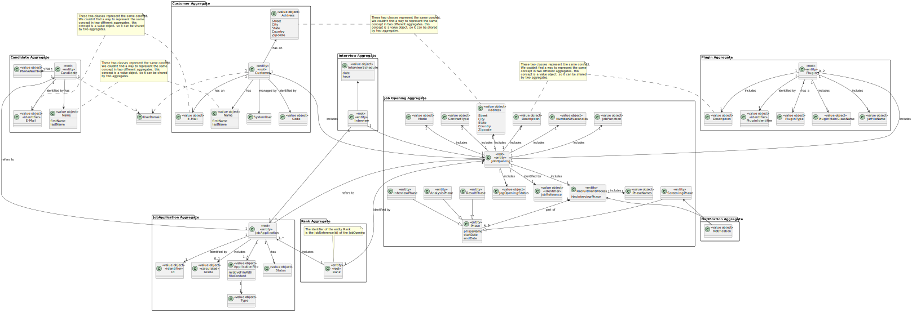

# US G006

## 1. Context

In this user storie, we elaborate a a Domain Model using DDD.

## 2. Requirements


*Example*

**US G006** As Project Manager, I want the team to elaborate a Domain Model using DDD

**Acceptance Criteria:**

- G006.1. the DM has to use DDD


**Customer Specifications and Clarifications:**

> **Question1:** Who is responsible for analyzing applications?
>
> **Answer1:** It will be the Customer Manager. He analyzes the applications and decides on the ranking of the candidates.


> **Question2:** What is the distinction between Company and Entity?
>
> **Answer2:** When the reference to entity appears in the statement, it is in the sense that we may have Jobs4u clients that may not be companies, they may be other types of organizations.


> **Question3:** For each Customer, is there only one "representative" who accesses the account (i.e. Customer App)?
>
> **Answer3:** Yes, that seems sufficient.


> **Question4:** In the context in which the Customer Manager registers a job offer, how are the requirements for that job offer selected/defined?
>
> **Answer4:** The Customer manager registers the job opening (US 1002) and then (normally) selects which requirements specification is suitable for that job opening. The requirements specification will be one that has been "created" by the language engineer and registered in the system.


> **Question5:** The email bot is referred to as being "out of scope". Is this about the system or the business model?
>
> **Answer5:** From the point of view of the process of receiving applications, it is important to have an idea of how applications are received and how they are processed. That said, the automatic process described as "email bot" is outside the scope of the solution to be developed, as illustrated in figure 4.1.
 

> **Question6:** The description doesn't specify the information to be collected for Customers? What information is needed? What about company employees?
> 
> **Answer6:**  It's not explicit. However, they are mentioned in the name of the company and its address in the context of a job opening. As for the users (company representatives accessing the Customer App), I'd say that this would be similar to the Candidate data. As for company employees, I'd say it's important to ensure that email is used to identify any user of the system. I think it will be important for each user to have their full name as well as a short username (which should be unique). Update on 2024-03-21: The Product Owner has reconsidered and decided that the short username is dispensable since only the email and password should be used to authenticate users.


> **Question7:** What is the distinction between requirements specification and interviews?
>
> **Answer7:** The "style" of the questions and answers is similar, but in requirements the aim is to assess the candidate and see if they have the minimums or not, so the result will be yes or no. In interviews the idea is to classify/score each answer in order to help you rank the candidates. In interviews, the idea is to classify/score each answer so that, in the end, you have different scores for the candidates and thus help to make your ranking.


> **Question8:** Can a customer manager manage several customers?
>
> **Answer8:** Yes.


> **Question9:**  Who informs the Customer manager of the type of interview/questions?
>
> **Answer9:**  This can be done by the customer manager in dialogue with the customer. Then, with the help of the Language engineer, the support for the interview is drawn up.


> **Question10:** Does the operator register an application or does the system do it automatically? And how does the application verification plugin fit into this process?
>
> **Answer10:** In US 2002, the Operator registers the application. To do this, it is the Operator who initiates the process, but the system must import the resulting data from the Application File Bot "automatically" (See US 2002 References). The aforementioned plugin enters this process through US 2003, in which the Operator generates a template file with the data to be entered to validate an application. In US 2004, the Operator, after filling in the specific application data (based on the previous template file), submits this file to the system, which will be used for the system to assess/verify the application. If the criteria are not met, the application is rejected.


> **Question11:** Regarding section 2.2.1 and the phases of the recruitment process, in order to move on to the next phase, does the previous one have to be closed or can we move on without the previous one being closed?
>
> **Answer11:** The short answer is that the phases should be sequential and not overlapping. When one phase closes, the next one opens. US 1007 provides for the definition of phases. US 1010 provides for the opening and closing of phases in the process. The Customer Manager's decision to close a phase should assume that the process moves on to the next phase automatically (regardless of the dates set for the phases).


> **Question14:** When creating a user in the system, is the name set by the user or is it the person's name (first and last) and is the password set by the user or generated by the system?
>
> **Answer14:** Under US 2000a the Operator creates system users for applicants who are not yet in the system. He has to do this on the basis of the data received in the application (which includes email and name). The email will serve to identify the person. In this context, it is necessary to have a password for this new user. Since this information is not transmitted by the applicant, I suppose the most "advisable" solution is for the system to generate a password for this user. How the user/applicant will receive this information (the form of authentication in the app) is out of scope, in the sense that there is no US that refers to this. US 1000 and 1001 also refer to the creation of users. Here, you could think about entering passwords manually, but it could be through the same automatic password setting mechanism described above.


> **Question15:** Can one person have several roles in the system?
>
> **Answer15:** It will be very difficult to control that a person can't have more than one form of access to the system (for example, a person who is a Customer Manager could also be a candidate for a job offer). With regard to "internal" roles, I would say that we should consider a hierarchy of access. The Admin can do "everything" that the others do. Then the Customer Manager and finally the Operator.


> **Question18:** Does the status change refer to the applicant or the individual application and how does it relate to the users' enable/disable?
>
> **Answer18:** The enable/disable of users is only to control access to the system. The status, in the application process, is the status of a candidate's application for a job opening, it is not directly related to the users' enable/disable.


> **Question19:** To identify an application, do you use the id of the applicant and the id of the job opening?
>
> **Answer19:** Not quite. Applications enter the system via the files generated by the Application Email Bot. These files are identified by the Job Reference followed by a "number" that identifies the application to that job reference. It will typically be a sequential number. The contents of these files will contain the candidate's details. Note that the candidate may not even exist yet (have no record in the system).


> **Question20:** Is everything in the job opening mandatory or are there optional fields?
>
> **Answer20:** The fields mentioned in section 2.2.2 are mandatory. The requirements will be dynamic since they depend on the requirements specification selected for that job opening (which is based on a language).


> **Question21:** From the app file bot's point of view, should it represent a service in the system?
>
> **Answer21:** I would say yes, since it is a process that is needed in the system to transform received data into a format that is "recognized" by the recruitment process.


> **Question22:** US2000b, what is the candidate's enable/disable?
>
> **Answer22:** (some reference to Q18). It refers to disabling the candidate's access to the system (i.e. Candidate App).


> **Question23:** Regarding the job specification, should the client send the requirements or is it the responsibility of the customer manager? What is the concept of a job specification?
>
> **Answer23:**  (some reference to Q20). Typically, it is the customer who informs the customer manager of the minimum requirements for a job offer. The customer manager checks whether a suitable requirements specification already exists. If not, a new one is created with the help of the Language Engineer.


> **Question24:** Do candidates also have associated statuses? As the process progresses, is the candidate's status also updated?
>
> **Answer24:** The status is that of the application. Progress in the process may not lead to "progress" in an application because, for example, at the end of the screening the application may be rejected, in which case that application ends there. Other applications follow the process.


> **Question26:** US3002, job openings list, position what is it?
> 
> **Answer26:** In this US, "position" has the same meaning as "title or function" in section 2.2.2.


> **Question28:** US1021, what is "all data of an application"? What is a job application?
>
> **Answer28:** A job application is an application (by a candidate) for a job opening. The "all data of an application" refers to all the data in an application, namely the files submitted by the candidate as well as data collected or generated during the process (such as interviews and processing of requirements).


> **Question29:** In the job opening (section 2.2.2), in the company field, should it be the customer name or the customer code, since the customer code is unique and entered manually?
>
> **Answer29:** The job opening information that appears at the bottom of page 5 should be seen as something to be used when advertising a job offer. In this context, it makes more sense for the Company to publish the name of the company and not its code. That said, in terms of database storage, the code could remain.


> **Question31:** Is the recruitment process as defined or could there be changes in the future?
>
> **Answer31:** The process is as described in section 2.2.1. At the moment, the only optional stage is the interviews.

> **Question56:** Are the phone number and postal code checks only made for Portuguese domains, or do we have to program according to the country concerned?
> 
> **Answer56:** That's enough for the Portuguese case.

[//]: # (**Dependencies/References:**)

[//]: # ()
[//]: # (*Regarding this requirement we understand that it relates to...*)


## 3. Analysis

> **Question12:** Regarding section 2.2.1, is it at the Analysis stage that the interviews are evaluated and is it this result that defines the ranking of the candidates? Also, what is the CV for at this stage? Since interviews are not compulsory, what happens when they don't take place?
>
> **Answer12:** The interview score is calculated at the interview stage. The CV and other data (such as the results of the interviews) are used by the Customer Manager in the analysis phase to rank the candidates. But the sorting is the Customer Manager's responsibility (e.g. you don't have to follow the order of the interview scores). US 1013 corresponds to the manual sorting of candidates by the Customer Manager. The fact that there are no interviews has no implications for the sorting of candidates as it does not depend explicitly on the interviews.


> **Question13:** In US 1011, how does the Customer Manager select the template to use for the interviews?
>
> **Answer13:** It is accepted that when templates are registered in the system (these "plugins") they are identified with a name or description. For example, "Supermarket Cashier Interview Template" or "Junior Backend Java Programmer Interview Template". In US 1011 the Customer manager is supposed to select a template from a possible list of templates.


> **Question16:** Regarding Companies, and related to Q11, what did the address mentioned in the answer mean?
>
> **Answer16:** I was referring to the company's postal address (not the email address).


> **Question17:** With regard to Job Opening (section 2.2.2), the job reference states that it must be generated by the system from a customer code. What is this customer code and are there any rules for creating it?
>
> **Answer17:** I would say that any customer must have a (unique) identification code which could be a kind of abbreviation of their name. With a limited number of characters. For example, for the client Instituto Superior de Engenharia do Porto, the customer code could be ISEP and there could be no other customer with this customer code. A reasonable limit would perhaps be 8 to 10 characters. This code is entered manually when the customer is created in the system.


> **Question25:** Does the candidate have an identification code or is it the email that identifies them?
>
> **Answer25:** The identification of the candidate is by email. There will be no need for a code.


> **Question27:** Does the customer have to have an address and company name or is it enough to have this information in the job opening?
>
> **Answer27:**  We have to register the customer's name and address. For each job opening, the address can be specific (and different from the customer's address).


> **Question30:** Does each question in an interview model accept x types of answers (e.g. multiple choice) or does the interview model accept x types of answers in all its questions? Are we assuming that a job opening only follows one interview model?
>
> **Answer30:** Yes, each question/answer accepts one type of question/answer (one of the types shown at the top of page 8). In US1011, the Customer manager selects the interview model to be used in the interviews for a job opening. In other words, there will only be one interview model to use in the interviews for that job opening.


> **Question32:** Can an interview have just one question? US1014, time and date, means start date and not end date? Can there be parallel interviews?
>
> **Answer32:** As for the number of questions in an interview, there is no upper or lower limit. In other words, there can be an interview with just 1 question (it won't make sense to have no questions). US1014 refers to setting a date for an interview with a candidate. Something like indicating the day and time (e.g. April 23 at 14:00). With regard to scheduling "overlapping" interviews (with the same start date), at the moment this would be something to allow (for example, the customer manager could delegate the conduct of the interview to someone else). This does not mean that they should validate that the interviews take place within the interview phase


> **Question33:** How does the Language Engineer make the interview model and job requirements? Is it text? Or does he select questions for the interview and requirements for the job opening? And is that when you're creating an interview or a job opening, or do you stop halfway through to do that and then carry on?
>
> **Answer33:** The language engineer, with information from the customer manager (who has obtained it from the customer), will develop a jar corresponding to the module/plugin in Java. To do this, he will have to use grammar/language development techniques such as antlr. This code will be in a jar that the language engineer then "installs/registers" in the application (US1008, for example, by associating a name with the jar in a configuration file - "5 years java experience", "req-model-5-years-java.jar"). The application with this information dynamically loads the jar. The grammar used in the jar will mirror the structure of the questions to be used in the model and their evaluation. These activities have to be done before the US1008 can be taken. This work is done "outside" the system, and the model is only registered (when it is ready) in US1008. US1009 and US1011 allow you to select models to use (from those that have been duly registered in the system).


> **Question34:** US1006, What information about the candidate's name should appear (full name, first and last name, etc.)?
>
> **Answer34:** From the outset, I would say that it should be the name as it was received in the application you made (page 6, "name of the candidate").

> **Question43:** What information do applicants and users of the system need?
> 
> **Answer43:** Some previous information is mentioned in Q11. In addition, section 2.2.3 states that with regard to candidates we have the following information: email of the candidate, name of the candidate, phone number of the candidate.

## 4. Design




[//]: # (### 4.1. Realization)

[//]: # ()
[//]: # (### 4.2. Class Diagram)

[//]: # ()
[//]: # (![a class diagram]&#40;class-diagram-01.svg "A Class Diagram"&#41;)

[//]: # ()
[//]: # (### 4.3. Applied Patterns)

[//]: # ()
[//]: # (### 4.4. Tests)

[//]: # ()
[//]: # (Include here the main tests used to validate the functionality. Focus on how they relate to the acceptance criteria.)

[//]: # ()
[//]: # (**Test 1:** *Verifies that it is not possible to ...*)

[//]: # ()
[//]: # (**Refers to Acceptance Criteria:** G001.1)

[//]: # ()
[//]: # ()
[//]: # (```)

[//]: # (@Test&#40;expected = IllegalArgumentException.class&#41;)

[//]: # (public void ensureXxxxYyyy&#40;&#41; {)

[//]: # (	...)

[//]: # (})

[//]: # (````)

[//]: # ()
[//]: # (## 5. Implementation)

[//]: # ()
[//]: # (*In this section the team should present, if necessary, some evidences that the implementation is according to the design. It should also describe and explain other important artifacts necessary to fully understand the implementation like, for instance, configuration files.*)

[//]: # ()
[//]: # (*It is also a best practice to include a listing &#40;with a brief summary&#41; of the major commits regarding this requirement.*)

[//]: # ()
[//]: # (## 6. Integration/Demonstration)

[//]: # ()
[//]: # (*In this section the team should describe the efforts realized in order to integrate this functionality with the other parts/components of the system*)

[//]: # ()
[//]: # (*It is also important to explain any scripts or instructions required to execute and demonstrate this functionality*)

[//]: # ()
[//]: # (## 7. Observations)

[//]: # ()
[//]: # (*This section should be used to include any content that does not fit any of the previous sections.*)

[//]: # ()
[//]: # (*The team should present here, for instance, a critical perspective on the developed work including the analysis of alternative solutions or related works*)

[//]: # ()
[//]: # (*The team should include in this section statements/references regarding third party works that were used in the development this work.*)
