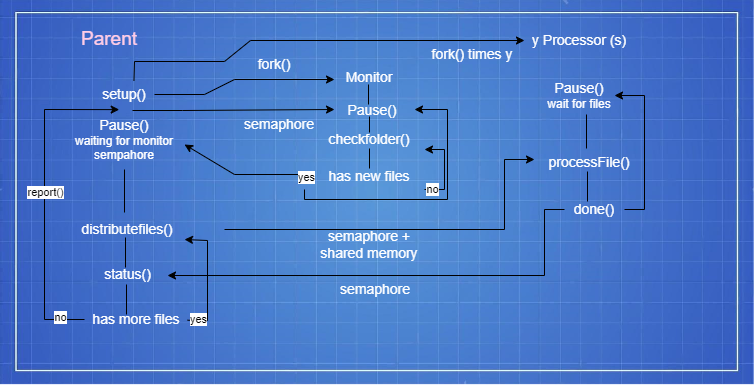

# Distribution

Ana Miguel Silva (Nº 1221133) - 25%

Diogo Pereira (Nº 1221137)  - 25%

Luís Morais (Nº 1221148) - 25%

Matilde Gonçalves (Nº 1220651)  - 25%

# Implementation percentage - 2001

| Level            | Description                                                                                                                  |
|------------------|------------------------------------------------------------------------------------------------------------------------------|
| 0 – Not done	    |                                                                                                                              |
| 1 – Attempted	   |                                                                                                                              |
| 2 – Many Defects | 	There is some implementation, but it is very rudimentary.                                                                   |
| 3 – Some Defects	 | There is implementation between most components/functionality, presenting some inconsistencies and/or unnecessary coupling.  |
| 4 – Correct	     | There is implementation between most components/functionalities without any type of incoherence and/or unnecessary coupling. |
| 5 - Exceptional	 | The previous item is true and this implementation is perfectly documented.                                                   |

* Parent process Forking - 4

* Monitor Child Monitoring Folder - 4

* Worker Child Moving Files - 4

* File distribution among Worker Children - 3

* Parent process report generation - 4

* Parent process SIGINT handler - 5

* Signals between Parent and Children - 5

* Pipes between Parent and Children - 4

* Exec Function, Separate Files for Parent, Monitor and Worker - 1

* Load Values from Configuration File - 0

# Diagram 

# Implementation percentage - 2001b

| Level            | Description                                                                                                                  |
|------------------|------------------------------------------------------------------------------------------------------------------------------|
| 0 – Not done	    |                                                                                                                              |
| 1 – Attempted	   |                                                                                                                              |
| 2 – Many Defects | 	There is some implementation, but it is very rudimentary.                                                                   |
| 3 – Some Defects	 | There is implementation between most components/functionality, presenting some inconsistencies and/or unnecessary coupling.  |
| 4 – Correct	     | There is implementation between most components/functionalities without any type of incoherence and/or unnecessary coupling. |
| 5 - Exceptional	 | The previous item is true and this implementation is perfectly documented.                                                   |

* Parent process Forking - 4

* Monitor Child Monitoring Folder - 4

* Worker Child Moving Files - 4

* File distribution among Worker Children - 3

* Parent process report generation - 4

* Parent process SIGINT handler - 3

* Semaphores between Parent and Children - 3

* Shared memory between Parent and Children - 4

* Exec Function, Separate Files for Parent, Monitor and Worker - 1

* Load Values from Configuration File - 0

# Diagram

# Implementation percentage - 4000

| Level            | Description                                                                                                                  |
|------------------|------------------------------------------------------------------------------------------------------------------------------|
| 0 – Not done	    |                                                                                                                              |
| 1 – Attempted	   |                                                                                                                              |
| 2 – Many Defects | 	There is some implementation, but it is very rudimentary.                                                                   |
| 3 – Some Defects	 | There is implementation between most components/functionality, presenting some inconsistencies and/or unnecessary coupling.  |
| 4 – Correct	     | There is implementation between most components/functionalities without any type of incoherence and/or unnecessary coupling. |
| 5 - Exceptional	 | The previous item is true and this implementation is perfectly documented.                                                   |

* Thread creation and execution - 4

* Thread synchronization - 4

* Thread code and logic - 4

* Integration with pre-existing methods to fetch the Job Applications - 5

* Compiled list includes the number of occurrences of each word and the files they appear in - 5

* Unit Tests of the Threads - 5

* List is displayed from most to least frequent - 4

# Diagram

# Important information about US4000

* In-depth documentation is located in [docs/us_4000/readme.md]

* WordCountTask (Java Thread Class) is located in [jobs4u.core/src/main/java/lapr4/jobs4u/candidatemanagement/application/WordCountTask.java]

* UI where the words, occurences and files are displayed is located in [jobs4u.app.backoffice.console/src/main/java/lapr4/jobs4u/app/backoffice/console/presentation/authz/DisplayCandidateDataUI.java]

* Controller with "mostFrequently" method (where the threads are created and used) is located in [jobs4u.core/src/main/java/lapr4/jobs4u/candidatemanagement/application/DisplayCandidateDataController.java]

* Unit tests are located in [jobs4u.core/src/test/java/lapr4/jobs4u/candidatemanagement/domain/ThreadTest.java]
